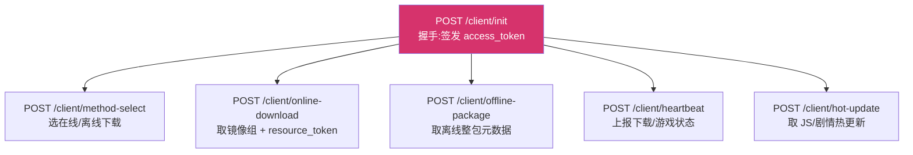
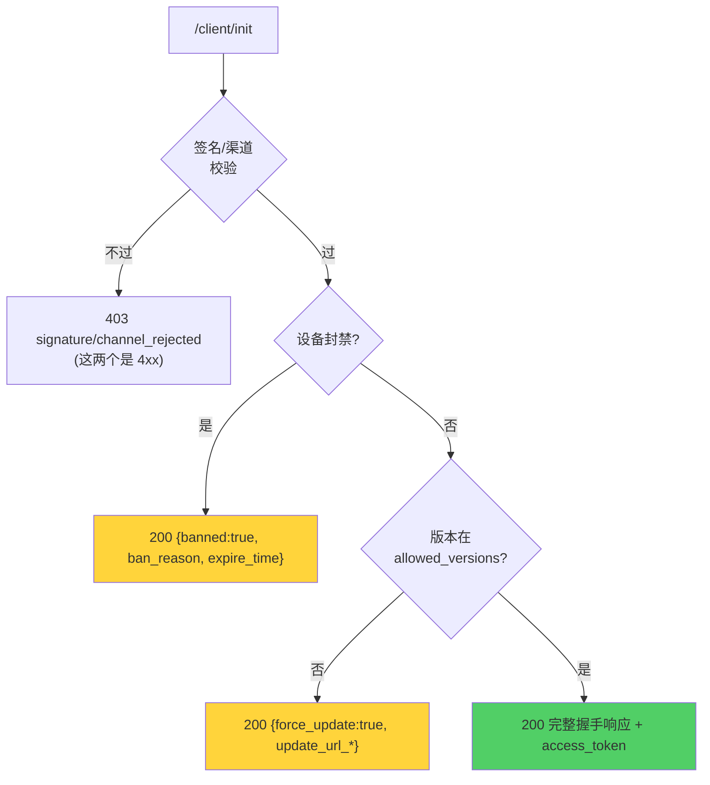

# 客户端握手协议

`/client/*` 是服务端与游戏客户端之间的契约,共 6 个端点。字段名、嵌套、空值处理**严格以客户端 Java 源码为唯一真理**(`magireco-cnv-client` 仓库的 `ClientInit.java` / `ResourceFlow.java`)。

::: tip 协议保真是硬约束
改这些响应前请先读 [协议保真原则](/contributing/protocol-fidelity)。一个字段名拼错、一个 `null` 发错,真机就会崩或行为异常,而服务端测试如果没覆盖到就发现不了。
:::

## 端点全景



除 `/init` 外,其余 5 个都要带 **authTriple**(`device_id` + `access_token` + `signature`)。

## `/client/init` 请求

```json
{
  "version":   "4.0.0",
  "device_id": "玩家设备唯一标识",
  "signature": "APK 签名证书 SHA-256(小写 hex)",
  "channel":   "normal"
}
```

| 字段 | 说明 |
|---|---|
| `version` | 客户端版本号,点分格式 |
| `device_id` | 设备指纹,贯穿封禁/会话/审计 |
| `signature` | **防改包核心**。APK 签名证书摘要,与服务端白名单比对 |
| `channel` | 用户所选渠道:`normal` / `internal-test`。决定更新提示频率与下载哪个 APK |

字段缺失时支持 `X-Device-Id` / `X-Client-Version` / `X-Signature` 头兜底(便于老客户端/调试)。

## `/client/init` 响应

成功时:

```json
{
  "success": true,
  "banned": false,
  "access_token": "32 字节 hex",
  "server":   { "status": "ok", "message": "", "end_time": 0 },
  "client":   {
    "allowed_versions": ["4.0.0"],
    "latest_version": "4.1.0",
    "update_url_normal": "https://.../v4.1.0.apk",
    "update_url_internal_test": "https://.../v4.1.0-test.apk",
    "update_apk_sha256": "<对应渠道 APK 的 sha256>"
  },
  "spoof":    { "fake_version": "1.0.0", "fake_name": "マギレコ" },
  "features": { "online_download": true, "offline_package": true },
  "services": { "cap_worker_url": "...", "game_server_host": "..." },
  "offline_pack": { "min_version": "20250501" }
}
```

各对象的职责:

| 对象 | 职责 |
|---|---|
| `server` | 服务器状态(`ok`/`maintenance`),维护文案与预计恢复时间(Unix 秒) |
| `client` | 版本白名单、更新提示、APK 下载与校验 |
| `spoof` | JNI 伪装字段(伪造 versionName / 应用名,绕过日服客户端检测) |
| `features` | 下载能力开关(在线/离线) |
| `services` | 握手期运行时地址(验证码服务、代理后端、游戏服 host) |
| `offline_pack` | 离线包版本门槛 |

### 三类"不放行"分支(都返回 HTTP 200)



**为什么封禁/版本闸门是 HTTP 200 而非 4xx?**
客户端的 `Net.postJson` 在 HTTP ≥400 时会抛 `IOException`,拿不到 body。如果用 403 返回封禁,客户端就读不到 `ban_reason` 和 update URL。所以这两类"业务拒绝"用 200 + 顶层 flag 表达,只有签名/渠道这种"协议级拒绝"才用 4xx。

### 空值处理:省略而非 null

::: danger 绝不发送 JSON null
所有可选**字符串**字段未设置时**必须省略 key**。Android `org.json` 的 `optString` 对显式 `null` 会返回字符串 `"null"`,导致客户端拿到字面量 `"null"` 当成有效值。
:::

实现上用 `putIfNonEmpty`(字符串非空才写)和 `putIfNonZero`(整数非 0 才写)。bool 字段不受此约束(`false` 是合法业务值)。

## 三道更新闸门

`client` 对象里有三种"催更新"机制,优先级与行为各不同:

| 机制 | 字段 | 行为 | 优先级 |
|---|---|---|---|
| 强制更新 | `force_update:true` + `update_url_*` | 版本被拒,必须更新或退出 | 高(握手中先判) |
| 版本白名单 | `allowed_versions` | 当前版本不在列表 → 强制更新 | 高 |
| **软提示** | `latest_version` | 按渠道提示,可"暂不更新" | 低(软) |

软提示按渠道有不同策略:

- **正式版(`normal`)**:仅当 `latest_version` 的 **major.minor** 高于当前才提示。补丁号变化(4.0.0→4.0.5)不打扰。
- **内测版(`internal-test`)**:任意版本位升高即提示(含补丁号)。

过滤完全在客户端做,服务端只需告诉它"最新版本号是多少"。详见 [版本闸门与软提示](/security/version-gates)。

## authTriple:其余 5 个端点的鉴权

```json
{ "device_id": "...", "access_token": "...", "signature": "..." }
```

服务端校验:token 合法 → 绑定该 device_id → **signature 与握手时一致** → 未封禁。signature 中途变化会作废会话(疑似换包)。

## 其余端点速览

### `/client/online-download`

返回镜像组与短时 `resource_token`:

```json
{
  "success": true,
  "resource_token": "HMAC 短时签名",
  "groups": [
    { "name": "线路A", "mirrors": [ {"url": "...", "files": [{"key":"...","size":1024}]} ] },
    { "name": "主节点本地", "mirrors": ["https://.../res"] },
    { "name": "副节点", "mirrors": [ {"url":"https://node-hk/", "files":[...]} ] }
  ]
}
```

三个来源按优先级拼接:管理后台镜像组 → 主节点本地 → 活跃副节点。mirror 带内联 `files` 时返回对象,否则返回纯 URL 字符串(客户端走 S3 XML 自发现)。

> **镜像限额过滤**:若某镜像当天流量超过管理员设定的日限额、或当前速度超过速度上限，
> 该镜像本次响应中**不出现**（客户端不感知，直接拿到过滤后的列表）。次日零点自动重置日流量。
> 对 CDN/S3 等不可控节点，仅控制调度（不派发），不限制已在下载的连接。
> 限额通过管理后台「资源管理 → 流量限额」按镜像配置；实时统计来自心跳速度均摊归因。

### `/client/offline-package`

```json
{ "success": true, "download_url": "...", "package_version": "20250501", "sha256": "...", "size": 4096 }
```

### `/client/heartbeat`

每 5 秒上报一次。请求带 `files` 数组(下载阶段)或为空数组(游戏阶段)。
`files[]` 每项 `{ name, status: pending|downloading|done|failed, percent, speed_bps }`。

心跳只在**客户端自己下载**时携带逐文件进度,共三种来源(见 `ResourceFlow.java` /
`SaveOverlayService.java`):

| 来源 | `files` | 说明 |
|---|---|---|
| 在线资源下载 | 游戏资源多文件 | 客户端多线程下载,逐文件真实 `speed_bps` |
| 热更新 | 固定 `cn_js_update.zip` / `cn_scenario_update.zip` | 同上 |
| 游戏内 | 空 `[]` | 仅为收取封禁/维护指令,无下载进度与速度 |

> **离线整包不在心跳内**:离线包由系统浏览器下载、客户端只做文件导入,全程不发心跳,
> 因此不会出现在管理后台「心跳监控」,协议上也**不存在“离线包下载速度”**。

响应 `action`:

| action | 时机 | 含义 |
|---|---|---|
| `ok` | 常态 | 继续 |
| `maintenance` | 游戏阶段 + 服务器维护 | 顶层带 message/end_time |
| `switch_mirrors` | 下载阶段 + 管理员入队换线 | `assignments:[{mirror, files:[name]}]` |
| `ban` | 运行中被封 | 顶层 reason / expire_time |

管理后台 `/admin/heartbeats` 下发内存心跳表快照:`type` = `online`/`hotupdate`/`game`
(由 `phase` + 文件名推导),`progress`/`speed_bps`/`current_file` 由 `files[]` 聚合得到。

### `/client/hot-update`

```json
{
  "success": true,
  "js":       { "version": 42, "sha256": "...", "download_url": "...", "size": 999 },
  "scenario": { "version": 23, "sha256": "...", "download_url": "...", "size": 888 }
}
```

JS 与剧情两类热更新包,客户端比对本地版本决定是否拉取。

## 字段真理的来源

| 客户端 Java 文件 | 对应服务端端点 |
|---|---|
| `ClientInit.java` | `/init`、`/online-download`、`/offline-package`、`/hot-update`、`authTriple()` |
| `ResourceFlow.java` | `/heartbeat`(ban / switch_mirrors) |
| `SaveSyncHelper.java` | `/account/save/{put,get}` |

服务端 `internal/api/client/protocol_test.go` 是这套契约的**保真测试**,任何改动都要让它继续通过。
