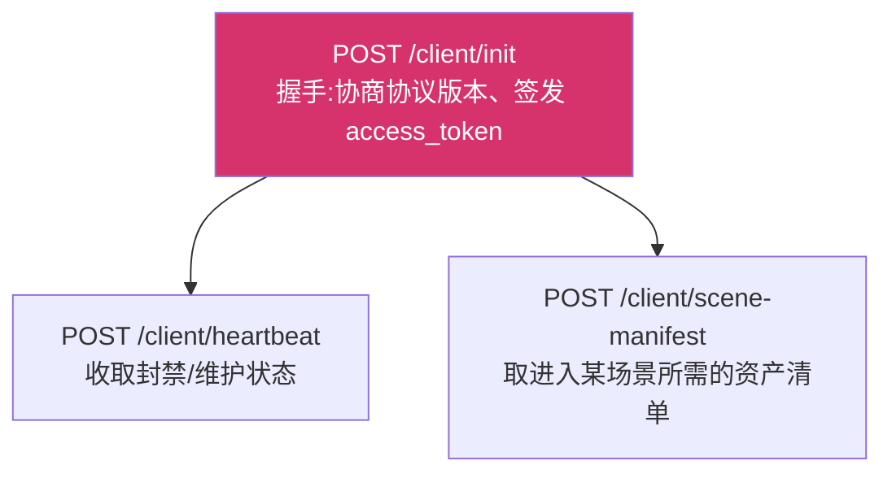
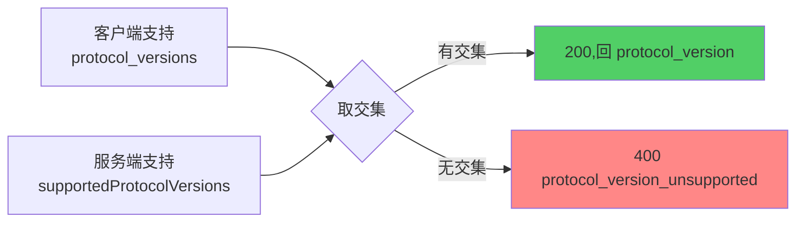
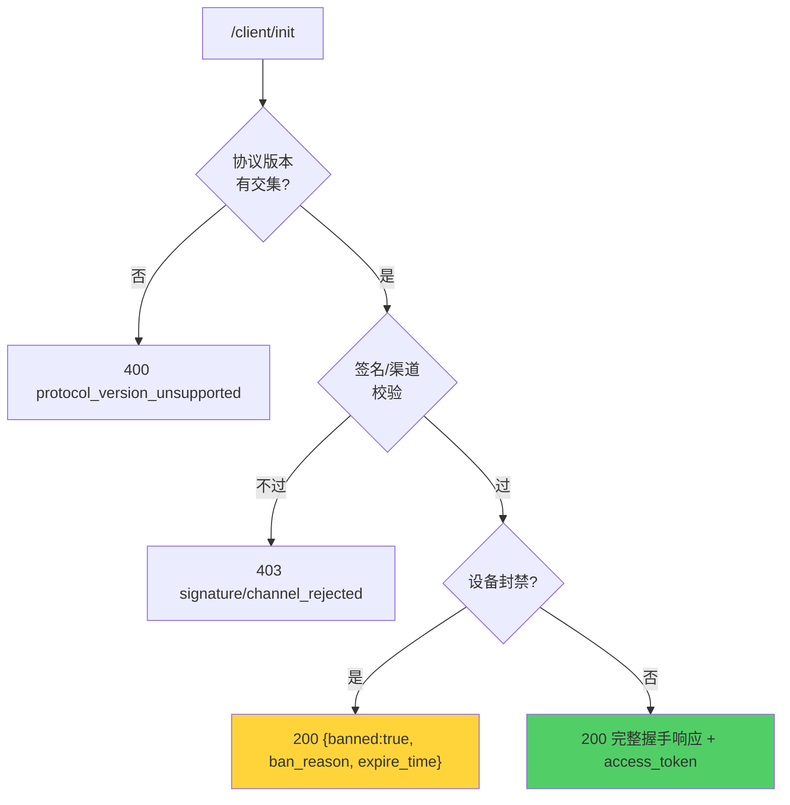

# 客户端握手协议

`/client/*` 是服务端与游戏客户端之间的契约,共 3 个端点。

::: tip 线格式的唯一真理是协议文档
字段名、嵌套与空值处理**以架构协议文档**(`magirecocn-architecture-protocol-document`)**为准**。

本文早期版本写的是"以客户端 Java 源码为唯一真理"。该锚点已失效——Android 客户端
(`magireco-cnv-client`)已弃维,不再有"照着实现"的对象。改这些响应前请先读
[协议保真原则](/contributing/protocol-fidelity)。
:::

## 端点全景



除 `/init` 外,其余两个都要带 **authTriple**(`device_id` + `access_token` + `signature`)。

::: warning 已移除的端点
`/client/method-select`、`/client/online-download`、`/client/offline-package`、
`/client/hot-update` **已随 Android 端弃维一并移除**,现在返回 404。

它们服务的是"先把整包资源下完再进游戏"的模型。Web 客户端**按需流式取用单个资产**,
既没有资源准备阶段,也没有批量下载端点——完整资源十几 GB,浏览器装不下。
:::

## `/client/init` 请求

```json
{
  "version":   "1.0.0",
  "device_id": "玩家设备唯一标识",
  "signature": "客户端完整性凭据",
  "channel":   "web",
  "protocol_versions": [1]
}
```

| 字段 | 必填 | 说明 |
|---|:--:|---|
| `device_id` | 是 | 设备指纹,贯穿封禁/会话/审计 |
| `protocol_versions` | 否 | 客户端支持的协议版本集合。缺省视为 `[1]` |
| `version` | 否 | 客户端版本号 |
| `signature` | 否 | 客户端完整性凭据,与服务端白名单比对 |
| `channel` | 否 | 构建渠道,与服务端白名单比对 |

::: tip signature 对 Web 端的强度不同
Android 端的 `signature` 是 APK 签名证书摘要——**攻击者无法在客户端绕过**,因为私钥
不在客户端。Web 客户端的源码整个跑在玩家浏览器里,**没有等价的不可绕过凭据**。

因此这三项对 Web 端是可选的,校验强度由部署配置(白名单 / `CNV_REQUIRE_SIGNATURE`)
决定。不要把它当成 Web 端的安全边界。
:::

字段缺失时支持 `X-Device-Id` / `X-Client-Version` / `X-Signature` 头兜底(便于调试)。

## 协议版本协商

握手的第一步,先于签名与渠道校验。



两条规则:

1. **按服务端的优先级顺序选**,不按客户端上报的顺序——版本策略属服务端职权。
2. **无交集时握手失败,客户端不得降级尝试。** 降级会让双方对线格式的理解不一致,
   而这类不一致往往不是立刻报错,是在某个字段上悄悄读出错值。

响应同时回两个字段:`protocol_version` 是本次协商结果,`protocol_versions` 是服务端
支持的全集——客户端据此判断"升级到哪一版才能继续对话",而不是只知道"谈崩了"。

## `/client/init` 响应

成功时:

```json
{
  "success": true,
  "banned": false,
  "protocol_version": 1,
  "protocol_versions": [1],
  "access_token": "32 字节 hex",
  "server_time_at": 1785090393,
  "server":     { "status": "ok", "message": "", "end_time": 0 },
  "features":   { "account_enabled": true },
  "asset_auth": { "type": "bearer", "token": "...", "expires_at": 1785090420 },
  "services":   { "cap_worker_url": "..." },
  "directory":  { "payload": "...", "sig": "..." }
}
```

各对象的职责:

| 对象 | 职责 |
|---|---|
| `server` | 服务器状态(`ok`/`maintenance`),维护文案与预计恢复时间(Unix 秒) |
| `features` | 账号系统总开关与停用提示 |
| `asset_auth` | 资产鉴权信封,见下 |
| `services` | 握手期运行时地址(验证码服务等) |
| `directory` | Ed25519 签名的节点目录,客户端据此按能力路由 |
| `server_time_at` | 服务端 Unix 秒,供客户端校正时钟偏移 |

### `asset_auth`:定信封不定内容

```json
{ "type": "bearer", "token": "...", "expires_at": 1785090420 }
```

`type` 是**判别字段**,其余字段的形状由它决定。当前唯一取值 `bearer`,承载既有的
`resource_token`(HMAC 签名、绑设备、按时间窗轮换)。`expires_at` 是 **Unix 秒**。

::: danger 遇到不认识的 type 必须明确失败
禁止猜测,也禁止静默降级为"不带鉴权直接请求"。降级的后果不是拿不到资产,是
**客户端行为与服务端预期分叉**,而这种分叉在日志里看不出来。
:::

### 缺省 = 拿不到资产,不是不需要鉴权

**`asset_auth` 整个缺省时,客户端必须视为"当前无法取用资产"并明确失败**,
不得改为不带鉴权直接请求边缘节点。要表达"确实不需要鉴权",必须显式下发
`{"type": "none"}`——那是开发期临时值,受生产守卫约束。

服务端侧据此 fail-closed:签名密钥过短时**不下发 `asset_auth`**,而不是用空密钥
算一个令牌。空密钥的 HMAC 照样能算出"看起来正常"的令牌,而那个令牌任何人都能
自己算出来。

> 协议早期版本把缺省定义成"边缘节点当前不要求鉴权"。那意味着**任何让服务端签不出
> 凭据的故障**都会在客户端表现为"那就不用鉴权了"——而且不会有任何症状:客户端
> 照常拿到资产、日志里一切正常,只有鉴权悄悄没了。安全机制的默认值必须落在
> "失效时拒绝服务"那一侧。

### 两类"不放行"分支



**为什么封禁是 HTTP 200 而非 4xx?**
封禁是**正常的业务结果**,不是传输或请求错误。客户端需要读到 body 里的
`ban_reason` 与 `expire_time` 才能给玩家一个可理解的提示;用 4xx 表达会让"被封禁"
和"请求写错了"在客户端看来是同一件事。

签名/渠道拒绝则确实是协议级拒绝,用 4xx。

### 空值处理:省略而非 null

::: danger 绝不发送 JSON null
所有可选**字符串**字段未设置时**必须省略 key**。

"字段缺席"与"字段为空"在客户端是两种不同的判断:缺席意味着服务端没有这项配置,
空串意味着服务端明确配了一个空值。发 `null` 把两者混成第三种状态,而各语言的
JSON 库对它的处理并不一致。
:::

实现上用 `putIfNonEmpty`(字符串非空才写)和 `putIfNonZero`(整数非 0 才写)。
bool 字段不受此约束(`false` 是合法业务值)。

::: warning APK 更新闸门已移除
`client.allowed_versions` / `force_update` / `update_url_*` / `latest_version` /
`spoof` **不再下发**,`client` 子对象整个消失。

它们下发的是 APK 安装包地址与向 Android 原生引擎伪造的版本号——浏览器自行更新,
无 APK 可推,也没有原生引擎可伪装。**版本相关的唯一机制是上面的协议版本协商。**

管理后台仍可写 `versions` 这组配置,但 `/client/*` 不再读取它。
:::

## authTriple:其余端点的鉴权

```json
{ "device_id": "...", "access_token": "...", "signature": "..." }
```

服务端校验:token 合法 → 绑定该 device_id → **signature 与握手时一致** → 未封禁。
signature 中途变化会作废会话(疑似换包)。

## 其余端点

### `/client/heartbeat`

**精简版:只收 authTriple,没有任何上报载荷。**

```json
{ "device_id": "...", "access_token": "...", "signature": "" }
```

原先随心跳上送的逐文件下载进度(`files[]` 的 `name`/`status`/`percent`/`speed_bps`)
已移除——它服务于"先下完整包再进游戏"的模型,Web 端不存在那个阶段。镜像换线指令
(`switch_mirrors`)同样移除。

保留下来的职责只有一个:**它是握手之外唯一的服务端推送时机**。

响应 `action`:

| action | 时机 | 含义 |
|---|---|---|
| `ok` | 常态 | 继续 |
| `maintenance` | 服务器维护 | 顶层带 `message` / `end_time` |
| `ban` | 运行中被封 | 顶层带 `reason` / `expire_time`(Unix 秒,0 = 永久) |

### `/client/scene-manifest`

```json
// 请求
{ "device_id": "...", "access_token": "...", "signature": "", "scene_id": "story_11011" }

// 响应
{ "success": true, "scene_id": "story_11011", "assets": [{ "path": "resource/..." }] }
```

**场景包是清单与调度单位,文件是传输与缓存单位。** 客户端拿到清单后与本地缓存做
差集,**只拉缺失的文件**;边缘节点下发的始终是单个文件,因此保持为纯对象存储 +
鉴权,不理解游戏结构。

为什么不把场景包做成传输单位:共享资产的复用率极高(主要角色出现在绝大多数场景),
包若自包含,同一份角色资产会被复制进几百个包——服务端存储翻数倍、玩家重复下载、
且缓存淘汰会为了 3 个需要的文件保留 47 个不需要的。

失败分支:

| 状态码 | 错误码 | 含义 |
|---|---|---|
| `400` | `missing_scene_id` | 请求没带 `scene_id` |
| `404` | `scene_not_found` | 未知的 `scene_id` |
| `503` | `manifest_unavailable` | 场景清单尚未接入构建管线 |

::: tip 503 而不是空清单
未接入时**明确报错**,不返回 `assets: []`。空清单会被客户端理解为"该场景无需任何
资产",于是静默进入一个残缺的场景——错误被推迟到最难排查的地方才暴露。
:::

::: warning 清单形状仍是待决项
当前是协议文档 `06-dev-mode` 规定的**开发期最小形状**,只含 `path`。正式形状
(内容哈希 / `size` / 增量 / 场景 ID 命名空间)是待决项 **R2**。

定稿后按扩展性规则**新增字段**即可:客户端忽略未知字段,既有实现不受影响。
:::

## 保真测试

服务端 `internal/api/client/protocol_test.go` 是这套契约的保真测试,任何改动都要让它
继续通过。它的职责有两面:

- **正向**:新协议要求的字段确实出现在约定的位置;
- **反向**:已移除的 Android 专有字段确实**不再**出现——哪怕对应的 config 仍留在库里。

少了反向断言,"删字段"这件事就没有回归保护,下次重构很容易把它们捡回来。
