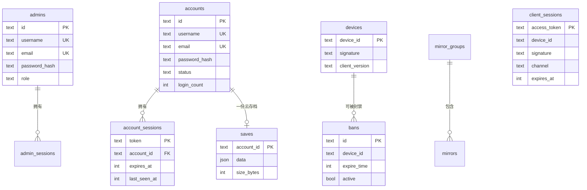

# 数据模型

主节点用一个关系数据库持有全部状态。本页是全表清单与关系总览。建表 SQL 内嵌在 `internal/store`,启动时按方言自动迁移。

## ER 总览

## 全表清单

按职责分组。`config` 是一张 KV 表,承载大量运行配置(下文单列)。

### 身份

| 表 | 主键 | 关键字段 | 说明 |
|---|---|---|---|
| `admins` | `id` | `username`/`email`(唯一)、`password_hash`、`role` | 后台管理员。role: super_admin/admin/readonly |
| `accounts` | `id`(`acc-xxxx`) | `username`/`email`(唯一)、`password_hash`、`status`、`login_count` | 玩家账号。status: active/disabled |

### 会话(三套)

| 表 | 主键 | 绑定 | TTL |
|---|---|---|---|
| `admin_sessions` | `token` | `admin_id`(级联删) | 7 天 |
| `account_sessions` | `token` | `account_id`(级联删) | 30 天,滑动续期 |
| `client_sessions` | `access_token` | `device_id` + `signature` + `channel` | 7 天 |

`account_sessions` 还存 `device_name`/`os`/`ip`/`region`,供用户中心展示登录设备。`client_sessions` **不绑账号**(握手在登录之前)。

### 设备与封禁

| 表 | 主键 | 关键字段 | 说明 |
|---|---|---|---|
| `devices` | `device_id` | `signature`、`client_version`、`first_seen`/`last_seen` | 设备指纹,握手时 upsert(保留旧非空值) |
| `bans` | `id` | `device_id`、`expire_time`(NULL=永久)、`active`、`auto` | 封禁记录,按 device_id 查活跃封禁 |

### 玩家数据

| 表 | 主键 | 关键字段 | 说明 |
|---|---|---|---|
| `saves` | `account_id` | `data`(JSON)、`size_bytes`、`updated_at` | 云存档,一账号一行,级联随账号删除 |

### 验证

| 表 | 主键 | 关键字段 | 说明 |
|---|---|---|---|
| `email_codes` | `id`(自增) | `email`、`code`、`purpose`、`expires_at`、`consumed` | 邮箱验证码。purpose: register/change_email/reset |
| `cap_challenges` | `token` | `c`/`d`/`s`、`expires_at`、`solved` | PoW 挑战 |
| `cap_tokens` | `token` | `expires_at`、`used` | 验证码兑换后的一次性令牌 |

### 配置与资源

| 表 | 主键 | 说明 |
|---|---|---|
| `config` | `key` | KV 配置表(JSON 值),见下文 |
| `mirror_groups` | `id`(自增) | 镜像线路组,`name` + `sort_order` |
| `mirrors` | `id`(自增) | 镜像,`group_id`、`kind`(http/s3)、`url`、可选 `bucket`/`region`/内联 `files` |
| `hot_bundles` | `kind`(js/scenario) | 热更新包,`version`、`sha256`、`download_url`、`size` |
| `offline_package` | `id`(恒为 1) | 离线整包单例,`download_url`、`package_version`、`sha256`、`size` |

### 运维

| 表 | 主键 | 说明 |
|---|---|---|
| `audit_log` | `id` | 审计日志,`ts`、`actor`、`type`、`target`、`details`(JSON)。按 ts/type/actor 建索引 |
| `secondary_nodes` | `id` | **已废弃**(旧心跳式副节点发现遗留;新架构改用面板注册表 + 签名目录)。仍建表但已无代码读写,新装可忽略 |

## `config` KV 表

很多运行配置不单独建表,而是以 JSON 存进 `config`。键即配置域:

| key | 内容 | 谁读 |
|---|---|---|
| `server` | 服务器状态、维护文案、预计恢复时间 | `/client/init` 的 `server` 对象 |
| `versions` | 版本白名单、更新 URL、latest_version、伪装字段、APK 哈希 | `/client/init` 的 `client`/`spoof` |
| `features` | 在线/离线下载开关、停用文案 | `/client/init` 的 `features` |
| `services` | 验证码 URL、代理后端、游戏服 host | `/client/init` 的 `services` |
| `offline_pack` | 离线包最低版本门槛 | `/client/init` 的 `offline_pack` |
| `captcha` | PoW 开关与难度 | 验证码服务 |
| `tasks` | 各定时任务周期 | 调度器 |
| `auto_package` | 离线包自动打包策略 | 调度器 |
| `resource_token_secret` | 自动生成的 HMAC 密钥(hex) | 资源 token 签名 |

`config` 用 `ConfigGet`/`ConfigSet`/`ConfigEnsure` 读写,值是任意 JSON,结构由各业务的 Go struct 定义。这让"新增一个配置项"只需加 struct 字段,不用改 schema。

## 时间戳约定

- 数据库内统一存 **Unix 毫秒**(`BIGINT`/`INTEGER`),`nowMs()` 生成。
- 下发给客户端时,部分字段转成 **Unix 秒**(如 `server.end_time`、封禁 `expire_time`)—— 因为客户端 Java 那边按秒解析。换算在 handler 层做。

这个"库存毫秒、协议出秒"的边界很容易踩错,改相关字段时留意。

## JSON 列的方言差异

`saves.data`、`config.value`、`audit_log.details`、`mirrors.files`、`secondary_nodes.files` 等是 JSON:

| 数据库 | 列类型 |
|---|---|
| PostgreSQL | `JSONB` |
| MySQL | `JSON` |
| SQLite | `TEXT` |

Go 侧统一用 `json.RawMessage` 读写,不依赖数据库的 JSON 函数(只把它当文本存),所以三方言行为一致。

## 级联与清理

- 删 `accounts` → 级联删其 `account_sessions` 和 `saves`(外键 `ON DELETE CASCADE`)。
- 删 `admins` → 级联删其 `admin_sessions`。
- 过期会话、过期封禁、过期验证码由**调度器**定期清理,不靠外键。

完整的存储层设计(方言抽象、UPSERT 生成、迁移机制)见 [存储层与多方言抽象](/contributing/store-dialects)。
