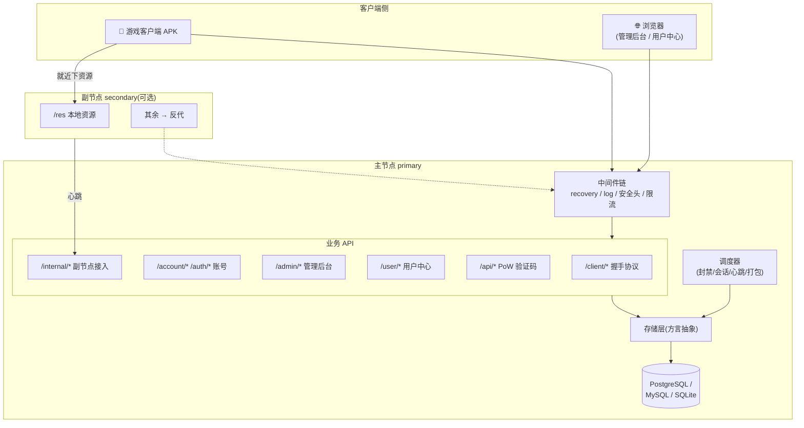
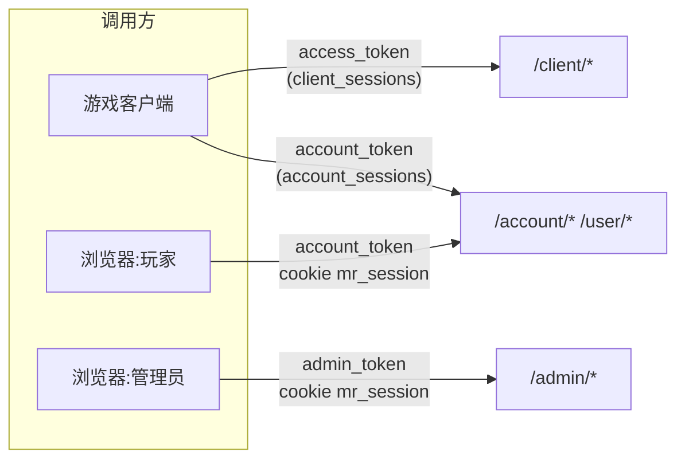

# 系统总览

本章面向**想理解系统如何运作**的人 —— 进阶运维、初级贡献者,或单纯好奇。不要求会 Go,但会涉及一些实现概念。

## 一张图看懂

## 五个关键设计决策

理解这五点,就理解了这个项目的"性格":

### 1. 客户端不可信,判断在服务端

客户端是装在玩家手机上的 APK,可以被反编译、改包、抓包。所以**所有安全判断都在服务端**:版本能不能玩、是否被封、签名对不对、渠道合不合法。客户端只是个"汇报者 + 执行者"。

### 2. 单二进制 + 一个数据库

没有 Redis、没有消息队列、没有微服务。一个 Go 二进制 + 一个数据库就是全部。限流用进程内令牌桶,心跳用进程内 map,验证码自带 PoW。**刻意把部署复杂度压到最低**,代价是水平扩展时需要改造(见各机制的"扩展"小节)。

### 3. 一套代码三种数据库

通过**方言抽象**(`Dialect` 接口),同一套业务 SQL 适配 PostgreSQL / MySQL / SQLite。业务代码统一用 `?` 占位符,存储层按方言改写(PG 转 `$N`)、生成不同的 UPSERT 语法。详见 [存储层与多方言](/contributing/store-dialects)。

### 4. 协议字段以客户端 Java 源码为唯一真理

`/client/*` 响应的每个字段名、嵌套层级、空值处理都**严格对齐客户端 Java 代码**。比如可选字符串字段为空时必须**省略 key**(不能发 JSON `null`,否则 Android `org.json` 的 `optString` 会拿到字符串 `"null"`)。这类约束有一整套保真测试守护。详见 [协议保真原则](/contributing/protocol-fidelity)。

### 5. 配置即时生效,无需重启

运行配置存数据库的 `config` 表,客户端**下次握手即读到新值**。运维改维护状态、版本白名单、镜像列表都不打断服务。环境变量只承载"部署级"的东西(数据库地址、密钥、安全闸门)。

## 三类入口,三套会话

服务端同时服务三类调用方,各有独立的会话体系:

- **client_sessions** — 客户端握手期 access_token,不绑定账号,默认 7 天。
- **account_sessions** — 玩家会话,游戏与网页共用,默认 30 天,**滑动续期**。
- **admin_sessions** — 管理员会话,默认 7 天。

详见 [三套会话体系](./sessions)。

## 代码结构映射

| 目录 | 职责 | 本章相关页 |
|---|---|---|
| `cmd/node` | 节点装配:`runBusiness`(DB + 全部 API + 调度器 + 静态)/ `runEdge`(资源分发);均挂管控 WS | [请求生命周期](./request-lifecycle) |
| `cmd/panel` | 面板:节点注册表(SQLite)+ WS 管控连接器 + 管理 API/WebUI | [多节点协调](./multi-node) |
| `internal/api/client` | `/client/*` 6 个握手接口 | [客户端握手协议](./client-protocol) |
| `internal/api/{account,user,admin,captcha,setup}` | 各业务域 | [三套会话](./sessions) |
| `internal/{control,directory,panelstore}` | 面板↔节点管控 / 签名目录 / 面板存储 | [多节点协调](./multi-node) |
| `internal/store` | 方言抽象 + 全部 SQL | [数据模型](./data-model) |
| `internal/{auth,middleware}` | 哈希/令牌/鉴权/限流 | [安全机制](/security/) |
| `internal/{scheduler,packer,capworker,proxy}` | 后台任务 / 打包 / PoW / 反代 | [贡献者指南](/contributing/) |

## 继续阅读

1. [请求生命周期](./request-lifecycle) — 一个请求从进来到响应经过什么
2. [客户端握手协议](./client-protocol) — 最核心的 `/client/init`
3. [多节点协调](./multi-node) — 主副节点怎么协作
4. [三套会话体系](./sessions) — 三类调用方的鉴权
5. [数据模型](./data-model) — 全部表与关系
