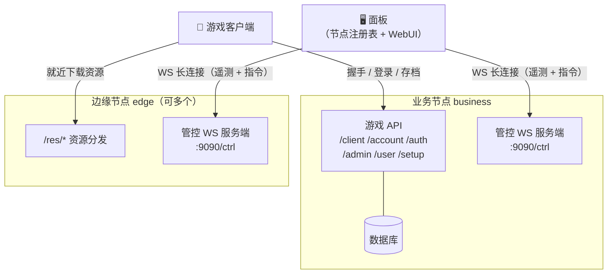
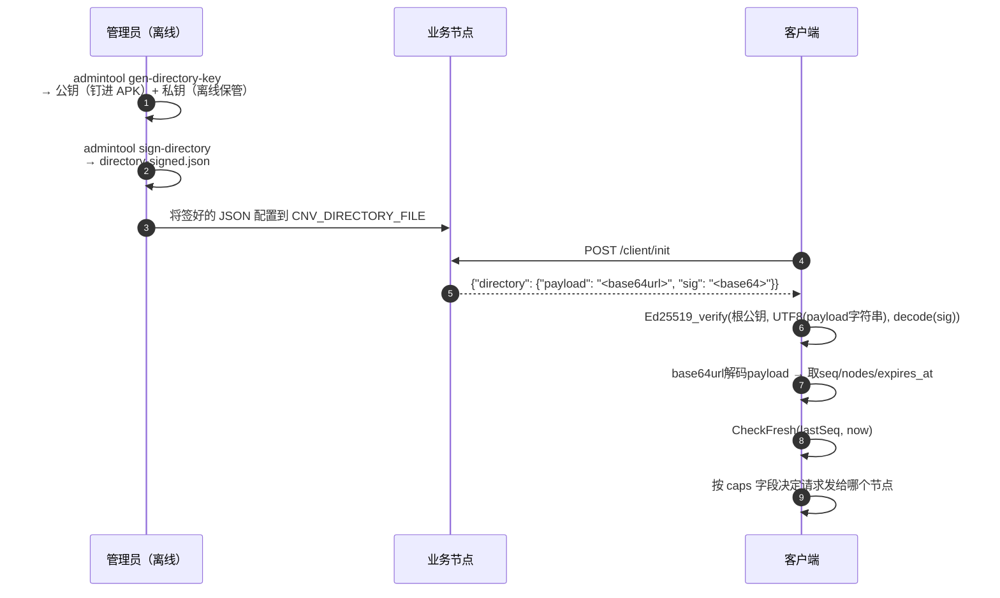
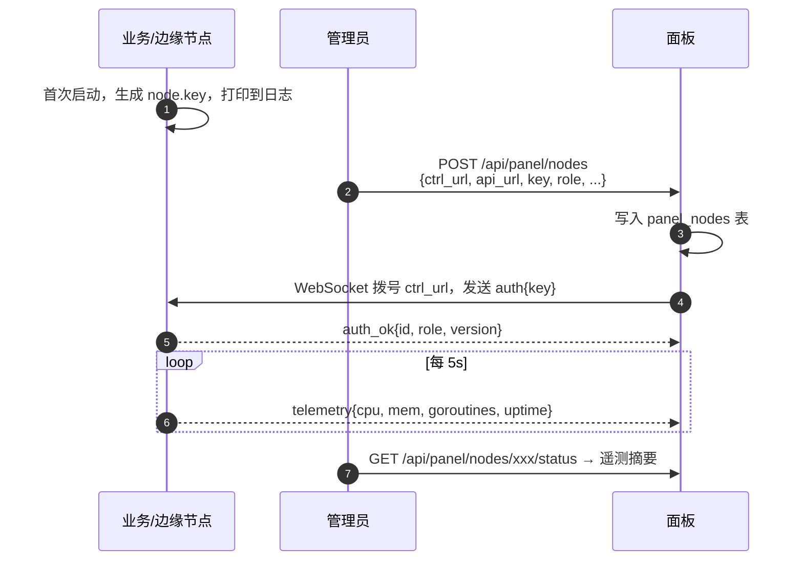
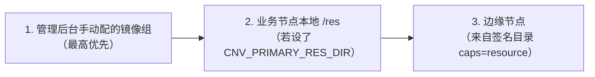

# 多节点协调

面板与各节点如何协作。本页讲机制（为什么这么设计）；部署操作见 [节点与面板](/self-host/nodes)。

## 设计目标

新架构参照 MCSManager 的面板↔守护进程模型，解决两个核心问题：

1. **资源下载流量分摊**：边缘节点就近分发，减轻业务节点压力。
2. **客户端多节点发现的安全性**：不硬编码节点地址（改包者可篡改），而是钉 Ed25519 公钥（私钥不在任何线上节点），目录签名保护地址完整性。

## 角色边界



## 管控通道（面板↔节点）

面板主动拨号到节点的 WebSocket 管控端点（`/ctrl`），建立后：

- **节点 → 面板**：每 5 秒推遥测（CPU、内存、Goroutine 数、运行时间）。
- **面板 → 节点**：下发指令（重启、GC、轮换密钥等），等待回执（按 `id` 关联）。
- 节点断线后面板每 30 秒重试连接。

这条通道用**节点自持密钥**鉴权：节点首次启动生成随机密钥，管理员将密钥复制到面板注册表，面板持有副本用于拨号。节点被击穿也签不出新密钥——密钥生成在节点进程内，私钥不在任何配置文件中传递。

## 客户端节点发现（签名目录）

游戏客户端在 `/client/init` 握手时，业务节点可附带**已签名的节点目录**。安全模型：



### 签名格式（JWS 风格）

目录采用 JWS 风格签名：签名覆盖 **base64url 编码后的字符串字节**，而非裸 JSON 字节。

```
payload = base64url( UTF-8( 紧凑JSON{seq,issued_at,expires_at,nodes} ) )  // 无 = 填充
sig     = Ed25519_sign( 私钥, UTF-8( payload字符串 ) )                     // 签字符串本身
```

客户端验签时不需要重序列化 JSON，彻底消除跨语言字段顺序 / `omitempty` / `<>&` 转义 / 数字格式的对齐问题。

下发格式（`/client/init` 响应中的 `directory` 字段）：

```json
{
  "payload": "<base64url(UTF-8(紧凑JSON))，无=填充>",
  "sig":     "<standard_base64(Ed25519签名)>"
}
```

关键安全特性：

| 特性 | 机制 |
|---|---|
| **防伪造** | 私钥离线，节点与面板均不持有；攻击者无法生成合法签名 |
| **防回滚** | `seq` 单调递增；客户端拒绝 seq < 已知值的目录 |
| **防长期利用** | `expires_at` 强制刷新；过期目录被拒 |
| **最小权限** | `caps` 字段锁定凭证类请求（login/account/save）只发声明了对应能力的节点 |

## 节点注册与发现流程



## 客户端下载源优先级

业务节点把各来源合并成 `groups` 下发给客户端，**顺序即优先级**：



客户端按组尝试下载，失败自动回退。管理员还可通过 `/admin` 给指定设备手动换线。

## 安全边界

- **面板被击穿**：攻击者能操控已注册节点（发指令、改注册表），但**无法伪造节点目录**——签名私钥不在面板。  
- **节点被击穿**：攻击者得到节点密钥，能以该节点身份接受面板指令，但**无法影响其它节点或面板数据库**——节点间相互隔离。  
- **目录被篡改**（中间人）：客户端用钉扎的公钥验签，任何改动都会导致签名校验失败，请求被拒。

## 扩展性

- 边缘节点可水平扩展（纯资源分发，无状态）。
- 业务节点当前是单节点模型（DB、限流桶、内存心跳表均在进程内）。
- 多业务节点高可用需要：限流换 Redis、会话存储已在 DB（天然共享）。对私服规模，单业务节点足矣。
