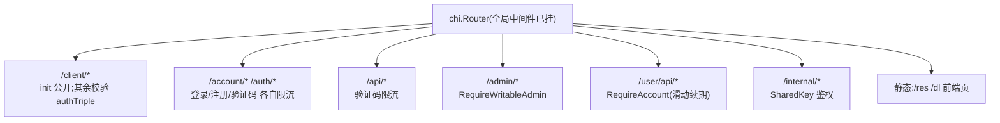
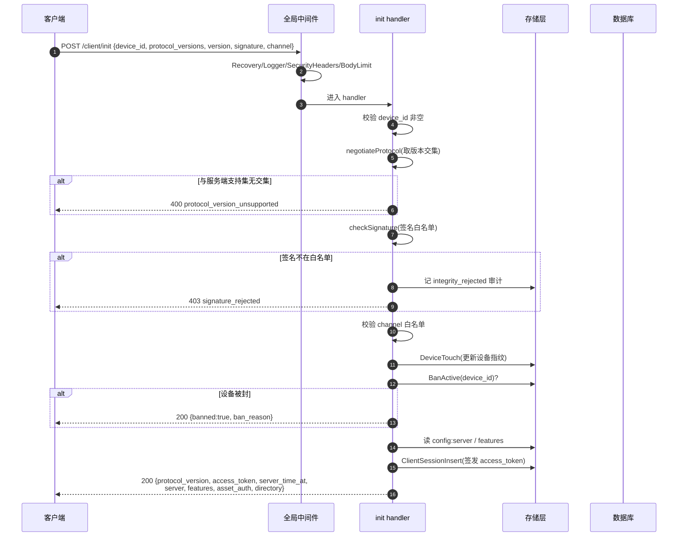
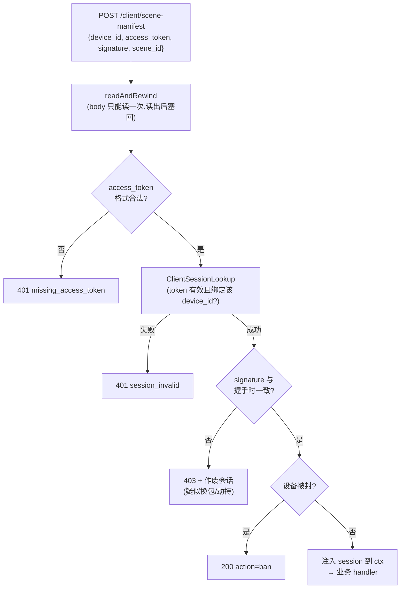

# 请求生命周期

一个 HTTP 请求从进入主节点到返回响应,经过哪些环节。理解这条链,改任何接口都有底。

## 中间件链

主节点在 `cmd/node/main.go` 里装配路由。**全局中间件**对每个请求生效,顺序如下:

| 中间件 | 作用 |
|---|---|
| `Recovery` | 捕获任何 panic,转成 500 + 结构化日志(含栈),保证单个请求崩溃不拖垮进程 |
| `Logger` | 每请求一行 INFO:方法、路径、状态码、字节数、耗时、来源 IP |
| `SecurityHeaders` | 注入 `X-Frame-Options`、`X-Content-Type-Options`、`Referrer-Policy`、CSP;TLS 下加 HSTS |
| `BodyLimit(8 MiB)` | 全站请求体上限,防超大 body 撑爆内存。客户端 `/client/*` 另有 1 MiB 内限 |

## 路由分组与各自的"门禁"

不同路由组挂不同的限流和鉴权中间件:

- `/client/init` 是**公开**的(握手起点),但内部做签名/渠道/版本校验。其余 `/client/*` 端点用 `requireClientSession` 校验 authTriple(`device_id` + `access_token` + `signature`)。
- `/admin/*` 默认要求**可写管理员**;`/admins/*` 子路由额外要求超管。
- `/user/api/*` 要求玩家会话,并在中间件里做**滑动续期**。
- `/internal/*` 用副节点共享密钥鉴权(等时比较)。

## 一个握手请求的完整旅程

以最核心的 `POST /client/init` 为例:

注意几个**刻意的协议约定**:

- **协议版本协商排在最前面**,早于签名与封禁判定。双方连"用哪套线格式说话"都没谈拢时,后面的字段谁也不该解读。无交集时握手终止,**客户端不得降级**。
- **封禁返回 HTTP 200**,把状态放在 body 的顶层 flag 里。封禁是正常的业务结果而非请求错误,客户端要读到 `ban_reason` 与 `expire_time` 才能提示玩家;用 4xx 会让"被封禁"和"请求写错了"在客户端看来是同一件事。
- 校验顺序:协议版本 → 签名 → 渠道 → 封禁 → 才签发会话。任何一关不过就提前返回,不签 token。
- **APK 版本闸门(`allowed_versions` / `force_update` / `update_url_*`)已移除**,`config.versions` 不再被 `/client/*` 读取。

详见 [客户端握手协议](./client-protocol)。

## authTriple:握手后的请求如何鉴权

`/client/init` 之后的端点(`heartbeat`、`scene-manifest`)都要带 **authTriple**:

关键深度防御:**后续请求的 signature 必须与握手时写入会话的那个一致**。会话存续期间它不该变;若变了,说明会话被劫持或客户端被换包,直接作废会话。

> 这条对 Android 端强度最高(APK 签名证书在单次安装期不可能变)。Web 客户端整个跑在玩家浏览器里,**没有不可绕过的完整性凭据**——它在那里是一致性检查,不是安全边界。

这里还有个工程细节:`http.Request.Body` 只能读一次,但中间件要读 body 取 authTriple、业务 handler 又要再读一次解析完整参数。解决办法是 `readAndRewind` 把 body 读进内存再塞回一个可重读的 reader。

## 响应统一出口

所有响应走 `internal/api/respond` 包,保证形状一致:

| 函数 | 用途 |
|---|---|
| `respond.OK(w, data)` | 成功,`{success:true, ...data}` |
| `respond.OKRaw(w, map)` | 成功但要精确控制顶层字段(如握手响应) |
| `respond.Fail(w, status, code, msg)` | 失败,`{success:false, error:{code, message}}` |
| `respond.JSON(w, status, v)` | 任意状态码 + 任意结构 |

这层统一让客户端永远能用同一套逻辑解析成功/失败。

## 优雅关闭

进程监听 `SIGINT`/`SIGTERM`。收到后:

1. `http.Server.Shutdown` 停止接收新连接,给在途请求最多 10 秒收尾。
2. 调度器的 context 被取消,各后台 goroutine 退出。

不会粗暴中断在途请求。
