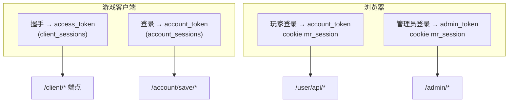
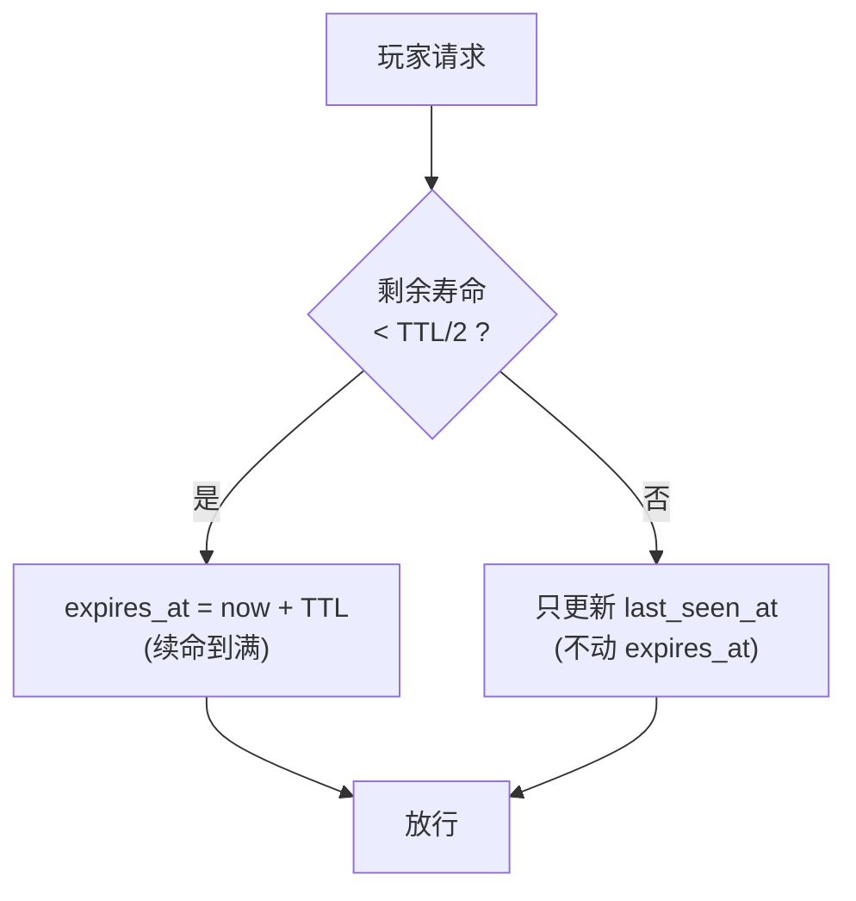
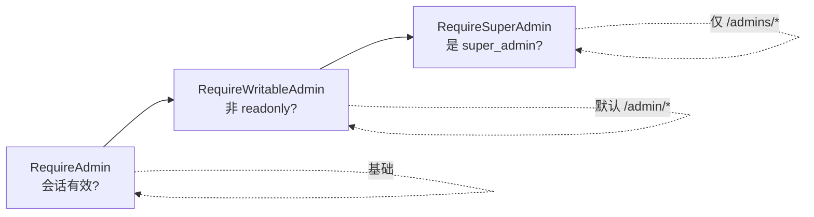

# 三套会话体系

服务端同时服务三类调用方,各有**完全独立**的会话存储与鉴权流程。理解三者区别是读懂鉴权代码的前提。

## 三套会话对比

| | client_sessions | account_sessions | admin_sessions |
|---|---|---|---|
| 谁用 | 游戏客户端握手 | 玩家(游戏 + 网页) | 管理员(后台) |
| 凭据 | `access_token` | `account_token` | `admin_token` |
| 传递方式 | authTriple(body) | cookie `mr_session` 或 Bearer | cookie `mr_session` |
| 默认 TTL | 7 天 | 30 天 | 7 天 |
| 滑动续期 | 否 | **是** | 否 |
| 绑定 | device_id + signature | account_id | admin_id |
| 签发处 | `/client/init` | `/account/login`、`/auth/*` | `/auth/login` |



## 为什么分三套

- **client_session 不绑账号**:握手发生在玩家登录**之前**(开 APK 就握手,可能还没登录)。它只认设备 + 签名,管的是"这个客户端能不能跟服务器对话"。
- **account_session 跨端共用**:同一个玩家 token 在游戏内(`/account/save/*`)和网页用户中心(`/user/api/*`)都用,所以 TTL 长(30 天)且滑动续期,实现"记住登录"。
- **admin_session 独立且短**:后台权限大,TTL 短(7 天),不滑动续期,降低被盗风险。

## Token 形态

三种 token 都由 `auth.NewToken()` 生成:**32 字节密码学随机数,hex 编码成 64 字符**。校验先过 `IsWellFormedToken`(长度 64 + 仅 `[0-9a-f]`),再查库。

```go
// 形如: "a3f1c2d4...(共 64 个 hex 字符)"
func NewToken() (string, error) {
    b := make([]byte, 32)
    rand.Read(b)
    return hex.EncodeToString(b), nil
}
```

## 玩家会话:滑动续期

这是 account_session 的特色。每次玩家命中 `/user/api/*` 或 `/account/save/*`,中间件调用 `AccountSessionTouch`:



效果:

- **活跃玩家永不掉线** —— 只要在 TTL 一半内有访问,过期时间就被推满。
- **减少数据库写** —— 不是每次访问都写库,只在跨过半 TTL 阈值时才续。
- **不活跃自然过期** —— 30 天不来,会话失效。
- **风险点**:被盗 token 持续使用也会自动续命,所以 TTL 不宜过长(默认 30 天是平衡点)。

实现细节(单条 SQL 用 `CASE WHEN`,三方言通用)见 [会话与令牌](/security/sessions-tokens) 与 [存储层与多方言](/contributing/store-dialects#滑动续期的-sql)。

## 鉴权中间件

| 中间件 | 保护 | 行为 |
|---|---|---|
| `requireClientSession` | `/client/*`(除 init) | 校验 authTriple + signature 一致性 + 封禁 |
| `RequireAccount` | `/user/api/*` | 校验玩家会话 + 滑动续期 + 账号未停用 |
| `RequireAdmin` | (基础) | 校验管理员会话有效 |
| `RequireWritableAdmin` | `/admin/*` | 在 `RequireAdmin` 上加:拒绝 `readonly` 角色 |
| `RequireSuperAdmin` | `/admins/*` | 仅 `super_admin` |

管理员的三个中间件是叠加关系:



中间件把鉴权结果通过 context 往下传,handler 用 `AdminFrom(ctx)` / `AccountFrom(ctx)` / `AccountTokenFrom(ctx)` 取出,彼此隔离(不同 ctxKey)。

## Cookie 安全属性

网页端(玩家 / 管理员)用统一的 `mr_session` cookie:

```go
http.SetCookie(w, &http.Cookie{
    Name:     "mr_session",
    Value:    token,
    Path:     "/",
    HttpOnly: true,                       // 防 XSS 读取
    Secure:   r.TLS != nil,               // 仅 HTTPS 传输
    SameSite: http.SameSiteStrictMode,    // 防 CSRF
    MaxAge:   int(ttl.Seconds()),
})
```

三个属性各挡一类攻击:`HttpOnly` 挡 XSS 窃取,`Secure` 挡明文窃听,`SameSite=Strict` 挡 CSRF。

## Token 提取优先级

网页中间件按此顺序取 token:

1. cookie `mr_session`(浏览器场景)
2. `Authorization: Bearer <token>`(API/调试场景)

客户端的 authTriple 则直接从请求 body 取 `access_token`,带 `X-*` 头兜底。

## 强制下线

几类操作会主动删会话:

| 操作 | 影响 |
|---|---|
| 玩家改密码 | 删该账号**其它**设备的会话(当前设备保留) |
| 找回密码成功 | 删该账号/管理员**全部**会话 |
| 客户端 signature 中途变化 | 作废该 client_session(疑似换包) |
| 管理员登出 | 删该 admin_session + 清 cookie |
| 账号被停用 | 鉴权时直接拒(`account_disabled`) |

会话过期清理由调度器的"会话 GC"任务周期执行(默认 300s)。
