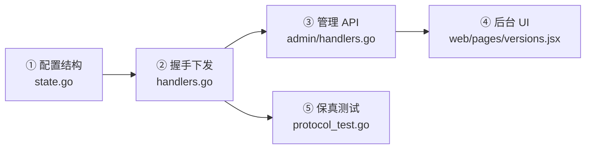
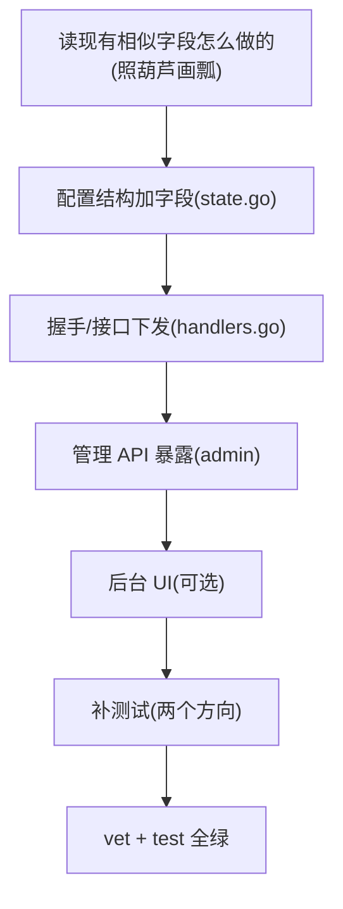

# 动手:新增一个接口

跟着走一遍完整流程,你就掌握了在这个项目里加功能的套路。我们以一个**真实改动**为例:在 `/client/init` 响应里新增一个 `latest_version` 软提示字段(这正是仓库里已合并的一个 commit)。

## 目标

让管理员能配一个"最新版本号",握手时下发给客户端做软更新提示。涉及四处:



一个"端到端"的字段,通常就这五处。下面逐步做。

## ① 配置结构:让服务端能读到这个值

`/client/init` 的版本相关配置在 `internal/api/client/state.go` 的 `versionCfg`。加一个字段:

```go
type versionCfg struct {
    AllowedVersions       []string `json:"allowed_versions"`
    LatestVersion         string   `json:"latest_version"`   // [+] 新增
    FakeVersion           string   `json:"fake_version"`
    // ... 其余不变
}
```

这个结构对应 `config` 表里 `versions` 键的 JSON。加个字段就能读到,**不用改数据库 schema** —— 这是 KV 配置表的好处。

## ② 握手下发:把值放进响应

`internal/api/client/handlers.go` 的 `init` handler 里,`client` 对象的组装处:

```go
clientObj := map[string]any{"allowed_versions": ver.AllowedVersions}
putIfNonEmpty(clientObj, "latest_version", ver.LatestVersion)   // [+] 新增
putIfNonEmpty(clientObj, "update_url_normal", ver.UpdateURLNormal)
// ...
```

::: warning 必须用 putIfNonEmpty
可选字符串字段**为空时要省略 key**,绝不能发 JSON `null`(Android `org.json` 的 `optString` 会把 null 读成字符串 `"null"`)。`putIfNonEmpty` 帮你做这件事。这是 [协议保真原则](./protocol-fidelity) 的硬约束。
:::

## ③ 管理 API:让后台能读写这个值

后台通过 `/admin/versions` 读写配置。在 `internal/api/admin/handlers.go` 的 `versionsCfg` 加同名字段,并在 `versionsGet` 响应里带上:

```go
type versionsCfg struct {
    AllowedVersions []string `json:"allowed_versions"`
    LatestVersion   string   `json:"latest_version"`   // [+] 新增
    // ...
}

func (h *Handler) versionsGet(w http.ResponseWriter, r *http.Request) {
    // ...
    respond.JSON(w, http.StatusOK, map[string]any{"success": true,
        "allowed_versions": c.AllowedVersions,
        "latest_version":   c.LatestVersion,   // [+] 新增
        // ...
    })
}
```

`versionsPut` 用同一个 `versionsCfg` 反序列化,所以**写入会自动带上新字段**,不用额外改。

## ④ 后台 UI:给运营一个输入框

`web/pages/versions.jsx` 加一个输入项(React,改完刷新浏览器即生效):

```jsx
<div className="field">
  <label className="field-label">最新版本号(软提示)</label>
  <input className="input mono" placeholder="例如 4.1.0"
    value={draft.latest_version || ""}
    onChange={(e) => setDraft({ ...draft, latest_version: e.target.value })}/>
  <div className="field-hint">下发后客户端按渠道决定是否提示更新。留空则不提示。</div>
</div>
```

## ⑤ 保真测试:锁住行为

在 `internal/api/client/protocol_test.go` 补两个方向的测试:

```go
// 配了就下发
func TestInit_LatestVersion_DownsendsWhenSet(t *testing.T) {
    h, st := newTestHandler(t)
    srv := newRouter(h)
    _ = st.ConfigSet(context.Background(), "versions", map[string]any{
        "allowed_versions": []string{"4.0.0"},
        "latest_version":   "4.1.0",
    })
    resp := postJSON(t, srv, "/client/init", map[string]any{
        "version": "4.0.0", "device_id": "dev_lv", "signature": "", "channel": "normal",
    })
    clientObj := resp["client"].(map[string]any)
    if clientObj["latest_version"] != "4.1.0" {
        t.Errorf("want 4.1.0, got %v", clientObj["latest_version"])
    }
}

// 没配就省略
func TestInit_LatestVersion_OmittedWhenUnset(t *testing.T) {
    h, _ := newTestHandler(t)
    srv := newRouter(h)
    resp := postJSON(t, srv, "/client/init", map[string]any{
        "version": "4.0.0", "device_id": "dev_lv2", "signature": "", "channel": "normal",
    })
    clientObj := resp["client"].(map[string]any)
    if _, has := clientObj["latest_version"]; has {
        t.Errorf("should be omitted when unset")
    }
}
```

## 跑测试 + 自检

```bash
go test ./internal/api/client/ -run TestInit_LatestVersion -v
go vet ./...
go test ./...
```

全绿,这个端到端的字段就完成了。

## 套路总结



**最重要的一条:照着旁边已有的字段抄。** 这个项目里相似的字段(`update_url_normal`、`update_apk_sha256`…)都已经按规范实现过,模仿它们的写法是最快也最不容易出错的路径。

## 如果是加一个新端点(而非字段)

流程类似,多两步:

1. 在对应 `Handler` 加方法 `func (h *Handler) myEndpoint(w, r)`。
2. 在 `Routes(r chi.Router)` 注册 `r.Post("/my-endpoint", h.myEndpoint)`。
3. 需要鉴权就放进对应的中间件路由组(看 `cmd/node/main.go` 现有分组)。
4. 用 `respond.OK/Fail/OKRaw` 统一出口。
5. 写测试。

读一个现成的简单端点(比如 `client` 包的 `methodSelect`)作模板即可。下一步看 [代码规范](./conventions)。
