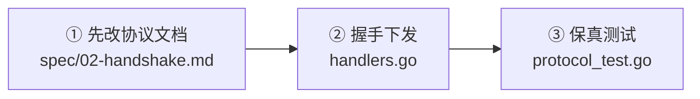
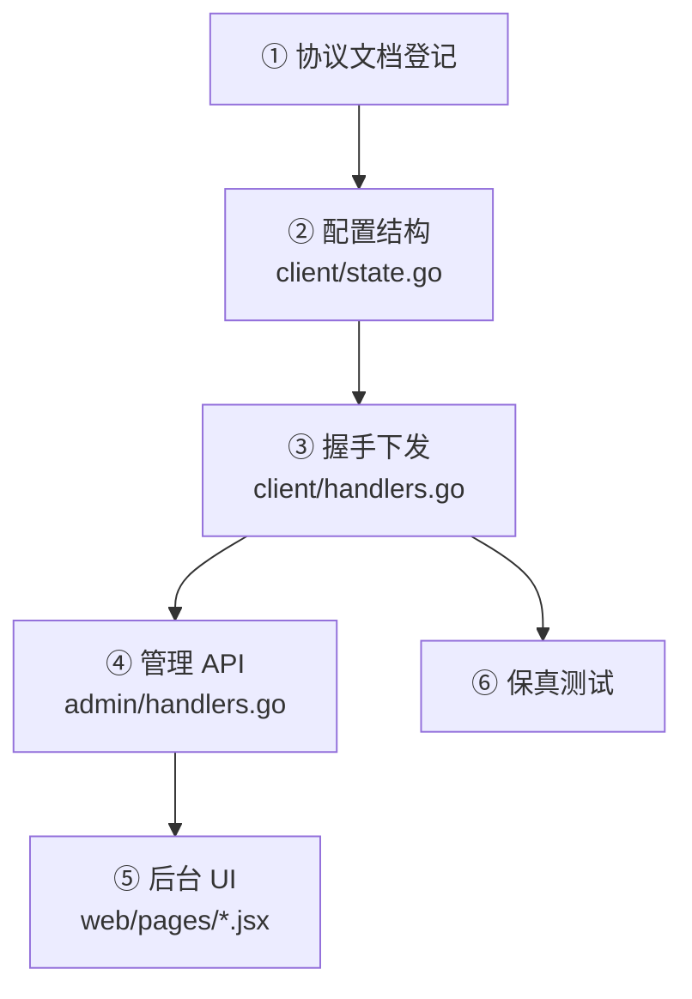

# 动手:新增一个接口

跟着走一遍完整流程,你就掌握了在这个项目里加功能的套路。我们以一个**真实改动**为例:
在 `/client/init` 响应里新增 `server_time_at`,让客户端能校正自己的时钟偏移。

## 目标

握手时下发服务端的 Unix 秒。涉及三处:



::: danger 第 ① 步不能跳过
线格式的唯一真理是**架构协议文档**,不是代码。先在文档里登记这个字段
(名字、类型、单位、可选性、状态标记),再写实现。

顺序反过来会得到一份"文档描述 A、实现是 B"的协议,而两侧的实现者只会读文档。
若那一项在文档里是 **🚧 保留**,先去把它定掉,**不要自行发挥**。
:::

不是所有字段都要走满这条链。带管理后台配置的字段会更长(见文末),而
`server_time_at` 直接取自系统时钟,不需要配置项。

## ① 协议文档:登记字段

在协议文档的握手篇里写清楚:

```
| 字段 | 类型 | 必填 | 说明 |
| `server_time_at` | int64 | 是 | 服务端 Unix **秒**,供客户端校正时钟偏移 |
```

单位一定要写明。`/client/init` 的响应里同时存在秒和毫秒两种时间字段
(`asset_auth.expires_at` 是毫秒),不写单位必然有人读错。

## ② 握手下发:把值放进响应

`internal/api/client/handlers.go` 的 `init` handler,响应体组装处:

```go
body := map[string]any{
    "success":           true,
    "banned":            false,
    "protocol_version":  negotiated,
    "protocol_versions": SupportedProtocolVersions(),
    "access_token":      accessToken,
    "server_time_at":    time.Now().Unix(),   // [+] 新增
    "server":            srvObj,
    "features":          featuresObj,
}
```

::: warning 可选字符串必须用 putIfNonEmpty
`server_time_at` 是必有的数值字段,直接写即可。但**可选字符串字段为空时要省略 key**,
绝不能发 JSON `null`——"缺席"与"为空"在客户端是两种不同的判断。用
`putIfNonEmpty` / `putIfNonZero` 帮你做这件事,见 [协议保真原则](./protocol-fidelity)。
:::

## ③ 保真测试:锁住行为

在 `internal/api/client/protocol_test.go` 里断言它存在且合理:

```go
if ts, ok := resp["server_time_at"].(float64); !ok || ts <= 0 {
    t.Errorf("server_time_at 应为正的 Unix 秒, got %v", resp["server_time_at"])
}
```

**带配置的字段要测两个方向**:配了就下发、没配就省略。
`TestInit_OmitsEmptyOptionalStrings` 是后一个方向的模板。

**删字段时要补反向断言**,而且要**先把对应配置种进库再断言它不出现**——
这样证明的是"配置存在也不下发",而不是"恰好没配所以看不见"。
`TestInit_ResponseShape` 就是这么写的。

## 跑测试 + 自检

```bash
go test ./internal/api/client/ -run TestInit -v
go vet ./...
go test ./...
```

再实机核对一次:起一个节点,用 `curl` 打一发 `/client/init`,看响应是不是你以为的
样子。单元测试断言的是你写下的期望,实机跑的是真实的编解码路径与配置加载。

## 带管理后台配置的字段

如果新字段的值来自管理员配置,链路更长:



以 `features.disabled_message` 为例:

**② 配置结构** —— `internal/api/client/state.go` 的 `featuresCfg` 对应 `config` 表里
`features` 键的 JSON。加个字段就能读到,**不用改数据库 schema**——这是 KV 配置表的好处。

```go
type featuresCfg struct {
    AccountEnabled  bool   `json:"account_enabled"`
    DisabledMessage string `json:"disabled_message"`
}
```

**④ 管理 API** —— `internal/api/admin/handlers.go` 里有一份**同名但独立**的结构。
读写都走它,`Put` 用同一个结构反序列化,所以写入会自动带上新字段。

::: tip 两份结构是有意分开的
`client` 包读的是"下发给客户端要什么",`admin` 包读的是"管理员能配什么"。
两者会分叉——比如 `versions` 这组配置管理后台仍可写,但 `/client/*` 已不再读取它。
合成一份会让"这个字段还下不下发"这个问题失去答案。
:::

**⑤ 后台 UI** —— `web/pages/*.jsx` 加输入项(React,改完刷新浏览器即生效)。

## 如果是加一个新端点(而非字段)

流程类似,多几步:

1. 在对应 `Handler` 加方法 `func (h *Handler) myEndpoint(w, r)`;
2. 在 `Routes(r chi.Router)` 注册;需要鉴权就放进 `requireClientSession` 的路由组;
3. 用 `respond.OK` / `Fail` / `OKRaw` 统一出口;
4. **能力未接入时明确报错,不要返回"看起来正常的空结果"**——参考
   `/client/scene-manifest` 在未接入构建管线时返回 503 而非空清单;
5. 写测试,含失败分支。

读一个现成的简单端点(比如 `client` 包的 `sceneManifest`)作模板即可。
下一步看 [代码规范](./conventions)。
