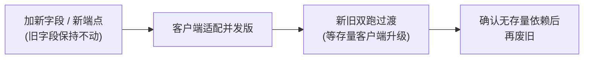

# 契约纪律与文档绑定

> **任何改 `/client/*`、`/account/*` 的人必读。** 这页是给**人类贡献者**的纪律说明；
> 给 AI Agent 的同等约束放在 `.claude/CLAUDE.md`（每个会话自动读取）。两者内容一致，只是受众不同。

客户端是**已签名、已分发**的 APK：字段名、解析逻辑、验签算法都**钉死在安装包里**，无法随服务端热改。所以服务端对"客户端能看到的东西"有一套硬纪律——破坏了，**线上真机就炸**，而你在服务端可能毫无察觉。

## 铁律一:只增不改

JSON 响应字段：

- **只可新增**，**不可删除 / 改名 / 改类型 / 改语义**。
- **新增字段必须可选**：客户端拿不到时要能按旧逻辑跑（客户端对所有新字段都做了"缺省即旧行为"）。
- 客户端对未知字段会安全忽略，但删改已有字段会让解析退化或直接报错。

任何线上契约变更走**先加新 → 双跑过渡 → 再废旧**，给已分发客户端留足升级窗口，**不得"一刀切"**：

## 哪些算"客户端可见契约"

凡是客户端正在解析并依赖的形状，都不可破坏。重点端点：

| 端点 | 关键字段（节选） |
|---|---|
| `/client/init` | `banned`/`ban_reason`、`force_update`、`access_token`、`server{...}`、`client{...}`、`features{...}`、`services{...}`、`contributors[]`、`directory{payload,sig}` |
| `/client/online-download` | `resource_token`、`groups[]{name,mirrors[]}`、兼容顶层平铺 `mirrors[]` |
| `/client/offline-package` | `download_url`、`package_version`、`sha256`（**不是** md5） |
| `/client/hot-update` | `js{version,sha256,download_url,size}`、`scenario{...}` |
| `/client/heartbeat` | 响应 `action`：`ok`/`switch_mirrors`/`ban`/`maintenance` |

字段从哪来、长什么样的"真理"在 `internal/api/client/handlers.go` + `state.go`，并由 `protocol_test.go` 守护。改之前先读 [协议保真原则](./protocol-fidelity)。

::: warning 可选字符串为空时省略 key，绝不发 `null`
加可选字符串用 `putIfNonEmpty`、可选整数用 `putIfNonZero`。这是最容易踩、后果最隐蔽的坑。
:::

## 签名节点目录纪律

若你改动 `/client/init` 下发的签名目录（`internal/directory/`）：

- **密钥 Ed25519，私钥永不上线**（离线 / CI Secret 签发）；公钥为 64 位小写十六进制，钉进 APK。
- 线格式 `{ "payload": "<base64url(紧凑JSON)>", "sig": "<base64(签名)>" }`；
  **签名覆盖的是 base64url 之后的 `payload` 字符串字节**，不是解码后的 JSON。
- `seq` 单调递增（防回滚）、`expires_at` 给合理 TTL。
- **能力分配是安全关键**：业务节点 `caps` 含 `init`/`login`/`account`/`save`；边缘节点 `caps` 仅 `resource`。
  **凭证类（login/account/save）绝不能指向只有 `resource` 的节点。**

详见 [节点与面板 · 签名节点目录](/server/self-host/nodes#签名节点目录)。

## 铁律二:代码与文档同提交

**改了客户端可见契约、或改了服务端代码结构（足以让文档描述失真）的代码，必须在同一个提交（或同一个 PR）里更新对应文档。** 分两类触发：

- **契约级**——改 `/client/*`、`/account/*` 的响应字段或语义 → 同步更新对应接口文档。这是双向纪律，还要**知会客户端侧**（他们要同步改解析 + 文档，可能还要发版），任一端单方面改 wire 格式都会炸。
- **结构级**——新增/删除/重命名包或入口（`cmd/*`、`internal/*`）、增删路由、改配置项 `CNV_*`、改 CLI 命令、改节点角色等，凡是会让文档描述对不上代码的，就要同步更新对应文档，如 [代码库导览](./codebase-tour)、[环境变量参考](/server/self-host/configuration)、[节点与面板](/server/self-host/nodes)、[架构总览](/server/architecture/)。

为了让这条纪律不靠"自觉"，仓库配了**两道只在不合规时才出声**的提醒：

| 面向 | 机制 | 行为 |
|---|---|---|
| **AI Agent** | `.claude/hooks/doc-binding-check.sh`（`PostToolUse` 钩子） | `git commit` 后，若本次提交 (a) 动了 `internal/api/client\|account/`，或 (b) 在 `cmd\|internal` 下新增/删除/重命名 `.go` 文件，却没动 `docs/`，向 Agent 发出提醒并要求补文档。 |
| **人类贡献者** | `.github/workflows/doc-binding.yml`（GitHub Action） | PR 上同口径比对改动；不合规则贴一条**会自我消除**的提醒评论。**不拦截合并**，纯提醒。 |

两者都**只在不合规时出声**，合规时完全静默。

::: tip 逃生通道
若本次改动确实**不涉及** `/client/*` 或 `/account/*` 的 wire 契约（纯内部重构、注释、日志等）：
- Agent：在 `git commit` 命令里带上 `skip-doc-check` 备注即可跳过钩子。
- PR：补上文档，或直接忽略评论（它不拦合并）。
:::

## 安全

- Ed25519 目录私钥、签名 keystore、资源令牌签发密钥**一律离线 / Secret**，不入库、不进日志。
- `access_token` / `resource_token` 要有有效期与撤销路径；跨节点校验一致。
- 资源/控制端点做**限流与防刷**（客户端会重试 + 心跳）。
- **不在响应 / 日志里回显敏感凭证。**

## 提交约定

- commit 信息**中文**，**一功能一 commit**，说清"改了什么、为什么"；触及安全/协议的改动在正文写明**风险与验证方式**。
- 格式照仓库历史：`<类型>(<范围>): <中文描述>`，见 [代码规范 · Commit 规范](./conventions#commit-规范)。
- **直接提交 `main`**：本仓库不走功能分支 / PR 流程，改动直接提交并推送 `main`。
- 不把任何模型标识写进 commit / 代码 / 入库产物。

## 提交前自查

- [ ] 改了 `/client/*`、`/account/*` 字段？→ 同提交更新了 `docs/` 对应页，且**只增没删改**。
- [ ] 改了代码结构（新增/删除/重命名包或入口、路由、`CNV_*` 配置、CLI 命令、节点角色）？→ 对应文档（codebase-tour / configuration / nodes / architecture）同步更新了？
- [ ] 新增字段是**可选**的？客户端拿不到能按旧逻辑跑？
- [ ] 改了签名目录？`seq` 递增了？`caps` 没把凭证能力给边缘节点？
- [ ] 涉及客户端可见契约？**知会客户端侧**了？
- [ ] 没把任何密钥 / 凭证写进代码、日志或提交？
