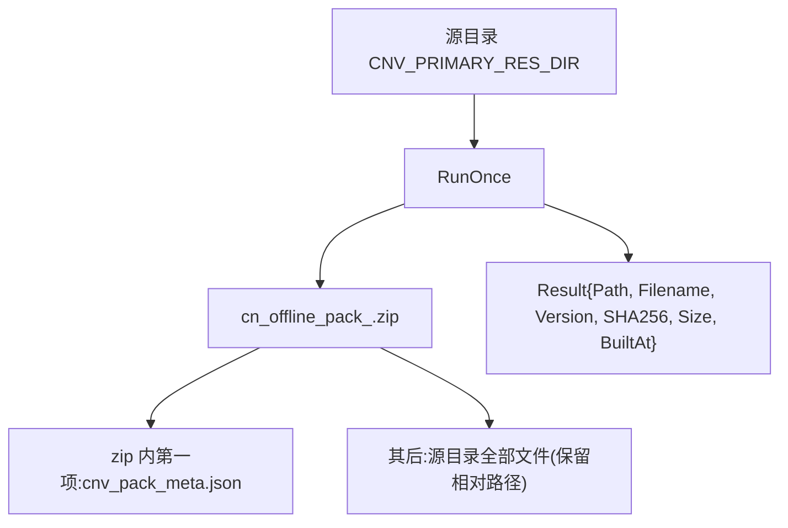
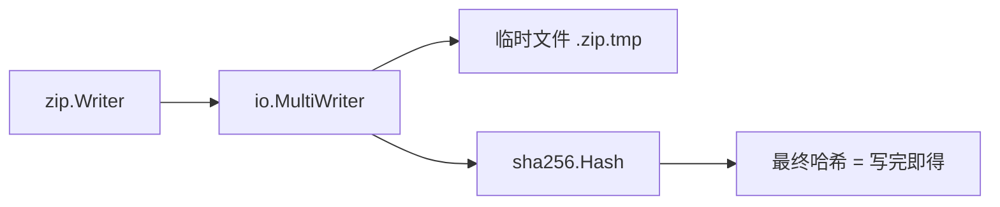
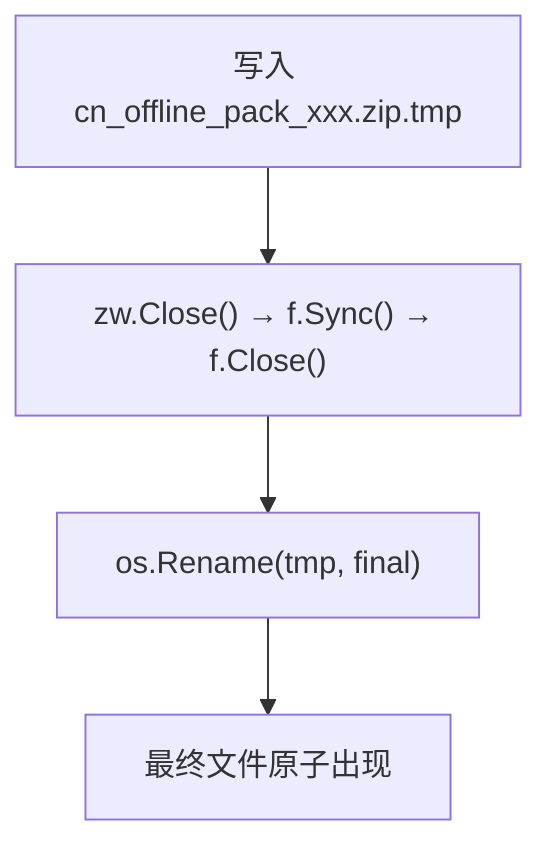
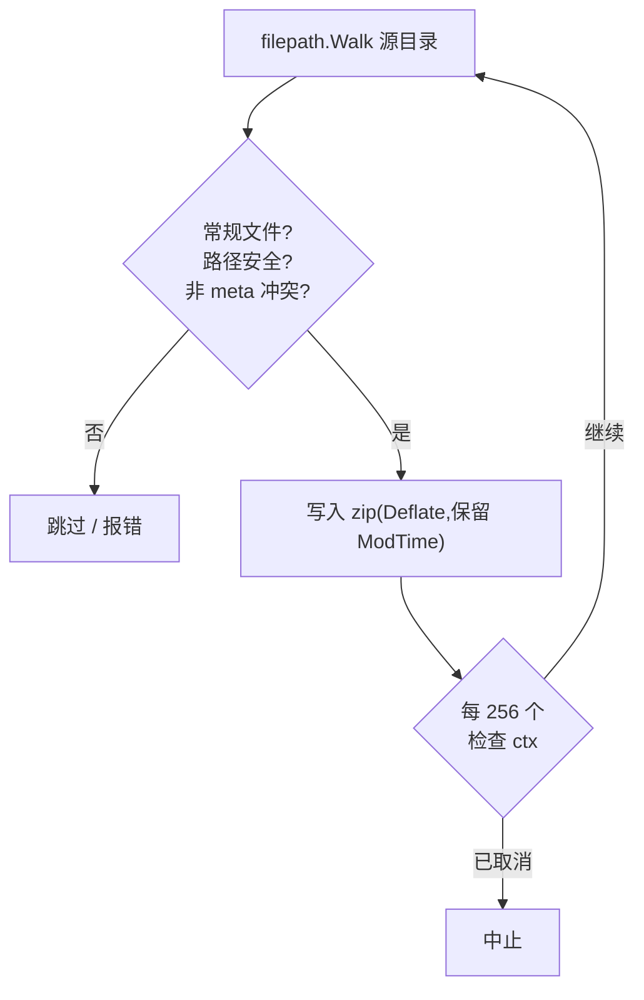
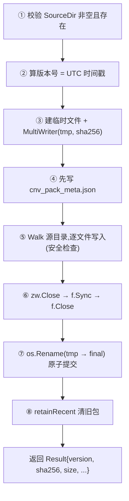

# 离线整包打包器

> **资深向**。涉及流式哈希、原子写、retention,以及为什么这些细节都重要。

`internal/packer` 把资源目录打成一个 zip(离线整包),供客户端一次性下载全部资源。可由管理后台手动触发(`/admin/auto-package/run`)或调度器周期跑(见 [调度器](./scheduler))。

## 产物结构



`Result` 返回产物的版本、哈希、大小,调度器据此写 `offline_package` 表。

| Result 字段 | 含义 |
|---|---|
| `Version` | `YYYYMMDDhhmm`(12 位,UTC 时间) |
| `SHA256` | zip 的 SHA-256(64 位小写 hex) |
| `Size` | zip 字节数 |
| `Filename` | `cn_offline_pack_<version>.zip` |

## 关键设计:流式写 + 边写边算哈希

打包可能涉及大量/大体积文件,**不能全读进内存**。用 `io.MultiWriter` 把数据同时写到临时文件和 SHA-256:



```go
h := sha256.New()
mw := io.MultiWriter(tmpFile, h)   // 一次写,两处收
zw := zip.NewWriter(mw)
// ... 写入文件 ...
// 写完 zw.Close() 后,h.Sum(nil) 就是整个 zip 的哈希
```

好处:**不需要打完再重新读一遍文件算哈希**,一趟搞定。

## 关键设计:原子写(临时文件 + rename)

打包不直接写最终文件名,而是写 `.tmp` 再 `os.Rename`:



为什么:

- **`os.Rename` 在同文件系统是原子的** —— 要么旧包,要么新包,不会出现"写到一半的半成品包"被客户端下到。
- 并发触发(手动 + 调度器同时)也不会损坏既有包。
- `f.Sync()` 先 fsync 落盘,再 rename,防掉电后留下损坏文件。

## 元数据放 zip 第一项

`cnv_pack_meta.json` 最先写进 zip 根目录:

```json
{
  "pack_version": "202505011230",
  "min_client_version": "4.0.0",
  "build_date": "2025-05-01T12:30:00Z",
  "description": "scheduled auto-package"
}
```

放第一项是为了**便于调试/校验** —— 不解压整个包就能读到元数据。

## 安全检查

打包时对每个文件做检查:

| 检查 | 原因 |
|---|---|
| 拒绝 `..` 路径跳出 | 防 zip 路径穿越 |
| 拒绝源目录里已存在 `cnv_pack_meta.json` | 防覆盖/伪造我们自己写的元数据 |
| 跳过目录与非常规文件(socket/device) | 只打常规文件 |
| 路径用 `filepath.ToSlash` | zip 内统一正斜杠,跨平台一致 |
| 每 256 个文件检查 `ctx` 取消 | 长打包可被优雅中断 |



## Retention:保留最近 N 份

打完后按 `RetainN` 清理旧包:

```go
func retainRecent(dir, prefix string, keep int) error {
    // 匹配 prefix_*.zip,按文件名倒序(= 时间倒序,因版本号是时间戳)
    // 删除排在 keep 之后的旧文件
}
```

因为文件名里嵌的是 `YYYYMMDDhhmm` 时间戳,**字典序倒序即时间倒序**,排序后保留前 `keep` 个即可。`RetainN <= 0` 表示不清理。

## RunOnce 全流程



## 测试覆盖(packer_test.go)

| 测试 | 验证 |
|---|---|
| `TestRunOnce_BuildsValidZipWithMeta` | 版本号格式、文件名、SHA-256 是 64 hex 且与磁盘一致、zip 内容含元数据 |
| `TestRunOnce_Retention` | 打 3 次 + `RetainN=2` → 最旧的被删,留最新 2 个 |
| `TestRunOnce_RefusesMetaCollision` | 源目录已有 `cnv_pack_meta.json` → 报错 |
| `TestRunOnce_MissingSource` | 源目录不存在/为空 → 报错 |

测试用 `Now` 字段注入固定时间(便于断言版本号),生产用 `time.Now().UTC()`。

## 改打包器的注意

- **保持原子写** —— 别为了"省一次 rename"直接写最终文件,会让客户端有概率下到半成品。
- **保持流式** —— 别 `io.ReadAll` 整个文件进内存,大资源会 OOM。
- 加元数据字段 → 同步更新 `metaJSON` struct 与测试断言。
- 路径处理 → 始终 `filepath.Rel` + `ToSlash`,别拼字符串。
