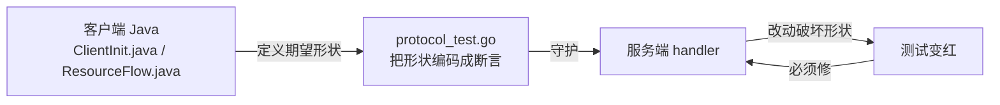
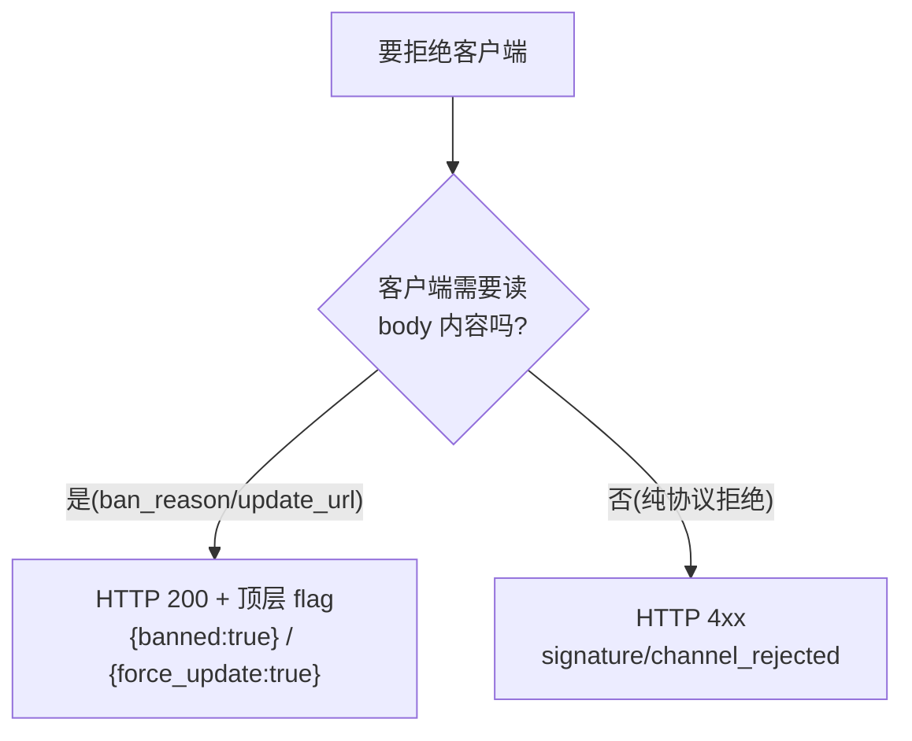
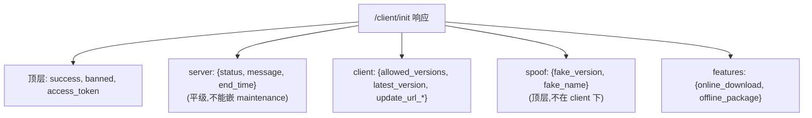
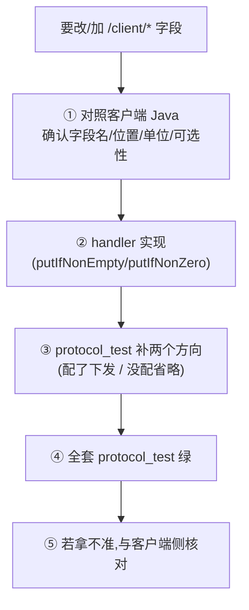

# 协议保真原则

> **资深向**,但**任何改 `/client/*` 的人必读**。一个字段名错位、一个 `null` 发错,真机就会崩或行为异常 —— 而你在服务端可能毫无察觉。

## 核心原则:客户端 Java 源码是唯一真理

`/client/*` 响应的每一个字段名、嵌套层级、空值处理,都**严格对齐客户端 Java 代码**。服务端不是"想怎么返回就怎么返回",而是**复刻客户端 `optString`/`optJSONObject` 期望的精确形状**。



对照表(`internal/api/client/handlers.go` 顶部注释也列了):

| 客户端 Java | 服务端端点 |
|---|---|
| `ClientInit.java` | `/init`、`/online-download`、`/offline-package`、`/hot-update`、`authTriple()` |
| `ResourceFlow.java` | `/heartbeat`(ban / switch_mirrors) |
| `SaveSyncHelper.java` | `/account/save/{put,get}` |

## 铁律一:可选字符串为空时省略 key,绝不发 null

这是最容易踩、后果最隐蔽的坑。

```mermaid
flowchart TB
    F["可选字符串字段为空"] --> WRONG["❌ 发 JSON null<br/>{\"update_url\": null}"]
    F --> RIGHT["✅ 省略整个 key<br/>{}"]
    WRONG --> BUG["Android org.json.optString<br/>把 null 读成字符串 'null'<br/>→ 客户端拿到字面量 'null'"]
    RIGHT --> OK["optString 返回默认值('')<br/>→ 客户端正确处理'无值'"]
```

Android 的 `org.json` 对显式 `null`,`optString` 返回的是**字符串 `"null"`** 而非空串。于是客户端可能拿着 `"null"` 当 URL 去下载、当版本号去比较 —— 行为全错。

实现上用辅助函数:

```go
putIfNonEmpty(clientObj, "update_url_normal", ver.UpdateURLNormal)  // 空则不写 key
putIfNonZero(srvObj, "end_time", srv.EndTime)                       // 0 则不写 key
```

| 字段类型 | 处理 | 原因 |
|---|---|---|
| 可选字符串 | `putIfNonEmpty`(空则省略) | null/空串会被 optString 误读 |
| 可选整数(0 表"无") | `putIfNonZero` | 0 是"无估计时间"的语义 |
| bool | 直接写 | `false` 是合法业务值,不能省 |
| 必有字段 | 直接写 | — |

`protocol_test.go` 有 `TestInit_OmitsEmptyOptionalStrings` 专门守这条。

## 铁律二:业务拒绝用 HTTP 200,不用 4xx

客户端的 `Net.postJson` 对 HTTP ≥400 会抛 `IOException`,**根本读不到 body**。所以凡是"需要客户端读 body 内容"的拒绝,必须用 200:



| 场景 | 状态码 | 为什么 |
|---|---|---|
| 设备封禁 | **200** `{banned:true, ban_reason, expire_time}` | 客户端要读封禁原因 |
| 版本不允许 | **200** `{force_update:true, update_url_*}` | 客户端要读更新地址 |
| 签名拒绝 | 403 `signature_rejected` | 纯协议拒绝,无需读 body |
| 渠道拒绝 | 403 `channel_rejected` | 同上 |

`TestInit_VersionNotAllowed_ReturnsForceUpdate` 专门断言版本闸门是 200 而非 403。**改这块时极易"顺手改对成 4xx",然后弄坏真机** —— 测试会拦住你。

## 铁律三:数值单位(毫秒 vs 秒)

- 数据库内统一存 **Unix 毫秒**。
- 下发给客户端的部分字段是 **Unix 秒**(客户端 Java 按秒解析,如 `BanInfo.java` 把 `expire_time` 当秒后 `*1000L`)。

```go
// 库里是毫秒,下发转秒
func banExpireSeconds(b *store.Ban) int64 {
    return *b.ExpireTime / 1000
}
```

`TestInit_BanReturns200WithBanFields` 甚至断言 `expire_time` 的数量级在 `1.7e9 ~ 2.0e9`(秒)而非毫秒。加时间字段时**先确认客户端按什么单位读**。

## 铁律四:嵌套位置精确

客户端用 `optJSONObject("server")` 之类按确切路径取值。字段放错层级,客户端就读不到:



`protocol_test.go` 里有断言:`server.message` 必须平级(`TestInit_ResponseShape` 会检查"不能有 `server.maintenance` 嵌套对象");`spoof` 必须在顶层而非 `client` 下。改结构前看清现有断言。

## authTriple 的 body 重读

`/client/*`(除 init)的鉴权中间件要读 body 取 authTriple,业务 handler 又要再读一次。但 `http.Request.Body` 只能读一次。解法:

```go
// readAndRewind:读进内存,再塞回一个可重读的 reader
body, _ := readAndRewind(r)   // 中间件用 body 解 authTriple
// ... r.Body 已被换成可重读的,handler 能再 Decode 一次
```

加新的需要鉴权的 `/client/*` 端点时,这套机制已经在中间件层处理好,你的 handler 正常 `ReadJSONAllowUnknown` 即可。

## 改协议的流程



1. **先读客户端 Java**,别凭感觉定字段名。拿不到源码时,参考文档或与客户端侧确认。
2. 实现时用对的辅助函数(空值处理)。
3. 测试覆盖"配了就下发"和"没配就省略"两个方向。
4. 跑 `go test ./internal/api/client/`,全绿才算数。

## 为什么这么严

服务端和客户端是**两个独立仓库、独立发版**。服务端改错一个字段,要等真机跑起来才暴露,而那时可能已经影响线上玩家。`protocol_test.go` 就是把"真机会不会崩"提前到 `go test` 阶段回答 —— 它绿,真机才稳。

**所以:改 `/client/*`,测试不绿不提交。**
