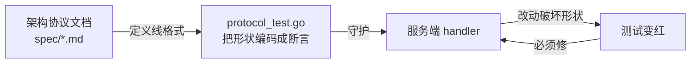
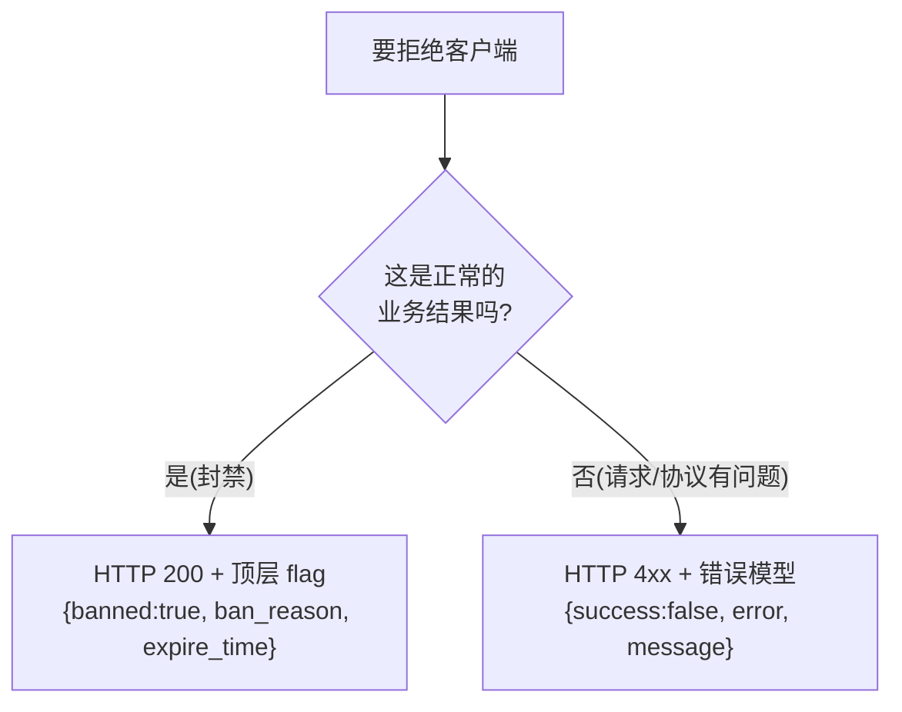
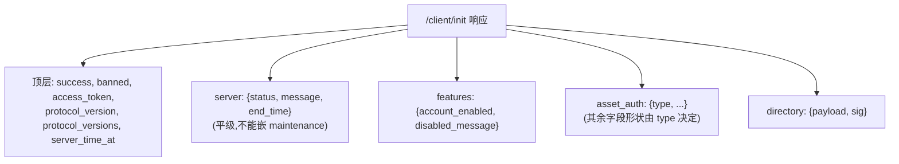
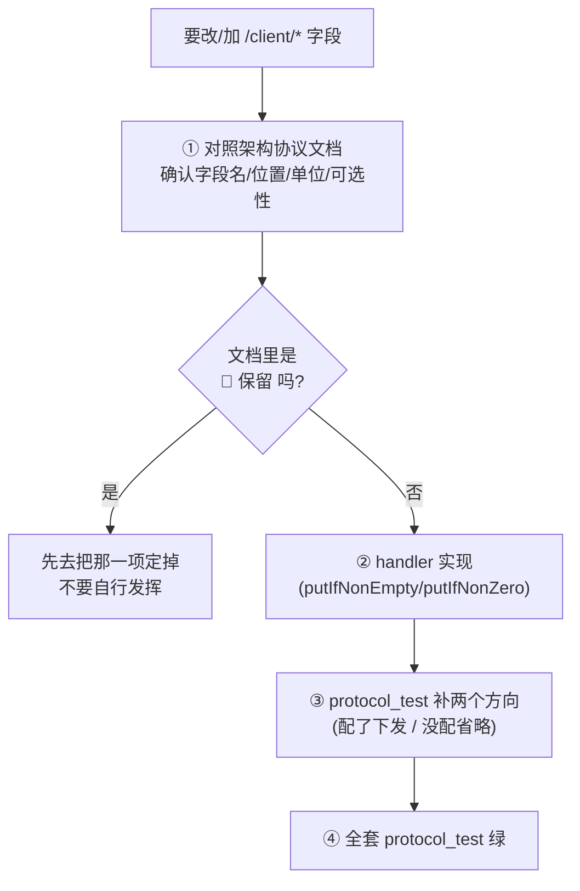

# 协议保真原则

> **资深向**,但**任何改 `/client/*` 的人必读**。一个字段名错位、一个 `null` 发错,
> 客户端就会行为异常 —— 而你在服务端可能毫无察觉。

## 核心原则:架构协议文档是唯一真理

`/client/*` 响应的每一个字段名、嵌套层级、空值处理,都以
**架构协议文档**(`magirecocn-architecture-protocol-document`)为准。



::: danger 旧锚点已失效
本页早期版本写的是"客户端 Java 源码是唯一真理",并列出
`ClientInit.java` / `ResourceFlow.java` 的对照表。

**那个锚点没有了**——Android 客户端(`magireco-cnv-client`)已弃维,不再有"照着实现"
的对象。今后是**文档定契约,两侧各自实现**;实现与文档冲突时以文档为准,
去改实现或提议改文档,**不要让文档迁就实现**。

文档中每项带状态标记:**✅ 已定 / 📝 草案 / 🚧 保留**。
🚧 保留 = 明令未定,**禁止自行发挥**;遇到它挡路时,去把那一项定掉。
:::

## 铁律一:可选字符串为空时省略 key,绝不发 null

```mermaid
flowchart TB
    F["可选字符串字段为空"] --> WRONG["❌ 发 JSON null<br/>{\"message\": null}"]
    F --> RIGHT["✅ 省略整个 key<br/>{}"]
    WRONG --> BUG["'缺席'与'为空'混成第三种状态<br/>各语言 JSON 库处理并不一致"]
    RIGHT --> OK["客户端能区分<br/>'没配' 与 '配了空值'"]
```

**"字段缺席"与"字段为空"是两种不同的判断**:缺席意味着服务端没有这项配置,
空串意味着服务端明确配了一个空值。发 `null` 把两者混成第三种状态。

实现上用辅助函数:

```go
putIfNonEmpty(srvObj, "message", srv.Message)   // 空则不写 key
putIfNonZero(srvObj, "end_time", srv.EndTime)   // 0 则不写 key
```

| 字段类型 | 处理 | 原因 |
|---|---|---|
| 可选字符串 | `putIfNonEmpty`(空则省略) | 缺席与空值语义不同 |
| 可选整数(0 表"无") | `putIfNonZero` | 0 是"无估计时间"的语义 |
| bool | 直接写 | `false` 是合法业务值,不能省 |
| 必有字段 | 直接写 | — |

`protocol_test.go` 有 `TestInit_OmitsEmptyOptionalStrings` 专门守这条。

## 铁律二:业务结果用 HTTP 200,协议级拒绝用 4xx

判据是**这次拒绝对客户端而言是不是一个正常的业务结果**:



| 场景 | 状态码 | 为什么 |
|---|---|---|
| 设备封禁 | **200** `{banned:true, ban_reason, expire_time}` | 封禁是业务结果,客户端要读理由与到期时间提示玩家 |
| 协议版本无交集 | 400 `protocol_version_unsupported` | 双方讲不同的话,这是协议级失败 |
| 签名拒绝 | 403 `signature_rejected` | 协议级拒绝 |
| 渠道拒绝 | 403 `channel_rejected` | 同上 |
| 场景清单未启用 | 503 `manifest_unavailable` | 服务暂不可用,**不返回空清单** |

::: tip 503 而不是空清单,是同一条判据的应用
`/client/scene-manifest` 在未接入构建管线时返回 503。空的 `assets: []` 会被客户端
理解为"该场景无需任何资产",于是静默进入一个残缺场景——错误被推迟到最难排查的
地方才暴露。**"我不知道"和"没有"必须是两种不同的响应。**
:::

## 铁律三:数值单位(毫秒 vs 秒)

- **库内统一存 Unix 毫秒。**
- **下发给客户端的时间字段一律是 Unix 秒**,没有例外:`expire_time`、`end_time`、
  `server_time_at`、`asset_auth.expires_at`。

```go
// 库里是毫秒,下发转秒
func banExpireSeconds(b *store.Ban) int64 {
    return *b.ExpireTime / 1000
}
```

`asset_auth.expires_at` 曾经是毫秒(沿用 Android 期 `resource_token` 的实现),
协议定稿时统一为秒。

::: tip 断言量级,不只断言存在
`TestInit_BanReturns200WithBanFields` 与 `TestInit_ResponseShape` 都断言时间字段的
**数量级**在 `1.7e9 ~ 2.0e9`。毫秒值会大三个数量级,量级断言能挡住单位回潮——
只断言"字段存在"是拦不住的。
:::

加时间字段时**先确认协议文档写的是什么单位**。

## 铁律四:嵌套位置精确

客户端按确切路径取值,字段放错层级就读不到:



## 铁律五:反向断言与正向断言同等重要

`protocol_test.go` 不只断言"该有的字段在",还断言**"已移除的字段确实不在"**——
并且是在**把对应的 config 种进库之后**断言的。

```go
// 先把 versions 配置写进库,再断言这些字段不出现在响应里
_ = st.ConfigSet(ctx, "versions", map[string]any{
    "allowed_versions":  []string{"4.0.0"},
    "update_url_normal": "https://example.invalid/app.apk",
})
// ... 断言 resp 里没有 "client" / "force_update" / "update_url_normal"
```

这样证明的是**"配置存在也不下发"**,而不是"恰好没配所以看不见"。少了这一步,
删字段这件事就没有回归保护——下次重构很容易把它们捡回来,而测试全绿。

## authTriple 的 body 重读

`/client/*`(除 `init`)的鉴权中间件要读 body 取 authTriple,业务 handler 又要再读
一次。但 `http.Request.Body` 只能读一次。解法:

```go
// readAndRewind:读进内存,再塞回一个可重读的 reader
body, _ := readAndRewind(r)   // 中间件用 body 解 authTriple
// ... r.Body 已被换成可重读的,handler 能再 Decode 一次
```

加新的需要鉴权的 `/client/*` 端点时,这套机制已经在中间件层处理好,你的 handler
正常 `ReadJSONAllowUnknown` 即可。

## 改协议的流程



1. **先读协议文档**,别凭感觉定字段名。
2. 实现时用对的辅助函数(空值处理)。
3. 测试覆盖"配了就下发"和"没配就省略"两个方向;**删字段时补反向断言**。
4. 跑 `go test ./internal/api/client/`,全绿才算数。

## 为什么这么严

服务端与客户端是**两个独立仓库、独立发版**,而客户端已经发布到玩家浏览器里,
**旧版本会持续在跑**。服务端不得单方面变更线格式。

`protocol_test.go` 就是把"客户端会不会读错"提前到 `go test` 阶段回答。

**所以:改 `/client/*`,测试不绿不提交。**
