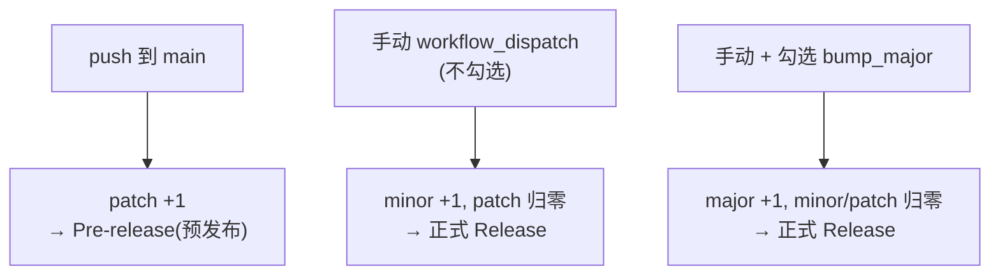
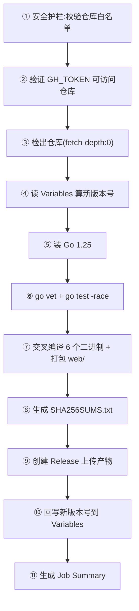

# 发布流程与 CI

> **资深向**。CI 配置在 `.github/workflows/build.yml`,负责测试、交叉编译、版本号自动推进、发 Release。

## 触发与版本规则



| 触发 | 版本变化 | Release 类型 |
|---|---|---|
| push 到 `main` | patch +1 | Pre-release |
| 手动(默认) | minor +1, patch=0 | 正式 Release |
| 手动 + `bump_major` | major +1, minor=patch=0 | 正式 Release |

每次构建 `VersionCode` 也 +1。版本号持久化在 **GitHub Actions Variables**(`SERVER_VERSION` / `SERVER_VERSION_CODE`),首次从 `1.0.0` / `1` 开始。

## 流水线步骤



### ① 安全护栏

第一步就是硬刹车:校验 `github.repository` 在白名单内,否则 `fail-fast`。防 fork 或误配置在非预期仓库跑发布、向外部发请求。

```python
ALLOWED = {"MagirecoCN-Revival-Project/magireco-cnv-server"}
if repo not in ALLOWED:
    sys.exit(1)
```

### ⑥ 测试:-race 需要 CGO

```bash
go vet ./...                                    # CGO_ENABLED=0
go test -race -count=1 ./...                    # CGO_ENABLED=1 ← 注意
```

::: warning 为什么测试这步开 CGO,发布构建关 CGO
Go 的竞态检测器依赖 libc,所以 `-race` 需要 `CGO_ENABLED=1`。但这**只影响测试这一步**;后面交叉编译会把 `CGO_ENABLED` 设回 `0`,产出纯静态二进制。`modernc.org/sqlite` 在 CGO=0/1 下都能跑,所以两路都安全。这是仓库一个专门的 fix commit 解决的(`fix(ci): -race 测试启用 CGO_ENABLED=1`)。
:::

### ⑦ 交叉编译

6 个二进制(3 命令 × 2 架构),全部 `CGO_ENABLED=0` 纯静态:

| 命令 | linux/amd64 | linux/arm64 |
|---|---|---|
| `primary` | ✓ | ✓ |
| `secondary` | ✓ | ✓ |
| `admintool` | ✓ | ✓ |

```bash
go build -trimpath -ldflags "-s -w \
  -X main.version=$VER -X main.versionCode=$CODE -X main.commit=$SHA" \
  -o dist/magireco-<cmd>-linux-<arch> ./cmd/<cmd>
```

`-ldflags` 把版本号注入二进制(`-X main.version=...`),`-s -w` 去符号表减体积,`-trimpath` 去构建路径。另把 `web/` 打成 `web-static.tar.gz`。

### ⑧ 校验清单

`SHA256SUMS.txt` 覆盖所有产物(排除它自己),供下载者校验完整性。

### ⑨ 发 Release

- push 触发 → `--prerelease`(预发布)。
- 手动触发 → 正式 Release。
- Release notes 自动包含:版本表格 + 自上次同类型 Release 以来的 commit 列表(用 GitHub Compare API,最多 50 条)。

### ⑩ 回写版本号

用 REST API 把新版本写回 Actions Variables(PATCH 失败则 POST 创建)。这样下次构建能接着递增。

## 所需 Secrets / Variables

| 名称 | 类型 | 说明 |
|---|---|---|
| `GH_TOKEN` | Secret(可选) | 有 `contents:write` + `variables:write` 的 PAT。缺失时回落到内置 `GITHUB_TOKEN`,但写 Variables 可能被组织策略拒 |
| `SERVER_VERSION` | Variable(自动) | 当前版本号,首次自动建为 `1.0.0` |
| `SERVER_VERSION_CODE` | Variable(自动) | 当前 VersionCode,首次 `1` |

::: tip 内置 GITHUB_TOKEN 的坑
内置 token(`ghs_` 前缀)在组织仓库写 Variables 可能 403。CI 有专门的诊断步骤提示这点。要稳妥,配一个 PAT 到 `GH_TOKEN` Secret。
:::

## 产物说明

| 产物 | 用途 |
|---|---|
| `magireco-node-linux-{amd64,arm64}` | 节点(business/edge 由 `CNV_NODE_ROLE` 决定) |
| `magireco-panel-linux-{amd64,arm64}` | 面板(节点注册表 + WS 监控) |
| `magireco-admintool-linux-{amd64,arm64}` | 运维 CLI |
| `web-static.tar.gz` | 前端静态目录(反代/离线部署用) |
| `SHA256SUMS.txt` | 完整性校验 |

## 本地复刻 CI 构建

```bash
# 测试(带 race)
CGO_ENABLED=1 go test -race -count=1 ./...

# 交叉编译(纯静态)
GOOS=linux GOARCH=amd64 CGO_ENABLED=0 \
  go build -trimpath -ldflags="-s -w" -o bin/magireco-node-linux-amd64 ./cmd/node
GOOS=linux GOARCH=arm64 CGO_ENABLED=0 \
  go build -trimpath -ldflags="-s -w" -o bin/magireco-node-linux-arm64 ./cmd/node
```

## 改 CI 的注意

- **别动安全护栏的白名单**,除非确实换了仓库。
- 加新命令(如又一个 `cmd/xxx`)→ 在交叉编译的 `targets` 列表加条目。
- 保持"测试 CGO=1、构建 CGO=0"的分界,别为图省事统一 —— 会让发布产物变成动态链接。
- Release notes 的 commit 列表靠规范的 commit message(见 [代码规范](./conventions#commit-规范))才好看。
