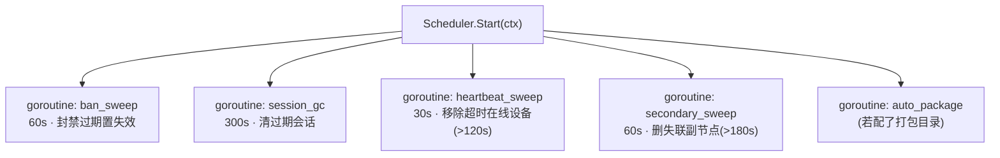
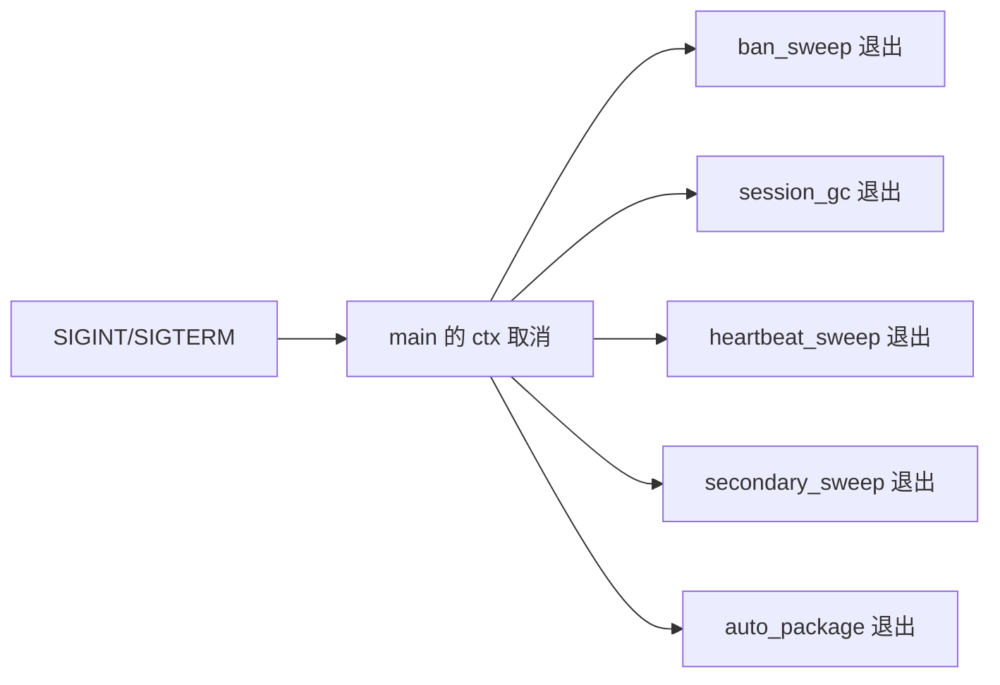
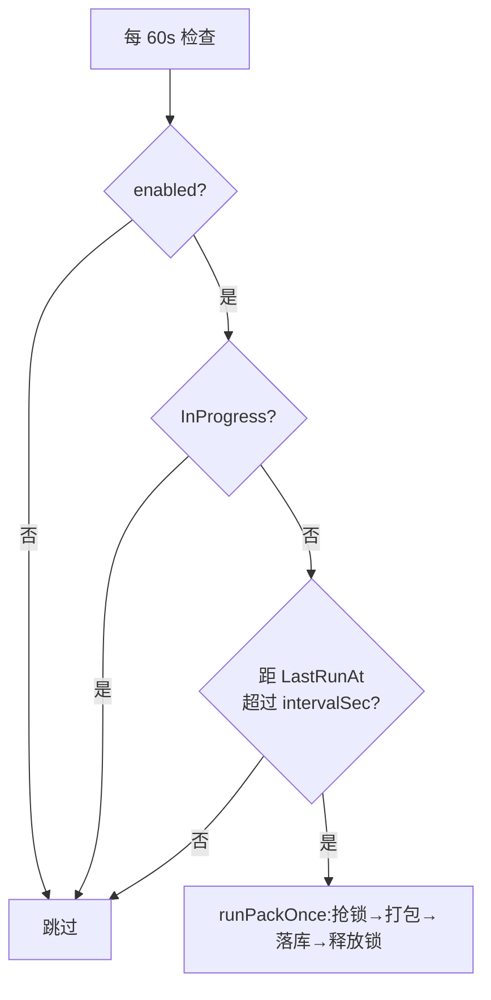

# 调度器与后台任务

> **资深向**。涉及 goroutine 生命周期、配置驱动的周期、优雅退出。

`internal/scheduler` 在主节点进程内跑一组周期任务,无需 cron。所有周期从 `config` 表的 `tasks` 键读,可在管理后台「定时任务」页调,改完下次任务循环按新值(进程内已起的 ticker 在下次 `Start` 才重读 —— 见下文局限)。

## 任务清单



| 任务 | 默认周期 | 阈值 | 干什么 |
|---|---|---|---|
| `ban_sweep` | 60s | — | `BanSweepExpired`:到期封禁置 `active=false` |
| `session_gc` | 300s | — | `SessionGC`:删过期的玩家/管理员会话 |
| `heartbeat_sweep` | 30s | 超时 120s | `Hearts.Sweep`:从**内存**心跳表移除超时设备 |
| `secondary_sweep` | 60s | 超时 180s | `SecondarySweepStale`:删 `last_seen` 过旧的副节点 |
| `auto_package` | 检查间隔 ≤60s | 按 `intervalSec` | 定期把资源目录打成离线整包 |

默认值在 `defaults()`:

```go
func defaults() Config {
    return Config{
        BanSweepMs:         60_000,
        SessionGCMs:        300_000,
        HeartbeatSweepMs:   30_000,
        HeartbeatTimeoutMs: 120_000,
        SecondarySweepMs:   60_000,
        SecondaryTimeoutMs: 180_000,
    }
}
```

## 通用循环框架:runEvery

每个简单任务都用 `runEvery` 包成一个 goroutine。模式很标准:`ticker` + `select { ctx.Done() / ticker.C }`:

```go
func (s *Scheduler) runEvery(ctx, interval, name, fn) {
    if interval <= 0 { return }            // 间隔 ≤0 → 不启动这个任务
    t := time.NewTicker(interval)
    defer t.Stop()
    for {
        select {
        case <-ctx.Done():                 // 优雅退出
            return
        case <-t.C:
            if err := fn(ctx); err != nil {
                s.Log.Warn("scheduler task failed", "name", name, "err", err)
            }
        }
    }
}
```

要点:

- **单个任务失败只记 WARN,不中断循环** —— 下个周期继续。一次清理失败不该让任务永久停摆。
- **`ctx.Done()` 优雅退出** —— 进程收 SIGINT/SIGTERM 后 `ctx` 取消,所有任务 goroutine 干净退出。
- **间隔 ≤0 跳过** —— 把某任务周期配成 0 等于关掉它。



## 自动打包:带锁的特殊任务

`auto_package` 比其它任务复杂,因为打包耗时且**不能并发**。它每分钟检查一次 `config.auto_package`:



`runPackOnce` 用 `InProgress` 标志当**分布式锁的简化版**(单进程内够用):

```go
func (s *Scheduler) runPackOnce(ctx, c) {
    c.InProgress = true
    s.St.ConfigSet(ctx, "auto_package", c)        // 上锁
    defer func() {
        c.InProgress = false
        c.LastRunAt = time.Now().UnixMilli()
        s.St.ConfigSet(ctx, "auto_package", c)    // 解锁 + 记录时间
    }()
    res, err := packer.RunOnce(ctx, packer.Config{...})
    // 成功 → OfflinePackageSet 落库(version/sha256/url)
}
```

打包完会把产物元数据写进 `offline_package` 表。

⚠️ **消费该表的 `/client/offline-package` 端点已移除**——Web 客户端按需流式取用资产,不走整包分发。打包器与本任务暂时保留,但目前没有客户端会来取。

检查间隔取 `min(intervalSec, 60s)`,保证你把周期改短时能及时生效。打包器本身见 [离线整包打包器](./packer)。

## 内存态 vs 持久态

注意 `heartbeat_sweep` 清的是**进程内存**的心跳表(`Hearts`),其它清的是**数据库**:

| 任务 | 操作对象 |
|---|---|
| heartbeat_sweep | 内存 `Heartbeats` map(在线设备实时状态) |
| ban_sweep / session_gc / secondary_sweep | 数据库表 |

内存心跳表是为什么单主节点能轻量追踪"谁在线、下到哪了" —— 不落库,重启即清空,符合"在线状态本就易失"的语义。代价是多主节点时这部分状态不共享(见下文)。

## 加一个新任务

```go
// 1. 在 Config 加周期字段 + defaults() 给默认值
type Config struct {
    // ...
    MyTaskMs int64 `json:"my_task_ms"`
}

// 2. 在 Start 里起一个 goroutine
go s.runEvery(ctx, time.Duration(cfg.MyTaskMs)*time.Millisecond, "my_task", s.myTask)

// 3. 实现任务函数(返回 error,失败会被记 WARN)
func (s *Scheduler) myTask(ctx context.Context) error {
    return s.St.DoSomething(ctx)
}
```

任务函数要:

- 接受 `ctx` 并尊重取消(长操作中途检查 `ctx.Err()`)。
- 幂等 —— 可能因重启而多跑,别假设"只跑一次"。
- 失败返回 error 而非 panic(虽有 recover,但任务里 panic 会杀掉那个 goroutine)。

## 局限

- **周期在 `Start` 时读一次** `config.tasks`。运行中改后台的周期配置,已起的 ticker 不会热更新 —— 要重启进程才生效(`auto_package` 例外,它每次循环重读)。如需热更新其它任务周期,得改造成每次循环重读。
- **单进程** —— 多主节点时各自都会跑这些清理任务。对幂等的清理(置失效/删行)无害,但 `auto_package` 的 `InProgress` 锁是进程内的,多主节点可能并发打包。真要多主,需把锁挪到数据库(如 `SELECT ... FOR UPDATE` 或乐观锁)。
