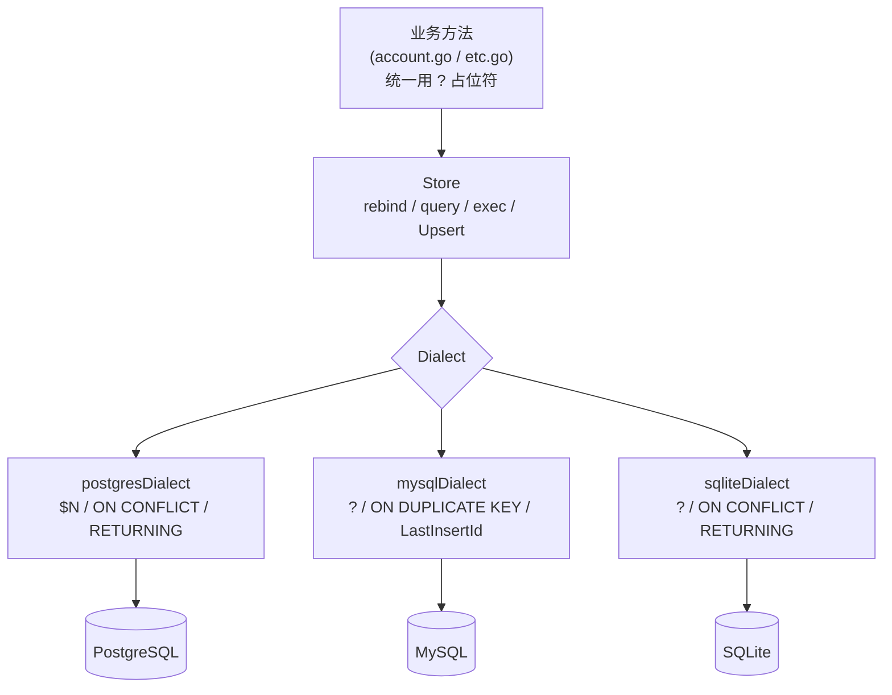
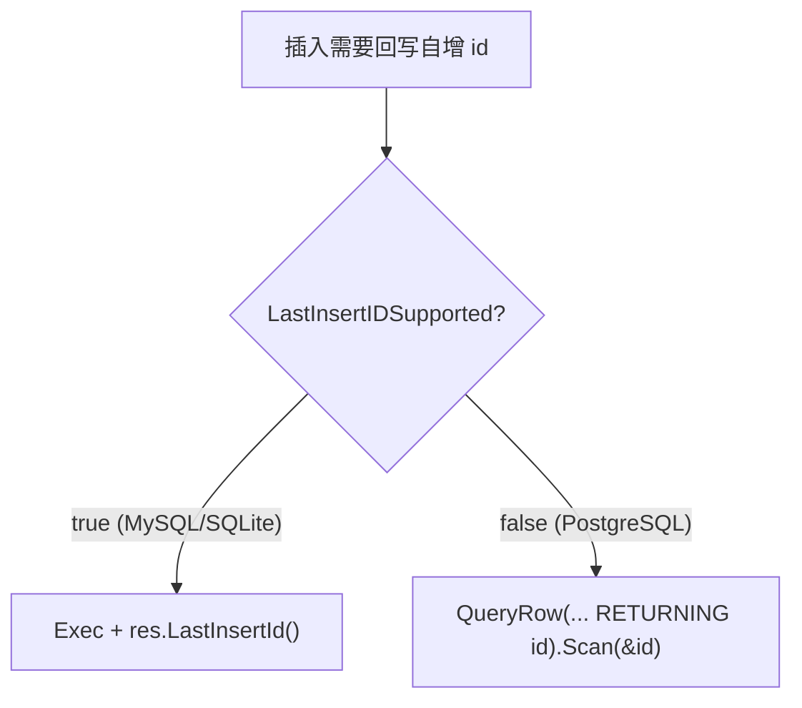
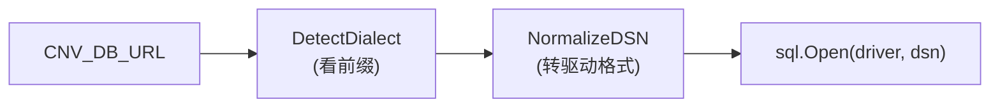
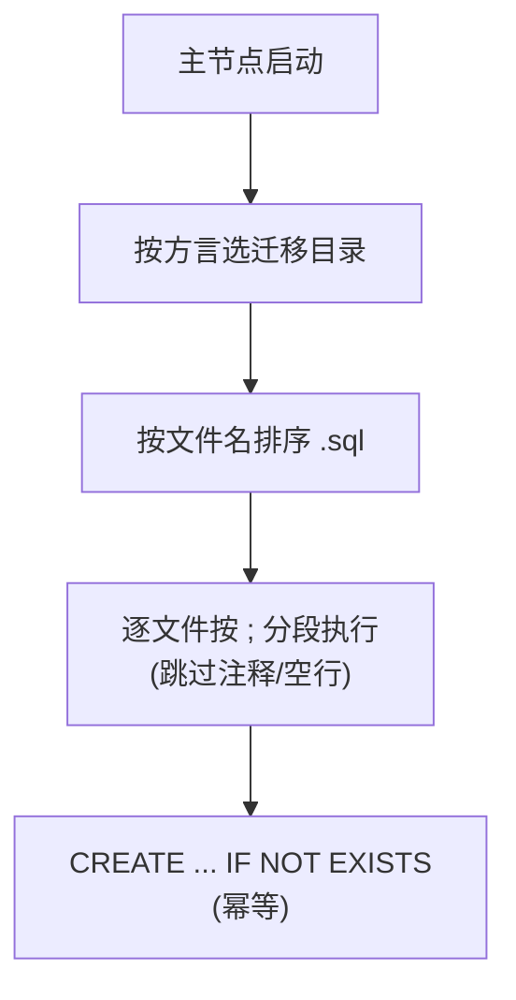
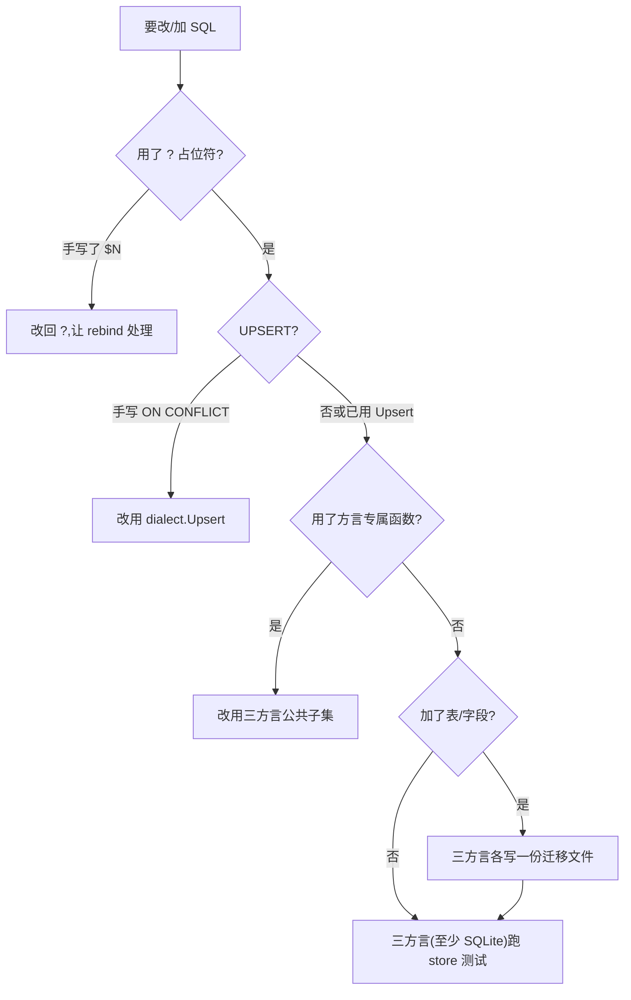

# 存储层与多方言抽象

> **资深向**。改存储层前必读 —— 一处改动要同时对 PostgreSQL / MySQL / SQLite 三种数据库成立。

## 设计目标

用**一套业务代码**支持三种数据库,且业务层几乎无感方言差异。代价是把所有差异收敛到一个薄抽象层 `Dialect`。



## Dialect 接口

差异只有四个方法:

```go
type Dialect interface {
    Driver() Driver                                  // sql.Open 的驱动名
    Rebind(query string) string                       // ? → 方言占位符
    Upsert(spec UpsertSpec) (sql string, supportsReturning bool)
    LastInsertIDSupported() bool
}
```

三方言的差异一览:

| 维度 | PostgreSQL | MySQL | SQLite |
|---|---|---|---|
| 驱动 | `pgx` | `mysql` | `sqlite`(modernc,纯 Go) |
| 占位符 | `$1, $2…` | `?` | `?` |
| UPSERT | `ON CONFLICT (...) DO UPDATE SET col=EXCLUDED.col` | `ON DUPLICATE KEY UPDATE col=VALUES(col)` | `ON CONFLICT(...) DO UPDATE SET col=excluded.col` |
| 取自增 id | `RETURNING id` | `LastInsertId()` | `RETURNING id`(3.35+) |
| JSON 列 | `JSONB` | `JSON` | `TEXT` |

## 占位符:统一写 `?`,存储层改写

业务 SQL **一律用 `?`**。`Store` 的 `query`/`queryRow`/`exec` 在执行前调 `rebind`:

```go
// postgres:把 ? 依次换成 $1 $2 $3...
func (postgresDialect) Rebind(q string) string {
    var b strings.Builder
    idx := 1
    for i := 0; i < len(q); i++ {
        if q[i] == '?' {
            b.WriteByte('$'); b.WriteString(strconv.Itoa(idx)); idx++
            continue
        }
        b.WriteByte(q[i])
    }
    return b.String()
}

// mysql / sqlite:原样返回(它们本就用 ?)
func (mysqlDialect) Rebind(q string) string  { return q }
func (sqliteDialect) Rebind(q string) string { return q }
```

所以你写一份 `WHERE a = ? AND b = ?`,三种库都能跑。**别手写 `$1`**,那会破坏 MySQL/SQLite。

## UPSERT:用 UpsertSpec 生成,别手写

三种库的 UPSERT 语法完全不同。统一用 `dialect.Upsert(UpsertSpec{...})` 生成:

```go
upsert, _ := s.d.Upsert(UpsertSpec{
    Table:        "config",
    Columns:      []string{"key", "value"},
    ConflictCols: []string{"key"},      // 冲突检测列(PK/UNIQUE)
    UpdateCols:   []string{"value"},    // 冲突时更新的列
})
// PG    → INSERT ... ON CONFLICT (key) DO UPDATE SET value = EXCLUDED.value
// MySQL → INSERT ... ON DUPLICATE KEY UPDATE value = VALUES(value)
// SQLite→ INSERT ... ON CONFLICT(key) DO UPDATE SET value = excluded.value
_, err = s.exec(ctx, upsert, key, raw)
```

注意 `EXCLUDED`(PG 大写)/ `VALUES()`(MySQL)/ `excluded`(SQLite 小写)的引用差异 —— 这正是为什么不能手写。

## 自增 id:RETURNING vs LastInsertId

PostgreSQL **不支持** `LastInsertId()`,要用 `RETURNING id`;MySQL 反过来。`insertReturningID` 用 `LastInsertIDSupported()` 分流:



```go
func (s *Store) insertReturningID(ctx, tx, table, cols, args...) (int64, error) {
    base := "INSERT INTO " + table + " (...) VALUES (...)"
    if s.d.LastInsertIDSupported() {
        res, _ := tx.ExecContext(ctx, s.rebind(base), args...)
        return res.LastInsertId()
    }
    var id int64
    err := tx.QueryRowContext(ctx, s.rebind(base+" RETURNING id"), args...).Scan(&id)
    return id, err
}
```

## DSN 识别与规范化

`DetectDialect` 按 DSN 前缀挑方言,`NormalizeDSN` 再把用户友好前缀转成驱动真正要的格式:



| 用户写 | 识别为 | 规范化后 |
|---|---|---|
| `postgres://...` | postgres | 原样 |
| `mysql://u:p@host:3306/db` | mysql | `u:p@tcp(host:3306)/db`(go-sql-driver 要这格式) |
| `sqlite:///path.db` / `file:` / `*.db` / `:memory:` | sqlite | 去 `sqlite://` 前缀 |

无法识别时默认回退 postgres(向后兼容)。

## 连接池与 SQLite PRAGMA

`Open` 统一配置连接池:

```go
db.SetMaxOpenConns(16)
db.SetMaxIdleConns(4)
db.SetConnMaxIdleTime(5 * time.Minute)
```

SQLite 额外设 PRAGMA(`WAL` / `synchronous=NORMAL` / `foreign_keys=ON` / `busy_timeout=5000`),让单文件库也有像样的并发与外键。

## 迁移机制

迁移 SQL **内嵌**进二进制(`go:embed`),每方言一套(类型差异:`JSONB`/`JSON`/`TEXT`,自增主键写法不同)。启动时按方言选目录、按文件名排序、逐条执行。

- 全部 `CREATE TABLE/INDEX IF NOT EXISTS` → **幂等**,重复启动安全。
- 加表/字段:**新增一个迁移文件**(如 `0003_xxx.sql`),三方言各写一份,**不改旧文件**。
- 不需要版本表追踪 —— 靠 `IF NOT EXISTS` 的幂等性。



## 滑动续期的 SQL

会话滑动续期是个好例子:**单条 UPDATE + `CASE WHEN`**,三方言通用,避免 SELECT-then-UPDATE 往返:

```sql
UPDATE account_sessions
   SET last_seen_at = ?,
       expires_at = CASE
           WHEN expires_at - ? < ? THEN ? + ?   -- 剩余 < TTL/2 → 续到 now+TTL
           ELSE expires_at                        -- 否则不动
       END
 WHERE token = ?
```

参数顺序:`now, now, ttl/2, now, ttl, token`。这条 SQL 只用标准 `CASE WHEN`,PG/MySQL/SQLite 都吃 —— 这是写跨方言 SQL 的典范:**只用三者公共子集**。`ttl<=0` 时退化成只更新 `last_seen_at`。

## JSON 列怎么处理

`saves.data`、`config.value`、`mirrors.files` 等是 JSON。三方言列类型不同(`JSONB`/`JSON`/`TEXT`),但 Go 侧**统一当文本存取**:

```go
// 写:json.Marshal 成 []byte 存进去
// 读:Scan 进 []byte,包成 json.RawMessage
```

**不用任何数据库的 JSON 函数**(如 PG 的 `jsonb_set`、MySQL 的 `JSON_EXTRACT`)。这样三方言行为完全一致,JSON 的结构由 Go struct 定义、在应用层解析。代价是不能在 SQL 里查 JSON 内部字段 —— 但这个项目不需要。

## 改存储层的纪律



测试默认用 SQLite 内存库;涉及方言差异(UPSERT、RETURNING、JSON)的改动,**最好也在 PG/MySQL 上验一遍**(Docker 起一个即可,见 [开发环境搭建](./dev-setup#用-postgresqlmysql-开发-可选))。`store_test.go` 的烟雾测试已经覆盖了 RETURNING/LastInsertId 两条路径。
