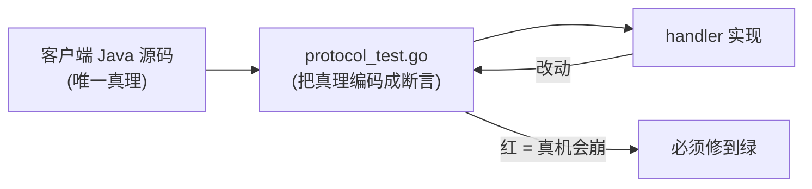
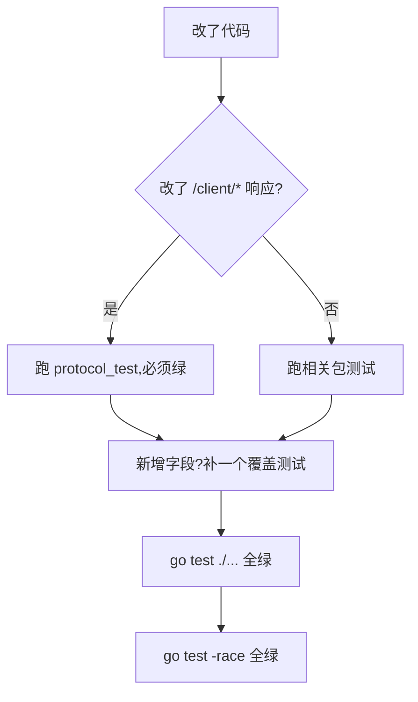

# 运行与编写测试

测试是这个项目的安全网,尤其是客户端协议的保真测试 —— 它们一绿,真机才不会崩。

## 跑测试

```bash
go test ./...                       # 全部
go test ./internal/api/client/...   # 单个包
go test -run TestInit ./internal/api/client/   # 单个用例(按名字匹配)
go test -v ./internal/api/client/   # 详细输出
```

CI 跑的是带竞态检测的版本:

```bash
go test -race -count=1 ./...
```

::: tip -race 需要 CGO
Go 的竞态检测器依赖 libc 拦截内存访问,所以要 `CGO_ENABLED=1`。本地:`CGO_ENABLED=1 go test -race ./...`。`modernc.org/sqlite` 在 CGO=0/1 下都能跑,所以测试用 CGO=1 不影响发布构建的纯静态产物。
:::

## 测试用的是 SQLite 内存/临时库

测试不连真数据库,而是开一个 SQLite 临时库、跑迁移、构造 handler。看 `protocol_test.go` 的 `newTestHandler`:

```go
func newTestHandler(t *testing.T) (*Handler, *store.Store) {
    dsn := filepath.Join(t.TempDir(), "proto.db")   // 临时目录,测试结束自动清理
    st, _ := store.Open(context.Background(), dsn)
    st.Migrate(context.Background())                 // 跑真实迁移
    t.Cleanup(func() { st.Close() })
    return &Handler{St: st, /* ... */}, st
}
```

这样每个测试都有一个**干净的真实 schema**,不需要 mock 数据库 —— 测的是真 SQL 在真(SQLite)引擎上的行为。

## 协议保真测试:本项目的命脉

`internal/api/client/protocol_test.go` 守护客户端契约。它断言的不只是"成功返回",而是**精确的字段名、嵌套位置、空值处理**。例如:

```go
// 可选字符串为空时必须省略 key(不能发 null)
func TestInit_OmitsEmptyOptionalStrings(t *testing.T) {
    resp := postJSON(t, srv, "/client/init", map[string]any{...})
    clientObj := resp["client"].(map[string]any)
    for _, k := range []string{"update_url_normal", "update_apk_sha256"} {
        if _, has := clientObj[k]; has {
            t.Errorf("client.%s should be omitted when empty", k)
        }
    }
}
```



**改任何 `/client/*` 响应,先看这套测试是否还绿。** 红了说明你破坏了与客户端的契约。详见 [协议保真原则](./protocol-fidelity)。

## 测试模式:postJSON / postRaw

`protocol_test.go` 提供两个辅助:

| 辅助 | 用途 |
|---|---|
| `postJSON(t, srv, path, body)` | 断言 HTTP 200 并返回解析后的 map(测正常响应字段) |
| `postRaw(t, srv, path, body)` | 返回原始 `ResponseRecorder`(测非 200 状态码 / 错误码) |

例如测"版本闸门必须是 200 而非 403":

```go
w := postRaw(t, srv, "/client/init", map[string]any{"version": "3.9.0", ...})
if w.Code != http.StatusOK {
    t.Fatalf("version_not_allowed 必须 HTTP 200,得到 %d", w.Code)
}
```

## 写一个测试

表驱动是 Go 惯例。一个典型的新测试:

```go
func TestInit_MyNewField(t *testing.T) {
    h, st := newTestHandler(t)
    srv := newRouter(h)

    // 1. 种入配置
    _ = st.ConfigSet(context.Background(), "versions", map[string]any{
        "allowed_versions": []string{"4.0.0"},
        "my_new_field":     "expected-value",
    })

    // 2. 发请求
    resp := postJSON(t, srv, "/client/init", map[string]any{
        "version": "4.0.0", "device_id": "dev_x", "signature": "", "channel": "normal",
    })

    // 3. 断言字段在客户端期望的位置
    clientObj := resp["client"].(map[string]any)
    if clientObj["my_new_field"] != "expected-value" {
        t.Errorf("client.my_new_field: want expected-value, got %v", clientObj["my_new_field"])
    }
}
```

要点:

- 每个测试用**不同的 device_id**,避免相互干扰。
- 用 `st.ConfigSet` 直接种配置,绕过 admin API。
- 既测"配了就下发",也测"没配就省略"——两个方向都覆盖。

## 各包测试覆盖

| 测试文件 | 覆盖 |
|---|---|
| `api/client/protocol_test.go` | 客户端 6 端点全字段、签名/渠道/版本闸门、authTriple |
| `api/account/save_ratelimit_test.go` | 云存档单会话限速 |
| `api/admin/csv_test.go`、`hostname_test.go` | 审计导出、host 归一化 |
| `auth/auth_test.go` | scrypt 哈希/校验、token、等时比较 |
| `store/store_test.go` | 全表 CRUD 烟雾测试(含 RETURNING/LastInsertId 路径) |
| `store/sliding_test.go` | 会话滑动续期三场景 |
| `middleware/limiter_test.go`、`clientip_test.go` | 限流、trust proxy 取 IP |
| `packer/packer_test.go` | 打包产物、retention、元数据冲突 |

## 改动时的测试纪律



- 改了协议响应 → `protocol_test` 必须继续绿,新字段补测试。
- 改了存储层 SQL → 至少在 SQLite 上跑 `store` 测试;涉及方言差异的最好也在 PG/MySQL 验。
- 新功能 → 配套写测试,别留空白。

提交前三连:`go vet ./...` → `go test ./...` → `go test -race -count=1 ./...`。
