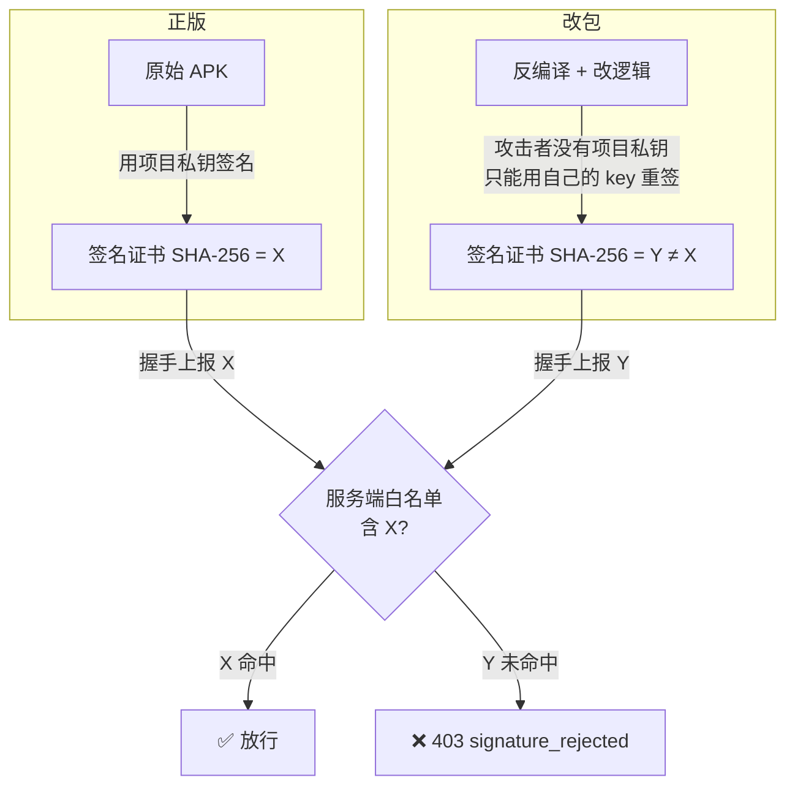
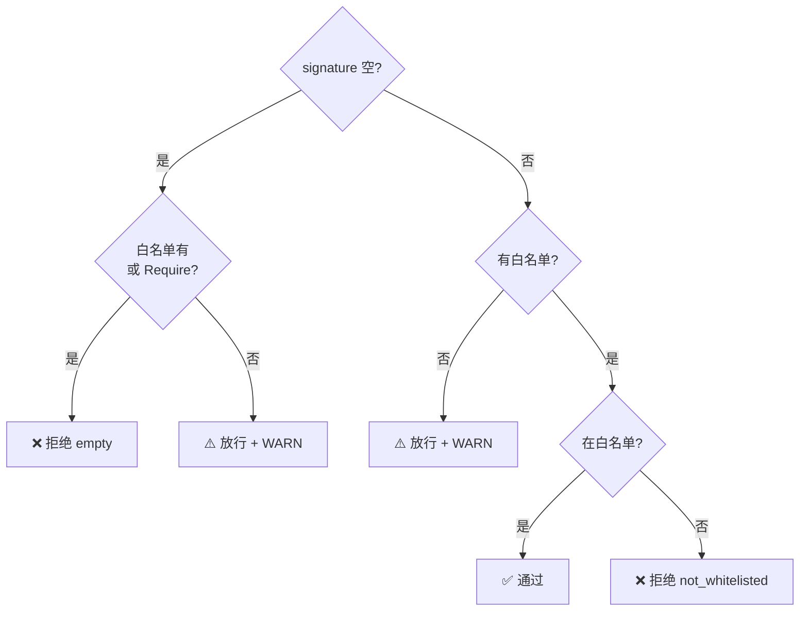
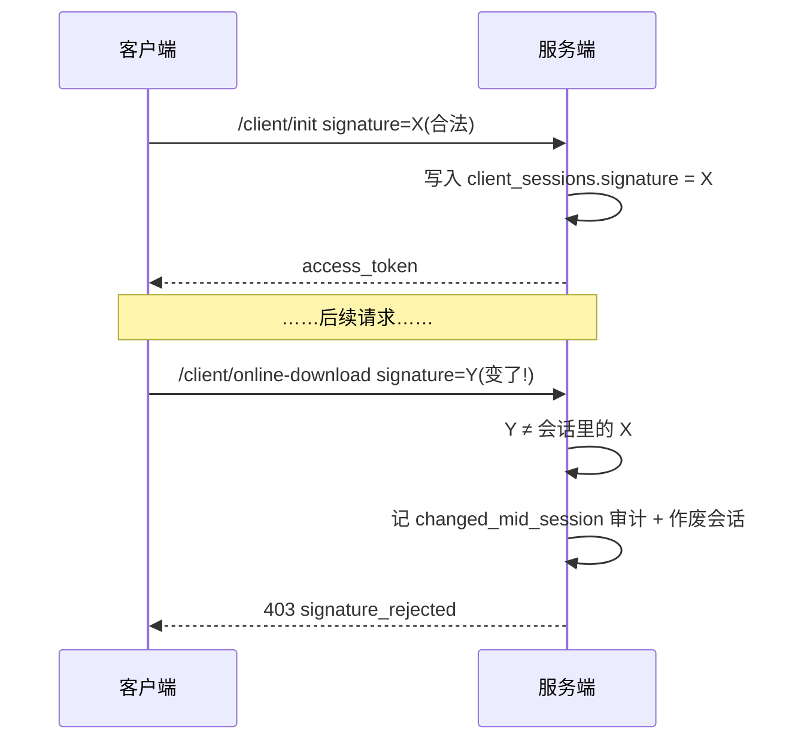

# 防改包闸门

这是整条防线里**最关键**的一道。它的特别之处:这是唯一攻击者**无法在客户端绕过**的环节 —— 因为签名私钥不在客户端手里。

## 原理

Android APK 必须用某个 keystore 签名才能安装。签名证书的指纹(SHA-256)是**公开可读**的,但**重新签名需要原始私钥**。



所以:**任何重打包都会导致签名指纹改变**,服务端只要比对白名单就能识别。攻击者无法伪造一个能通过的签名,因为那需要项目私钥。

## 配置

### 1. 导出你的 APK 签名指纹

```bash
keytool -exportcert -keystore your.keystore -alias your_alias \
  | openssl dgst -sha256
# 取输出的 64 位小写 hex
```

### 2. 配进服务端

```bash
export CNV_SIGNATURE_WHITELIST='abcdef0123...（64 位 hex,逗号分隔多个）'
```

这个值必须与客户端 CI 注入到 `IntegrityGuard.EXPECTED_SIGNATURE_SHA256` 的值**完全一致**。

### 3.(强烈建议)开启强制非空

```bash
export CNV_REQUIRE_SIGNATURE=true
```

## 校验逻辑

`checkSignature` 的决策表:

| signature | 白名单 | RequireSignature | 结果 |
|---|---|---|---|
| 空 | 有 | — | ❌ `empty`(必然不在白名单) |
| 空 | 无 | true | ❌ `empty`(强制非空) |
| 空 | 无 | false | ⚠️ 放行 + WARN(仅开发) |
| 非空 | 有 | — | 在白名单→✅;不在→❌ `not_whitelisted` |
| 非空 | 无 | — | ⚠️ 放行 + WARN(仅开发) |



::: warning 空白名单 = 放行所有
为空时服务端放行所有签名,只打一条 WARN 日志。**生产环境这等于这道闸门没开**。`CNV_REQUIRE_SIGNATURE=true` 能在没白名单时至少堵住空签名,但真正的防护还得靠白名单。
:::

## 深度防御:会话内签名一致性

光在握手时查一次还不够。`/client/init` 之后的每个端点(`online-download`、`heartbeat` 等)都带 authTriple,其中也有 `signature`。中间件会复核:



**Android APK 的签名证书在单次安装期内不可能变化**。若中途变了,只可能是:会话被劫持、客户端被换包、或中间人篡改。一律作废会话,要求重新握手。

作废后即便换回正确签名也用不了那个 token(必须重新 `/client/init`)。

## 异常落审计

每次签名/渠道拒绝都会写 `audit_log`,供运维做风控:

| 字段 | 内容 |
|---|---|
| `type` | `client.integrity_rejected` |
| `field` | `signature` / `channel` |
| `reason` | `empty` / `not_whitelisted` / `changed_mid_session` |
| details | device_id、IP、version、channel、signature 前 12 位 |

只记 signature **前缀**(不记完整摘要),既能回查去重,又不至于把真有效证书摘要泄进日志。频繁出现同一来源 IP 的拒绝,值得关注。

## 渠道白名单(辅助)

`CNV_CHANNEL_WHITELIST` 拒绝伪造的第三方渠道:

```bash
export CNV_CHANNEL_WHITELIST='normal,internal-test'
```

空 channel 不强制(老客户端可能不填),非空时必须在白名单内,否则 `403 channel_rejected`。这是辅助闸门,核心仍是签名。

## 局限与边界

诚实地说,签名校验**不是绝对**的:

- 它防的是"改了包还想连你的服务器"。如果攻击者搭自己的服务器,这道闸门管不着(但那也就脱离了你的生态)。
- 抓包重放仍可能 —— 但会话内 signature 一致性 + 短时 resource_token + 限流共同抬高成本。
- 它依赖客户端诚实上报签名 —— 但**改包后客户端无法上报一个它没有私钥的签名**,这正是闸门的力量所在。

纵深防御的意义就在于:单层有局限,叠起来让攻击不划算。
