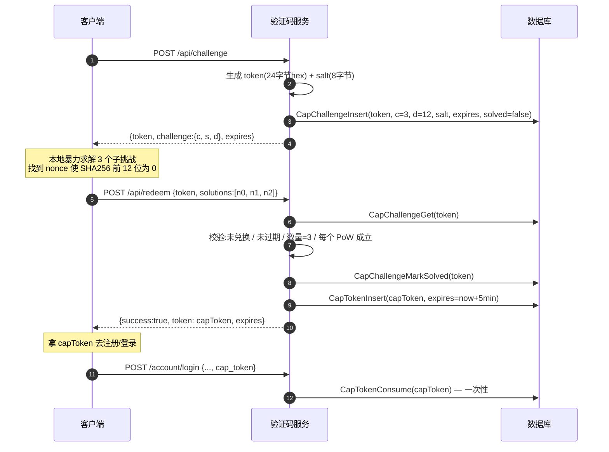
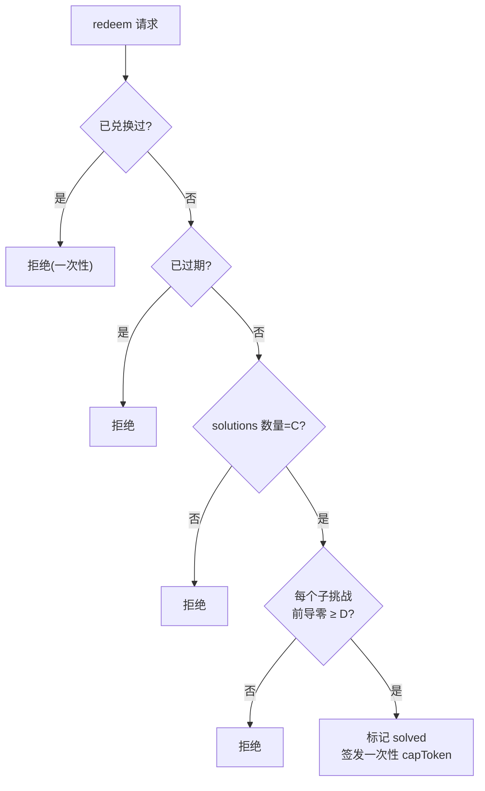
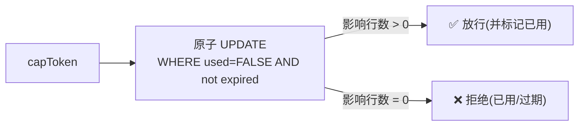

# PoW 人机验证

服务端内置一套基于**工作量证明(Proof of Work)**的人机验证,无需任何第三方服务。用于注册/登录前确认对方愿意付出计算成本,挡批量机器人。

## 为什么用 PoW 而非图形验证码

| | PoW | 传统图形验证码 |
|---|---|---|
| 第三方依赖 | 无,自给自足 | 通常需要服务/打码平台 |
| 隐私 | 不收集用户行为 | 部分方案追踪用户 |
| 无障碍 | 对视障友好(纯计算) | 图形识别有障碍 |
| 防机器人 | 抬高**单位请求成本** | 抬高**识别成本** |

PoW 的逻辑:让客户端先做一定量的哈希计算才能拿到通行令牌。对单个真人用户,几万次哈希是毫秒级、无感的;对想批量注册的机器人,乘以海量请求就成了显著的算力账单。

## 难度参数

```go
func DefaultConfig() Config {
    return Config{
        C: 3,                        // 子挑战数:要解 3 个独立 PoW
        D: 12,                       // 难度:SHA-256 前 12 个二进制位必须为 0
        ChallengeTTL: 2 * time.Minute,  // 挑战有效期
        TokenTTL:     5 * time.Minute,  // 兑换后令牌有效期
    }
}
```

`D=12` 意味着哈希结果前 12 位是 0,期望约 `2^12 ≈ 4096` 次尝试解一个子挑战,3 个共约 1.2 万次哈希。难度可在后台「验证码」页调整。

## 挑战 / 兑换流程



## 验证算法

每个子挑战 `i` 的成立条件:

```
h = SHA256( token + "." + i + "." + solutions[i] )
leadingZeroBits(h) >= D
```

`leadingZeroBits` 数哈希字节流前导零位:整字节为 0 计 8 位,首个非零字节用 `bits.LeadingZeros8` 数其内部前导零。3 个子挑战全部成立才放行。



## 一次性与防重放

两层 token 都是**一次性**的:

- **挑战 token**:`redeem` 成功后标记 `solved=true`,再次提交同一挑战被拒。
- **兑换 capToken**:消费时用原子 SQL —— `UPDATE cap_tokens SET used=TRUE WHERE token=? AND used=FALSE AND expires_at>?`,仅当"未使用且未过期"才置位并返回受影响行数 >0。这保证同一 capToken **并发也只能用一次**(数据库行锁兜底)。



## HTTP 端点

| 端点 | 作用 |
|---|---|
| `POST /api/challenge` | 签发新挑战 |
| `POST /api/redeem` | 提交解答,兑换 capToken |

可拆到独立域名(如 `captcha.magireco.top`),也可直接用主节点的 `/api/*`。这组端点本身受 `captcha` 限流器保护(60 次/分钟/IP)。

## 在业务里启用

登录/注册 handler 调用 `Consume(ctx, capToken, enabled)`:

- `enabled=false`(后台关掉验证码)→ 直接放行,不校验。
- `enabled=true` 且 token 为空或消费失败 → 拒绝。

是否启用、难度多少,都在后台「验证码」页配置,存 `config.captcha`。

## 局限

PoW 不是万能:

- 它抬高的是**单位请求算力成本**,挡的是"用一台机器批量注册"。有大量算力(僵尸网络)的攻击者仍能突破,但成本显著上升。
- 对付定向的低频攻击作用有限 —— 那要靠[限流](./rate-limiting)、[防枚举](./password-hashing#防枚举)等其它防线。

PoW 在防线体系里的定位是"给自动化批量行为加税",与限流、scrypt 高成本叠加使用。
