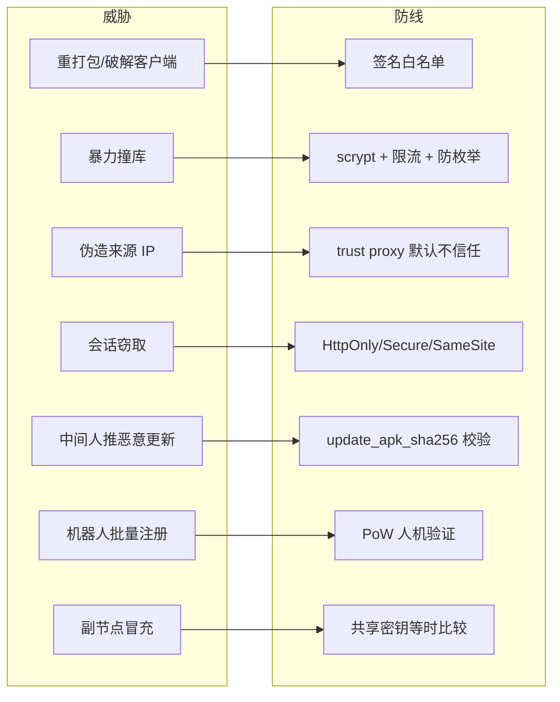
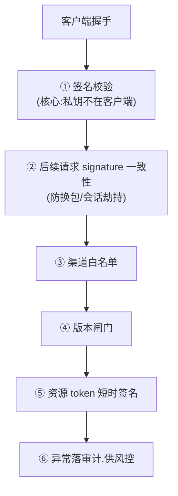

# 威胁模型与总览

本章逐道讲解服务端的安全防线:每道防线挡什么、怎么实现、如何配置。先建立整体的威胁模型,再分章深入。

## 核心假设:客户端不可信

最根本的前提:**客户端是装在玩家手机上的 APK,完全不可信**。它可以被:

- 反编译、读出逻辑与硬编码值
- 改包后用攻击者自己的 key 重签
- 抓包、改请求、伪造字段
- 脚本化批量调用

因此 **所有安全判断都必须在服务端做**,且不能依赖任何"客户端会诚实上报"的假设。客户端发来的 `version`、`channel`、`signature` 都是**待验证的声明**,不是事实。

## 威胁 → 防线对照表

| 威胁 | 防线 | 详见 |
|---|---|---|
| 重打包/破解客户端 | APK 签名白名单(攻击者无主签名私钥) | [防改包闸门](./anti-tamper) |
| 暴力撞库 | 版本化 scrypt 高成本 + 登录限流 + 等时防枚举 | [口令哈希](./password-hashing)、[限流](./rate-limiting) |
| 伪造来源 IP 绕过限流 | trust proxy 默认不信任转发头 | [受信任代理](./trust-proxy) |
| 会话窃取 | 随机长 token + 安全 cookie 属性 | [会话与令牌](./sessions-tokens) |
| 协议版本不匹配导致静默误读 | 握手强制协商,无交集即失败、禁止降级 | [协议版本协商](./version-gates) |
| 机器人批量注册 | PoW 人机验证 + 注册限流 | [PoW 验证](./captcha-pow) |
| 副节点冒充 | 共享密钥等时比较 + 长度下限 | [会话与令牌](./sessions-tokens#副节点共享密钥) |

## 纵深防御:一道闸门挡不住就下一道

防改包是个典型例子,服务端叠了多层:

任何单层都不是万无一失,但叠起来显著抬高攻击成本。其中**签名校验是唯一攻击者无法在客户端绕过的环节** —— 因为签名私钥不在客户端手里。

## 哪些是"硬闸门",哪些是"软提示"

| 类型 | 例子 | 行为 |
|---|---|---|
| **协商** | 协议版本无交集 | 握手终止,客户端不得降级 |
| **闸门** | 签名拒绝、渠道拒绝、设备封禁 | 直接拒绝,不签发会话 |

握手的判定顺序是**协议版本 → 签名 → 渠道 → 封禁**,任何一关不过就提前返回。
详见 [协议版本协商](./version-gates)。

> APK 版本闸门(`allowed_versions` 硬闸门 + `latest_version` 软提示)已随 Android 端
> 弃维一并移除。

## 已落实的密码学选择

| 场景 | 选择 | 理由 |
|---|---|---|
| 口令哈希 | scrypt(N=32768, r=8, p=1) | 内存硬,抗 GPU/ASIC 撞库;参数随哈希存储可平滑升级 |
| 令牌生成 | `crypto/rand` 32 字节 hex | 密码学随机,不可预测 |
| 密钥比较 | `subtle.ConstantTimeCompare` | 等时,防时序侧信道 |
| 资源 token | HMAC-SHA256 + 时间窗 | 短时有效,服务端可验,无需存储 |
| 人机验证 | PoW(SHA-256 前导零) | 自给自足,无第三方依赖 |

## 安全相关代码位置

| 关注点 | 文件 |
|---|---|
| 口令哈希、令牌、签名白名单、等时比较 | `internal/auth/auth.go` |
| 鉴权中间件、限流、trust proxy、安全头 | `internal/middleware/middleware.go` |
| 签名校验、authTriple、封禁、版本闸门 | `internal/api/client/handlers.go` |
| PoW 挑战/兑换 | `internal/capworker/capworker.go` |
| 节点管控连接鉴权(节点密钥,等时比较) | `internal/control/server.go` |
| 签名节点目录(Ed25519 信任根) | `internal/directory/directory.go` |
| 登录防枚举、注册/找回流程 | `internal/api/account/handlers.go` |

## 运维侧:别让防线形同虚设

再好的防线,配错了等于没有。上生产前务必过一遍 **[安全加固清单](/self-host/security-checklist)**,尤其是:

- 配 `CNV_SIGNATURE_WHITELIST`(否则放行所有改包客户端)
- 配对 `CNV_TRUST_PROXY`(否则限流退化成全局共享)
- 全程 HTTPS(否则安全 cookie 属性失效)

接下来逐章深入每道防线。
