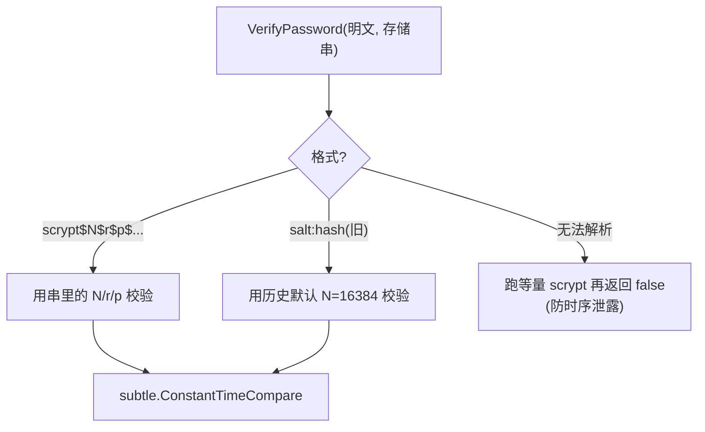
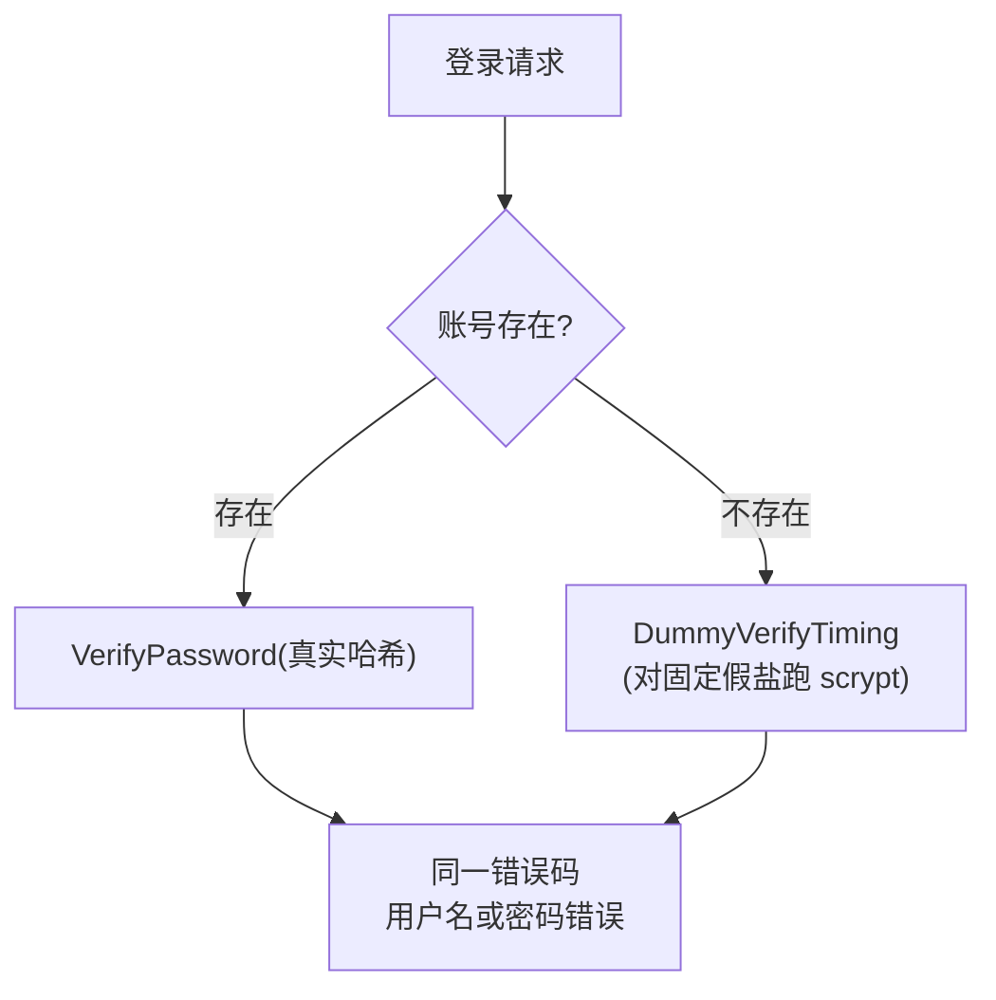
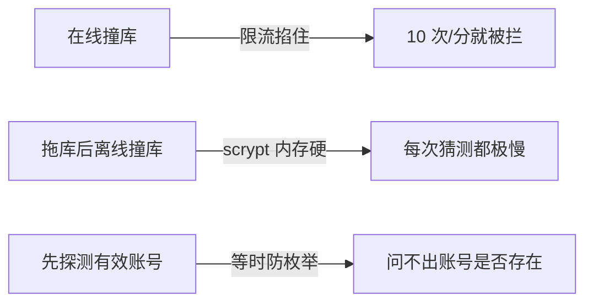

# 口令哈希(scrypt)

玩家与管理员口令用 **scrypt** 哈希存储。本页讲参数选择、版本化格式、以及配套的防枚举措施。

## 为什么是 scrypt

scrypt 是**内存硬(memory-hard)**的密钥派生函数。相比 bcrypt/PBKDF2,它要求大量内存,使 GPU/ASIC 并行撞库的性价比大幅下降。这正是抵御离线撞库(假设数据库泄露)需要的特性。

## 参数

```go
const (
    scryptN = 32768   // 2^15,CPU/内存成本因子
    scryptR = 8        // 块大小
    scryptP = 1        // 并行度
    scryptL = 32       // 输出长度(字节)
    saltLen = 16       // 随机盐长度(字节)
)
```

`N` 从早期的 16384(2^14)提升到 **32768(2^15)**,贴近 OWASP / RFC 7914 对交互式登录的推荐下限。每次登录哈希消耗约几十毫秒 CPU —— 对正常用户无感,对撞库者是巨大成本。

## 版本化存储格式

哈希串自带参数,便于将来调参而不让旧哈希失效:

```
scrypt$<N>$<r>$<p>$<saltHex>$<derivedHex>
```

例如:

```
scrypt$32768$8$1$a1b2...（16 字节盐）$f3e4...（32 字节派生值）
```


## 平滑升级:旧哈希不失效

校验时**从哈希串自身解析参数**,而非用当前全局默认。这意味着:

- 调高 `N` 后,新口令用新参数,旧口令仍按各自记录的参数校验,**无需强制迁移**。
- 还兼容更早的旧格式 `salt:hash`(无参数前缀),按历史默认 `N=16384` 校验。



想升级全员到更高 `N`?可在用户**下次成功登录时**(此时手里有明文)用新参数重新哈希并写回 —— 渐进式迁移,无需明文库。

## 等时比较

派生值比对用 `subtle.ConstantTimeCompare`,**不因前缀匹配长度而提前返回**,防时序侧信道推断哈希。

## 防枚举:账号不存在也耗等量 CPU

撞库者常通过"响应快慢"判断账号是否存在(存在则走哈希校验慢,不存在则直接返回快)。本项目堵死这条:

```go
// 账号不存在分支
auth.DummyVerifyTiming(password)  // 跑一次等量 scrypt,再返回"用户名或密码错误"
```



要点:

- 账号存在与否,**响应时间一致**(都跑了一次完整 scrypt)。
- 错误信息**完全相同**(`用户名或密码错误`),不暴露是用户名错还是密码错。
- 连哈希格式异常的分支也跑等量 scrypt 再返回 false。

找回密码同理:无论邮箱是否注册过,都返回成功,不泄露账号是否存在。

## 与其它防线协同

口令哈希不是孤立的:

| 配合 | 作用 |
|---|---|
| [登录限流](./rate-limiting) | 10 次/分钟/IP,在线撞库直接被掐 |
| scrypt 高成本 | 即便拖库,离线撞库也极慢 |
| 防枚举等时 | 不让攻击者先筛出有效账号 |
| [PoW 验证](./captcha-pow) | 登录可叠加人机验证,挡脚本 |



## 工具

忘记口令时用 `admintool` 重置(会用当前参数重新哈希):

```bash
go run ./cmd/admintool reset-admin   -dsn="$CNV_DB_URL" -email=admin@example.com
go run ./cmd/admintool reset-account -dsn="$CNV_DB_URL" -email=player@example.com
```

口令最小长度 8 字符,在注册/改密/找回流程校验。
