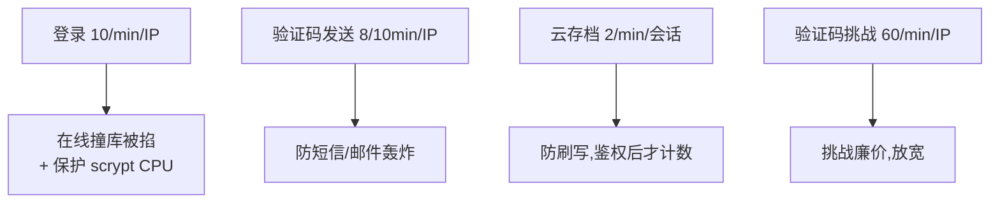
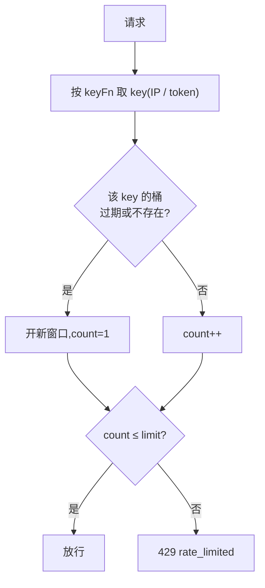
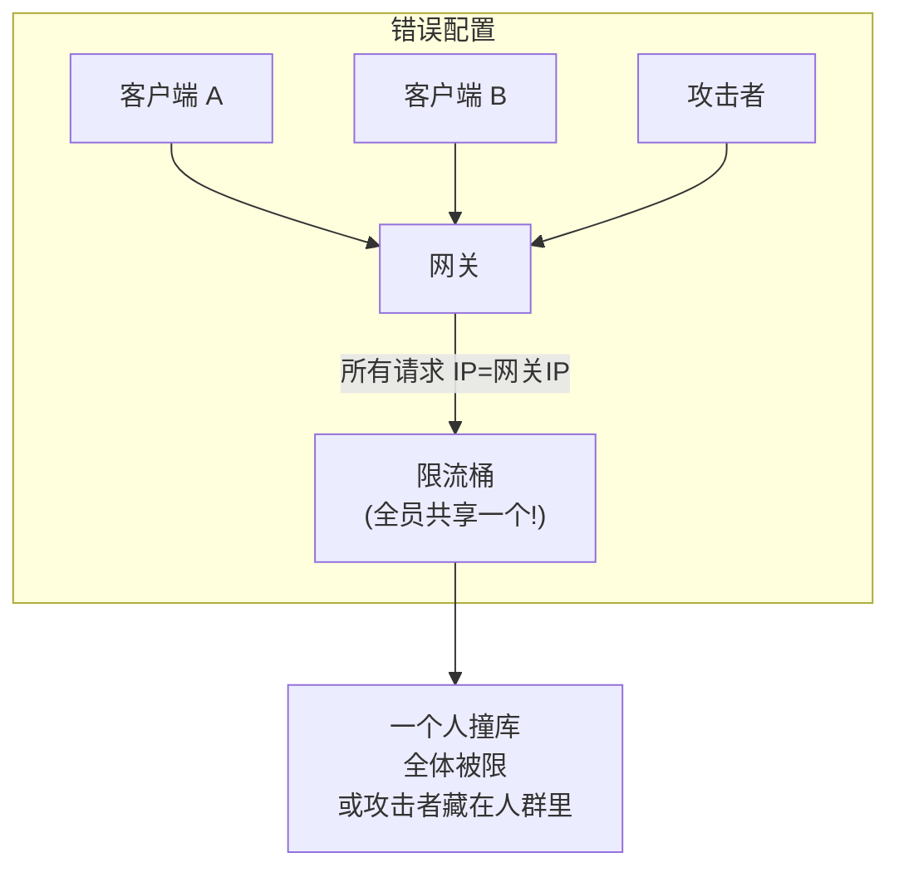

# 限流与防爆破

服务端用进程内令牌桶对敏感端点限流,缓解暴力破解、验证码刷取、云存档刷写,以及保护 scrypt 不被拖垮 CPU。

## 限流器清单

| 限流器 | 配额 | 维度 | 保护端点 |
|---|---|---|---|
| `login` | 10 次/分钟 | IP | `/account/login`、`/auth/login` |
| `auth` | 30 次/分钟 | IP | `/auth/register`、`/auth/forgot` |
| `email-code` | 8 次/10 分钟 | IP | `/auth/send-code`、`/auth/verify-code` |
| `captcha` | 60 次/分钟 | IP | `/api/*`(PoW 挑战) |
| `save-put` | 2 次/分钟 | **会话 token** | `/account/save/put` |

超限统一返回 `429 rate_limited`。

## 为什么这么配



- **登录**配额最严:既挡在线撞库,又防止大量并发登录把 scrypt(每次几十毫秒 CPU)堆成 DoS。
- **云存档按会话而非 IP**:同一玩家可能在 NAT 后共享 IP,按会话更精准;且**鉴权通过后才消费配额**,随机 token 灌不进桶。
- **验证码挑战放宽**:生成挑战本身廉价,主要防滥用而非每次都卡。

## 令牌桶实现

```go
type Limiter struct {
    limit   int
    window  time.Duration
    buckets map[string]*bucket   // key → {count, reset}
    mu      sync.Mutex
}

func (l *Limiter) Allow(key string) bool {
    b := l.buckets[key]
    if b == nil || now.After(b.reset) {
        b = &bucket{reset: now.Add(l.window)}   // 新窗口
    }
    b.count++
    return b.count <= l.limit
}
```



- 固定窗口计数,简单高效。每 1000 次操作顺手回收过期桶,避免内存无限增长。
- 两种用法:作为中间件(`keyFn` 取 IP),或 handler 内直接 `Allow(token)`(云存档场景,token 在 body 里,鉴权后才调)。

## 维度的关键:来源 IP 必须真实

IP 维度的限流**只有在拿到真实客户端 IP 时才有意义**。如果服务端放在反代后却没配 `CNV_TRUST_PROXY`:



后果两面都坏:

- **误伤**:一个用户触发限流,所有人共享那个桶被一起限。
- **失效**:攻击者的请求混在所有人的桶里,实际配额被放大。

所以放在反代后**必须**正确设置 trust proxy,并让网关重写转发头。详见 [受信任代理](./trust-proxy)。

## 多实例的局限

限流器是**进程内内存**实现:

- 单主节点:完全够用,无外部依赖。
- 多主节点(罕见):每个实例各有独立的桶,等效配额被实例数放大。要精确,需改用共享存储(Redis 等)。

这是"刻意保持简单"的取舍 —— 不为绝大多数用不到的水平扩展场景引入 Redis 依赖。

## 与其它防线协同

限流是第一道闸,但不是唯一:

| 防线 | 角色 |
|---|---|
| **限流** | 掐住高频尝试,降速 |
| [scrypt 高成本](./password-hashing) | 即便慢速撞库,每次猜测也极贵 |
| [防枚举等时](./password-hashing#防枚举) | 不让攻击者先筛出有效账号 |
| [PoW 验证](./captcha-pow) | 给登录/注册叠加机器成本 |
| [封禁](#) | 对确认的恶意设备直接拉黑 |

四者叠加:**降速 → 提价 → 隐藏目标 → 加机器成本**,让暴力破解整体不划算。

## 调参

限流配额目前在 `cmd/node/main.go` 里硬编码(如 `NewLimiter("login", 10, time.Minute, ...)`)。要调整,改对应参数重新编译。后台「定时任务」页调的是**后台任务周期**,不是这里的请求限流 —— 别混淆。

## 自动封禁

限流只是降速;对**确认的滥用行为**,服务端会自动把设备拉黑。实现在 `internal/autoban`,
判定全在内存滑动窗口里做,命中阈值就往 `bans` 表写一条 `IssuedBy=system`、`Auto=true`
的封禁——之后该设备在所有 authTriple 端点(`/client/heartbeat` 等)按既有契约收到
`action:ban`,**不新增任何 wire 字段**。

启用开关与各路阈值存 `config` 表(key `autoban`),在后台「设备封禁」页**运行时可调**(每个信号的
触发次数 / 统计窗口 / 封禁时长都能改):判定器带 5s 缓存读配置,改完即时生效、无需重启;
未配置时用下表的保守默认(即 `autoban.DefaultConfig()`)。

### 信号与默认阈值

| 信号 | 触发条件(默认,可调) | 封禁理由 | 时长(默认) |
|---|---|---|---|
| 客户端篡改 | `signature` 会话中途变更**即时**;`/client/init` 签名/渠道白名单不过累计 3 次 | 客户端篡改检测命中 | 永久 |
| 心跳高频伪造 | 单设备 60s 内 ≥ 90 次心跳(>1.5/s) | 心跳包高频伪造 | 24h |
| 资源请求高频 | 单设备 5min 内 ≥ 30 次 `/client/online-download` | 异常资源请求频率 | 24h |
| 验证码连败 | 登录 15min 内 3 次验证码失败 | 未通过 cap-worker 校验 3 次 | 1h |
| 多账号切换 | 单设备 30min 内登录 ≥ 5 个不同账号 | 多账号异常切换 | 24h |

每次自动封禁同时落一条 `device.ban` 审计(`details.source=auto`),在后台「审计日志」与
「设备封禁」页可见(`Auto · system`);改阈值则落一条 `autoban.config.update` 审计。

### 与手工封禁的关系

自动封禁与管理员手工封禁写同一张 `bans` 表、走同一套生效/解封路径:管理员可在「设备封禁」页
随时解除任何一条(含自动)。封禁去重:已有活跃封禁的设备不会被重复写入。过期封禁由调度器
(`internal/scheduler`)周期清扫。
