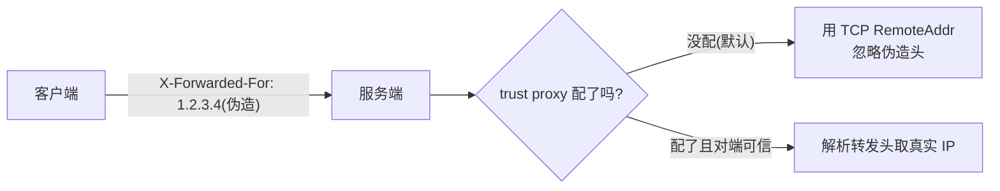
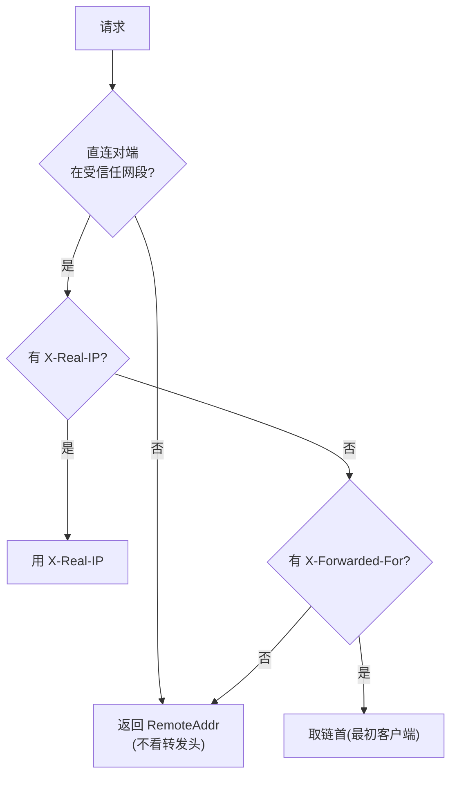
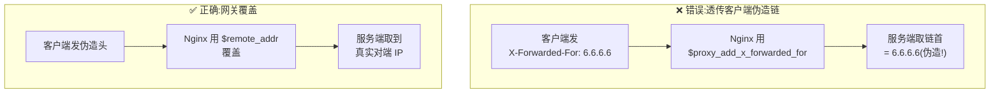
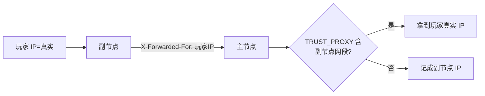

# 受信任代理与来源 IP

来源 IP 是限流和审计的基础。这一节讲服务端如何**默认不信任**转发头、为什么这样设计、以及放在反代后怎么正确配置。

## 默认:只信 TCP 对端



默认情况下,服务端**完全忽略** `X-Forwarded-For` / `X-Real-IP`,只用 TCP 连接的对端地址(`RemoteAddr`)。

为什么默认不信任?因为转发头是**纯文本、可任意伪造**的。如果默认信任,任何客户端都能发个 `X-Forwarded-For: 1.2.3.4` 把自己伪装成任意 IP,从而:

- 绕过 IP 限流(每次换个伪造 IP)
- 污染审计日志(嫁祸他人 IP)
- 伪装设备来源

直连场景下,`RemoteAddr` 就是真实客户端,默认行为既安全又正确。

## 放在反代后:必须显式信任

但如果你把服务端放在 Nginx/Caddy 后面,`RemoteAddr` 就变成了**网关的 IP**,所有请求看起来都来自同一个地址。这时需要告诉服务端"我信任这个网关的转发头":

```bash
export CNV_TRUST_PROXY='loopback'      # 网关在本机
# 或
export CNV_TRUST_PROXY='10.0.0.0/8'    # 网关在内网某网段
```

## 取值语义

与 express 的 `trust proxy` 一致:

| 取值 | 含义 | 何时用 |
|---|---|---|
| 空 / `off` / `false` | 不信任,只用 RemoteAddr | 直接对外(默认) |
| `all` / `true` / `*` | 信任所有上游 | 确有可信前置且无法枚举网段 |
| `loopback` | 信任 `127.0.0.0/8` + `::1` | 网关与服务端同机 |
| CIDR 列表 | 仅信任列出网段 | 网关在内网,如 `10.0.0.0/8,192.168.0.0/16` |

## 解析逻辑



要点:**只有当本次请求的直连对端命中受信任网段时,才解析转发头**。否则一律用 RemoteAddr。这保证了:即便某个未授权来源发了伪造头,只要它不在你信任的网段里,头就被忽略。

取 `X-Forwarded-For` 的**链首**(最初客户端)—— 前提是网关已剥离客户端伪造的部分。

## ⚠️ 网关侧必须重写转发头

服务端信任网关,网关就必须**对得起这份信任** —— 剥离客户端可能伪造的头,用自己看到的真实对端重写。



Nginx:

```nginx
proxy_set_header X-Real-IP       $remote_addr;
proxy_set_header X-Forwarded-For $remote_addr;   # 用 $remote_addr 覆盖,而非 $proxy_add_x_forwarded_for
```

::: danger 不要用 $proxy_add_x_forwarded_for
`$proxy_add_x_forwarded_for` 会把客户端发来的 `X-Forwarded-For` 接在前面 —— 等于把客户端伪造的链也信了。直接用 `$remote_addr` 让网关用真实对端覆盖。
:::

## 副节点反代的影响

副节点会把请求反代给主节点,并带上 `X-Forwarded-Proto`(标准库自动加 `X-Forwarded-For`)。所以**主节点的 `CNV_TRUST_PROXY` 要把副节点的来源网段算进去**,否则主节点拿到的是副节点 IP 而非真实玩家 IP。



## 配错的连锁后果

| 现象 | 根因 |
|---|---|
| 限流把所有人当一个人 | 反代后没配 trust proxy,IP 全是网关 IP |
| 审计日志 IP 全是内网地址 | 同上 |
| 限流被轻易绕过 | 配了 `all` 但网关没剥离客户端伪造头 |
| 设备来源失真 | 同上 |

## 自检

```bash
# 看日志里的 ip 字段是否是真实客户端 IP
journalctl -u magireco-node -f | grep '"ip"'
# 若全是网关/内网地址,说明 trust proxy 没配对
```

来源 IP 配对了,[限流](./rate-limiting) 和审计才真正有效。这是个不起眼但极易踩坑的环节。
