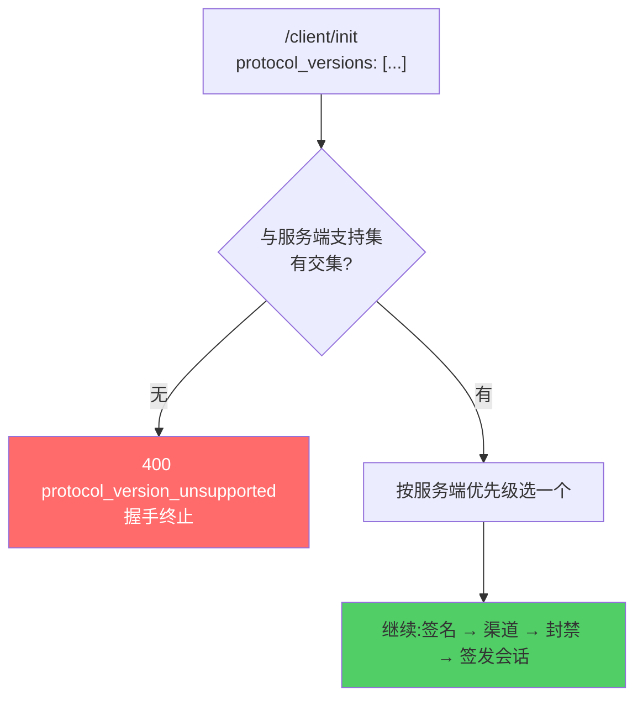

# 协议版本协商

服务端只有**一种**版本机制:在握手时与客户端协商**协议版本**。

::: danger 本页曾经写的是另一回事
早期版本的本页描述的是 **APK 版本闸门**——`allowed_versions` 硬闸门、
`latest_version` 软提示、`update_url_*` 下载地址、`update_apk_sha256` 安装前校验。

**那一整套已经移除。** 它服务的是"服务端推 APK、客户端装 APK"的分发模型;Web
客户端由浏览器自行更新,没有 APK 可推,也没有"安装前"这个时机。

管理后台仍可写 `config.versions`,但 `/client/*` **不再读取它**。
:::

## 协商发生在握手最前面

早于签名校验、早于封禁判定。理由很直接:**双方连"用哪套线格式说话"都没谈拢时,
后面的字段谁也不该解读。**



## 两条规则

### 1. 按服务端的优先级顺序选

交集里可能有多个版本。取哪一个由**服务端**的偏好顺序决定,不看客户端上报的顺序。

版本策略属服务端职权:哪一版稳定、哪一版正在灰度、哪一版准备下线,只有服务端知道。
让客户端的排序决定选型,等于把运维决策交给一个跑在玩家浏览器里、可被随意改写的程序。

实现上就是遍历服务端的 `supportedProtocolVersions`(降序),取第一个客户端也支持的。

### 2. 无交集时失败,客户端不得降级

```json
// HTTP 400
{
  "success": false,
  "error": "protocol_version_unsupported",
  "message": "客户端与服务端没有共同支持的协议版本,请更新客户端"
}
```

::: warning 为什么禁止"挑个最接近的凑合用"
降级的失败方式很坏:它通常**不会立刻报错**。双方仍然能完成握手、能收发请求,
只是在某个字段上悄悄读出错值——可能是一个多出来的枚举值被忽略,可能是一个改了
语义的字段被按老意思解读。

等到症状出现时,现场早已离协商那一刻很远了。明确失败反而是最便宜的处理方式。
:::

## 响应回两个字段

```json
{ "protocol_version": 1, "protocol_versions": [1] }
```

| 字段 | 含义 |
|---|---|
| `protocol_version` | **本次会话**协商出的版本,双方据此解读后续所有字段 |
| `protocol_versions` | 服务端支持的**全集** |

只回协商结果是不够的:协商失败时客户端只知道"谈崩了",不知道该升到哪一版。
下发全集让它能直接告诉玩家"请更新到支持协议 vN 的版本"。

## 新增一个协议版本时

1. 在 `internal/api/client/handlers.go` 的 `supportedProtocolVersions` 里**按优先级插入**
   新版本号;
2. 在架构协议文档里登记该版本与前一版的差异;
3. 让 `protocol_test.go` 的协商用例覆盖"新旧客户端各自能谈成什么"。

协商逻辑与响应字段**无需改动**——它们本来就是按集合写的。

## 与客户端完整性凭据的关系

协议版本协商**不是**安全机制,它解决的是兼容性。

真正的完整性凭据是 `signature`(与 `channel`),见 [防改包](./anti-tamper)。
两者在握手里相邻,但目的不同:协商回答"我们说不说同一种话",签名回答"你是不是
我认识的那个客户端"。

::: tip Web 端没有不可绕过的完整性凭据
Android 端的 APK 签名摘要之所以有效,是因为**私钥不在客户端**,重打包必然改变签名。
Web 客户端整个跑在玩家浏览器里,不存在等价物。

因此 Web 端的一切校验都只在服务端有意义——见 [服务端是唯一权威](/contributing/discipline)。
:::

## 配置入口

协议版本**不在管理后台配置**,它是代码里的常量。原因:改协议版本必然伴随代码改动,
把它做成运行时开关只会制造"配置说支持、代码其实不支持"的错位。

后台「版本管理」页写入的 `config.versions` 现已不被 `/client/*` 读取,详见
[管理后台使用](/self-host/admin-panel#_1-版本管理-最关键)。
