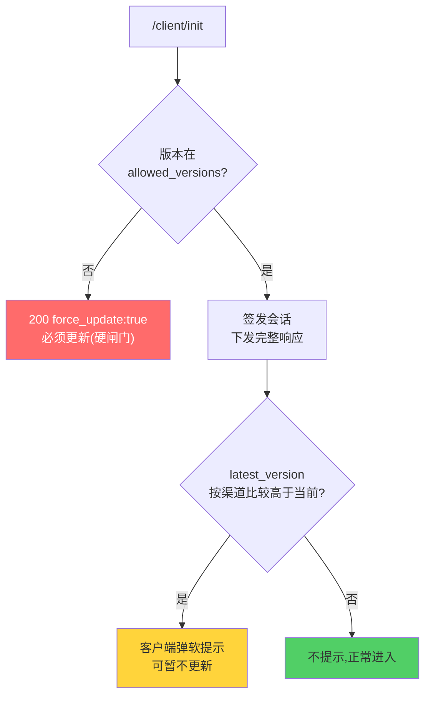
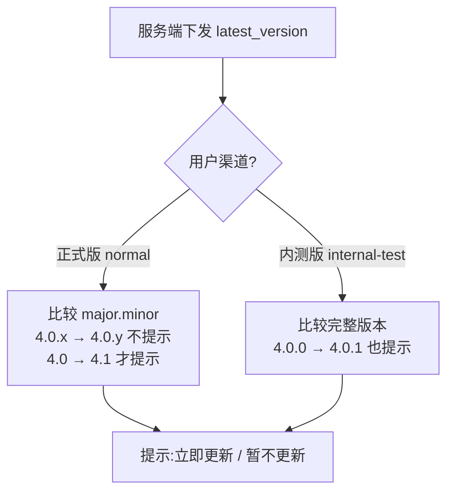
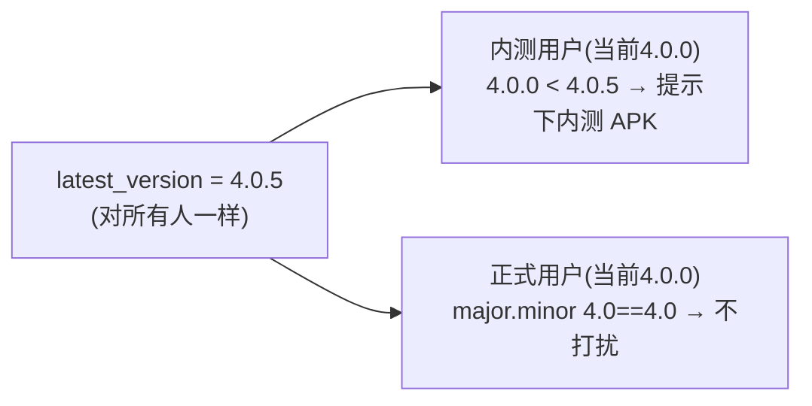
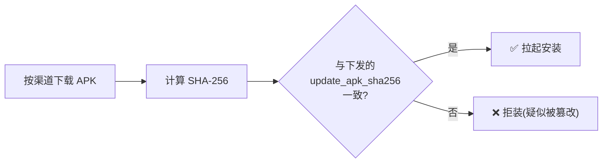

# 版本闸门与软提示

服务端通过三种机制控制客户端版本:两道**硬闸门**(强制更新)和一道**软提示**(可暂不更新)。本页讲清三者的语义、优先级与渠道策略。

## 三种机制对比

| 机制 | 字段 | 行为 | 优先级 |
|---|---|---|---|
| 强制更新 | `force_update:true` + `update_url_*` | 版本被拒,必须更新或退出 | 高(握手中先判) |
| 版本白名单 | `client.allowed_versions` | 当前版本不在列表 → 强制更新 | 高 |
| **更新软提示** | `client.latest_version` | 按渠道提示,可"暂不更新"继续 | 低(软) |



**先硬后软**:握手时先判版本白名单(硬),通过了才轮到 `latest_version`(软)。硬闸门不过直接强制更新,根本到不了软提示。

## 硬闸门:版本白名单

`allowed_versions` 不为空且当前版本不在列表时,握手返回:

```json
{
  "success": false,
  "force_update": true,
  "current_version": "3.9.0",
  "update_url_normal": "https://.../normal.apk",
  "update_url_internal_test": "https://.../internal.apk"
}
```

::: warning 这是 HTTP 200,不是 4xx
客户端 `Net.postJson` 对 HTTP ≥400 会抛 `IOException`,读不到 body 里的 update URL。所以版本闸门必须用 **200 + 顶层 `force_update`**。此分支**不签发 access_token**,客户端拿到 `force_update` 就停下走更新流程,不会继续握手。
:::

`update_url_*` 没配的渠道,对应 key 省略(避免客户端 `optString` 拿到空串误判)。

## 软提示:latest_version

这是给"有新版但不强制"场景用的。服务端只需告诉客户端**最新版本号是多少**,**过滤逻辑全在客户端**:



| 渠道 | 何时提示 |
|---|---|
| **正式版(`normal`)** | 仅当 `latest_version` 的 **major.minor** 高于当前。补丁号变化(4.0.0→4.0.5)**不打扰** |
| **内测版(`internal-test`)** | **任意**版本位升高即提示(含补丁号,4.0.0→4.0.1) |

软提示可"暂不更新"继续启动,**不阻断**。`latest_version` 为空/省略则完全不提示。

## 为什么单一版本号通常就够

因为过滤在客户端,服务端**不需要为两个渠道维护两套版本号**。举例:服务端对所有人下发 `latest_version = "4.0.5"`:



- **内测用户**:`4.0.0 < 4.0.5` → 提示,下 `update_url_internal_test`。
- **正式用户**:`major.minor 4.0 == 4.0` → 不提示,补丁版本不打扰。

之后发 `4.1.0`,改 `latest_version` 即可:内测继续提示,正式用户因 `4.0 < 4.1` 也开始提示,下 `update_url_normal`。"内测发补丁、大版本才推正式"的策略,靠客户端按位过滤天然实现。

需要两渠道**不同版本线**(如内测 4.2.x、正式停 4.1.x)时,才按 `channel` 分别返回不同 `latest_version`。

## APK 完整性校验

`update_apk_sha256` 让客户端**安装前校验**下载的 APK,防中间人推恶意包:



::: tip 两渠道 APK 不同时按渠道下发哈希
若正式版与内测版是不同的 APK 文件,单一 `update_apk_sha256` 只能匹配其中一个,另一渠道会校验失败。解法是服务端**按请求里的 `channel` 返回对应渠道那个 APK 的哈希**(`update_apk_sha256_internal_test` 优先用于内测渠道,否则回退通用值)。这正是本仓库已实现的逻辑。
:::

强烈建议下发哈希。缺失时客户端记 WARN 并跳过校验(安全性下降,不建议长期如此)。

## 软提示与硬闸门的关系

`latest_version` 是**软提示**,**不替代**强制更新和版本白名单两道硬闸门。三者可同时配置:

- 硬闸门保证"太旧的版本根本不让玩"。
- 软提示负责"有新版了,温和提醒一下"。

硬闸门的下载 URL 渠道选择,也跟随用户所选渠道,与软提示一致。

## 配置入口

全在后台「版本管理」页:

- 允许的客户端版本(白名单)
- 最新版本号(软提示)
- 正式/内测通道 APK URL
- 各渠道 APK SHA-256

存入 `config.versions`,握手时即时生效。运维语义见 [管理后台使用](/self-host/admin-panel#_1-版本管理-最关键)。
