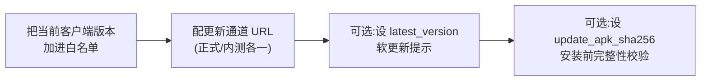

# 管理后台使用

管理后台是一套浏览器里的可视化控制台。前端用 React + 浏览器内 Babel,**无构建步骤**,由**面板**统一托管:浏览器打开**面板根路径 `/`**(默认 `:8090`)即进管理后台,未登录会跳到面板的 `/login.html`。

> **入口已迁到面板**。管理后台、登录/注册/找回、用户中心等全部人类前端现在都由面板托管;页面在浏览器里**跨域直连业务节点 API**(节点按面板来源放行 CORS)。业务节点根路径 `/` 不再是后台,而是[只读状态页](./nodes#节点只读状态页)。部署上需给业务节点设 `CNV_PANEL_PUBLIC_URL`、并在面板注册表登记业务节点,详见 [面板托管前端与跨域直连](./nodes#面板托管前端与跨域直连)。

## 登录与角色

用 `admintool create-admin` 建的管理员账号登录(见 [快速部署](./quick-start))。三种角色:

| 角色 | 权限 |
|---|---|
| `super_admin` | 全部权限,**可管理其他管理员**(权限管理页) |
| `admin` | 运维 / 资源 / 用户操作,不能管理员管理 |
| `readonly` | 仅查看,所有写操作被拒(403) |

鉴权:同源访问(本地回落)用 `mr_session` cookie(`HttpOnly` + `Secure` + `SameSite=Strict`);经面板跨域直连节点时改用 `Authorization: Bearer`(token 存 `localStorage`,登录后随每个请求发送)。两者有效期都由 `CNV_ADMIN_SESSION_TTL` 控制(默认 7 天)。

## 页面一览

| # | 页面 | 你能做什么 | 对应配置/数据 |
|---|---|---|---|
| 01 | **仪表盘** | 总览在线设备、节点、近期事件 | 聚合只读 |
| 02 | **服务器控制** | 切换 `正常`/`维护中`,设维护文案与预计恢复时间;配置握手期 services 地址;**调请求体与上传上限**(全局请求体上限、热更新包上限,运行时即时生效) | `config.server` / `config.limits` |
| 03 | **版本管理** | 客户端版本白名单、更新通道 URL、最新版本号软提示、APK 校验哈希、JNI 伪装字段 | `config.versions` |
| 03 | **定时任务** | 调整各后台任务周期(心跳超时、封禁清理等) | `config.tasks` |
| 04 | **资源管理** | 镜像组与镜像、离线整包、自动打包策略、resource_token 密钥轮换 | `mirrors` / `offline_package` |
| 05 | **热更新** | 发布 JS / 剧情热更新包,两种来源:**填写直链**(服务端下载到本地)或**上传文件**;均校验为合法 zip 后由服务端**自托管分发**(`CNV_HOTUPDATE_DIR` → `CNV_HOTUPDATE_URL_PATH`),sha256/size 由服务端计算,版本号自增 | `hot_bundles` + 托管目录 |
| 06 | **账号管理** | 玩家账号增删改、重置密码、停用/启用 | `accounts` |
| 07 | **设备封禁** | 按 device_id 封禁/解封,设过期时间与原因;含**自动封禁**(`Auto · system`)及其**阈值面板**(5 路信号的次数/窗口/时长运行时可调),见 [自动封禁](/security/rate-limiting#自动封禁) | `bans` / `config.autoban` |
| 08 | **心跳监控** | 看客户端**自行下载**(在线资源下载 / 热更新)的逐文件进度与速度,以及在线游戏设备;手动给某设备换线 / 封禁。**离线整包走浏览器下载、客户端不上报心跳,故不在此列**(无“下载速度”) | 内存心跳表 |
| 09 | **验证码 (cap-worker)** | 内置 PoW(`/api/challenge`、`/api/redeem`,无外部端点 URL,免误配);运行连通性测试、查看上次结果 | `config.captcha` |
| 10 | **审计日志** | 检索所有关键操作记录(中文操作名 + 目标属性,如「发布离线包 · 离线包版本 2.4.0」),支持导出 CSV | `audit_log` |
| 12 | **权限管理** | (仅超管)增删管理员、改角色 | `admins` |

## 上线必做的几件事

新部署后,按这个顺序配一遍:

### 1. 版本管理(最关键)

- **允许的客户端版本**:不在白名单的客户端握手会被强制更新(`force_update`)。**必须**把当前发布版本加进去,否则所有人都被挡。
- **更新通道 URL**:`正式版` 与 `内测版` 各一个 APK 下载地址。
- **最新版本号(软提示)**:可选。下发后客户端按渠道决定是否提示更新(正式版仅 major.minor 升高时提示,内测版任意版本位升高即提示)。留空则不提示。
- **APK SHA-256**:可选但强烈建议,客户端安装前校验,防中间人推恶意包。两个渠道 APK 不同时可分别配置。

详细语义见 [版本闸门与软提示](/security/version-gates)。

### 2. 服务器控制

确认状态是 `正常`。需要停服维护时切到 `维护中`,客户端握手会收到维护提示并停在启动页。

### 3. 资源管理

配置客户端从哪下资源。两个来源会被合并下发:

1. **管理后台镜像组**(你在这里配的,优先级最高)
2. **本节点本地 `/res`**(若设了 `CNV_PRIMARY_RES_DIR`)

镜像可以是 HTTP 直链,也可以是 S3(带 bucket/region,客户端走 XML 自发现)。可为镜像内联文件清单 `[{key,size}]` 让客户端精确选源。

> 跨地域的**边缘节点**不再走管理后台,而是由**签名节点目录**(声明 `caps: ["resource"]`)下发给客户端,见 [节点与面板](./nodes)。

### 4. 验证码(可选)

默认 PoW 验证码可开关。开启后注册/登录需先过人机验证。难度(前导零位数)可调,默认 12 位(约 2 万次哈希)。

## 一切改动即时生效

所有配置写入数据库的 `config` 表(或对应业务表),客户端**下次握手 `/client/init` 时即生效**,无需重启服务。这是刻意设计 —— 运维改配置不打断服务。

## 审计

后台所有写操作都会落 `audit_log`:谁、什么时间、做了什么、对谁。审计日志页把机器化的 `type` 翻成中文操作名、把 `target` 标注成它代表的属性(离线包版本 / 账号 / 设备 / 角色…),并从 `details` 补出要点(封禁原因、维护文案、SHA256/大小等);原始 `type`/`target`/完整 `details` 仍可展开查看。可按类型/操作者/时间检索,并导出 CSV 留档。建议定期复核。
