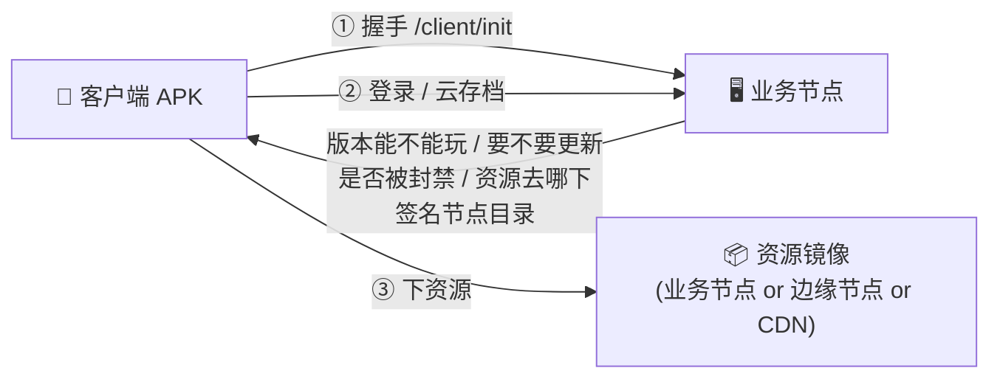
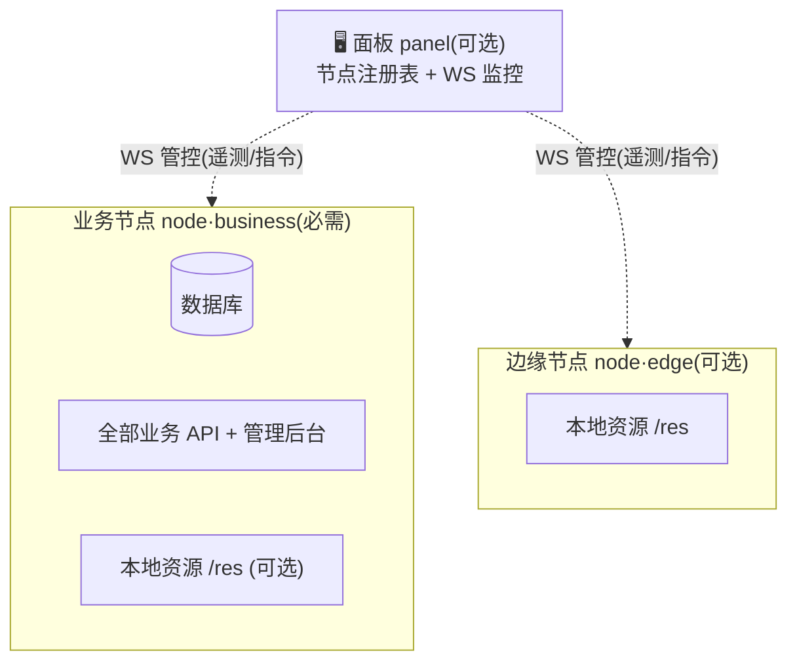

# 概述:这是什么

这是「魔法纪录复兴计划」的**服务端**。如果你想为改造版的「魔法纪录 CNV 客户端」(一个安卓 APK)搭一个自己的后端,你来对地方了。

本章面向**只想把服务器跑起来**的人 —— 不需要读 Go 源码,照着做即可。

## 服务端负责什么

客户端是装在玩家手机上的 APK,**不可信**。所有关键判断都放在服务端:



具体来说,服务端提供:

| 能力 | 说明 |
|---|---|
| **客户端握手** | 校验版本/签名/渠道,下发服务器状态、资源镜像列表、更新提示、伪装字段 |
| **账号系统** | 注册、登录、找回密码(邮箱验证码)、云存档同步 |
| **资源分发** | 在线下载(镜像组 + S3 自发现)、离线整包、热更新包 |
| **封禁与风控** | 设备封禁、版本闸门、限流、PoW 人机验证 |
| **管理后台** | 浏览器里可视化管理上述一切(12 个页面) |
| **用户中心** | 玩家自助管理设备、存档、邮箱、密码 |

## 节点与面板



- **业务节点(`CNV_NODE_ROLE=business`)** — 必需。持有数据库与全部业务逻辑、管理后台、(可选)本地资源分发,并挂管控 WS。
- **边缘节点(`CNV_NODE_ROLE=edge`)** — 可选。只做本地资源分发,不需要数据库。由**签名节点目录**告诉客户端去哪就近下载。
- **面板(panel)** — 可选。通过管控 WebSocket 连接并监控各节点、维护节点注册表;节点首次启动生成的连接密钥复制到面板即完成配对。

只跑一个业务节点就能完整工作。边缘节点 + 面板是用来在多地分摊下载带宽、集中监控的,等有需要再加。

## 技术栈一览

| 层 | 选型 |
|---|---|
| 语言/运行时 | Go(单二进制,`CGO_ENABLED=0` 可静态编译) |
| Web 框架 | [go-chi](https://github.com/go-chi/chi) 路由 + 自研中间件 |
| 数据库 | PostgreSQL / MySQL / SQLite **三选一** |
| 前端面板 | React + 浏览器内 Babel,**无构建步骤**(直接发 `.jsx`) |
| 验证码 | 内置 PoW(SHA-256 leading-zero),无需第三方 |

没有 Redis、没有消息队列、没有前端构建链 —— 刻意保持**单二进制 + 一个数据库**的极简部署。

## 最小部署长什么样

一台云服务器 + 一个数据库,五分钟可跑通:

```bash
export CNV_DB_URL='sqlite:///srv/magireco/magireco.db'   # 单机最简:SQLite
export CNV_ADMIN_JWT_SECRET='换成你自己的 32+ 字符随机串'
go run ./cmd/node                                          # 默认监听 :8080
```

然后用 `admintool` 建第一个管理员,登录后台即可。完整步骤见 **[快速部署](./quick-start)**。

## 接下来读什么

1. **[部署前准备](./prerequisites)** — 你需要先有什么(服务器、域名、数据库、客户端签名)
2. **[快速部署](./quick-start)** — 一步步把主节点跑起来
3. **[选择数据库](./database)** — 三种数据库怎么选、连接串怎么写
4. **[环境变量参考](./configuration)** — 所有 `CNV_*` 配置项
5. **[安全加固清单](./security-checklist)** — 上生产前**务必**过一遍
