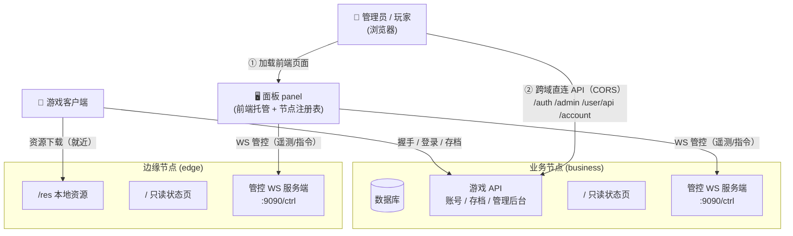

# 节点与面板

服务端由两种可执行文件组成：**节点**（`magireco-node`）与**面板**（`magireco-panel`）。

- **节点**负责实际执行：数据库读写、游戏 API 处理、资源分发。
- **面板**负责编排与监控：通过 WebSocket 管控通道连接所有节点、维护节点注册表，并**托管全部人类可见前端**（登录 / 注册 / 找回 / 游戏管理后台 / 用户中心）。

面板本身不承载游戏 API：游戏客户端经签名目录找到节点后**直连节点**；浏览器里的管理后台 / 用户中心也是从面板加载静态前端后**跨域直连业务节点 API**（节点侧按面板来源放行 CORS）。

> **人类入口都在面板**。业务节点不再托管任何 WebUI——它的根路径 `/` 改为一个**只读实时状态页**（所有角色的节点统一，见 [节点只读状态页](#节点只读状态页)）。客户端 APK 用内置浏览器打开的 `/account/register`、`/account/forgot`、`/account/verify-email` 在配置了面板地址后会 **302 跳转到面板**的同名页（契约路由不破）。

## 节点角色

节点通过 `CNV_NODE_ROLE` 区分角色：

| 角色 | 说明 |
|---|---|
| `business`（默认）| 完整游戏 API 栈（`/client` `/account` `/auth` `/admin` `/user` `/setup`）+ 数据库 + 管控 WS |
| `edge` | 仅提供静态资源下载（`/res/*`）+ 管控 WS，无数据库依赖 |

> **拓扑约束**：整个面板-节点系统**只有一个**带数据库的业务节点（持有游戏库——玩家账号 / 云存档）；**边缘节点数量不限**，只分发资源、不连库。游戏库的 `CNV_DB_URL` 因此是全局唯一的一项配置（在 [面板安装向导](#面板安装向导-wordpress-式)里配置并测试）。



## 节点密钥（自持配对）

节点在**首次启动**时自动生成一把 64 位十六进制随机连接密钥，持久化到 `CNV_NODE_KEY_FILE`（默认 `./data/node.key`），并打印到 stdout 日志：

```
节点密钥已生成（首次启动）—— 请将以下密钥复制到面板节点注册表
  node_key=a3f1...  control_addr=127.0.0.1:9090
```

管理员**将这把密钥复制到面板的节点注册表**，面板即可通过管控 WS 连接节点。密钥**不需要**写进节点的配置文件或环境变量——节点自己持有它，面板持有一份副本。

> **安全说明** 节点密钥仅控制面板↔节点的管控通道，与游戏客户端无关。游戏客户端的信任根是钉扎进 APK 的 Ed25519 公钥，见 [签名节点目录](#签名节点目录)。

## 管控通道

面板主动拨号到节点的管控 WS（`CNV_CONTROL_ADDR`，默认 `127.0.0.1:9090`，路径 `/ctrl`），建立长连接后：

- 节点每 5 秒向面板推送遥测（CPU / 内存 / Goroutine 数 / 运行时间）。
- 面板可向节点下发指令（重启、GC、轮换密钥等）。
- 管控地址默认绑定 `127.0.0.1`（本机）；**跨机部署时**设 `CNV_CONTROL_ADDR=:9090` 并用防火墙或内网隔离限制访问。

## 签名节点目录

当客户端需要连接不同角色的节点（如部分请求去资源节点），业务节点可在 `/client/init` 响应里下发**已签名的节点目录**。

目录由 `admintool sign-directory` **离线**签名（Ed25519 私钥不上线），客户端用**硬编码进 APK 的公钥**验签，防止攻击者伪造节点地址。

### 签名格式

输出为 JWS 风格的双字段 JSON——签名覆盖 base64url 字符串字节本身，消除跨语言序列化对齐问题：

```json
{
  "payload": "<base64url(紧凑JSON{seq,issued_at,expires_at,nodes})，无=填充>",
  "sig":     "<standard_base64(Ed25519签名)>"
}
```

客户端验签：`Ed25519.verify(根公钥, UTF-8(payload字符串), base64decode(sig))`，验通后再 base64url 解码取内层 JSON。

### 操作步骤

```bash
# 1. 生成密钥对（一次性，私钥离线保管 / 存 CI Secret）
admintool gen-directory-key
#   DIRECTORY_PUBKEY=...（钉进 APK / 设为 GitHub Variable CNV_DIRECTORY_PUBKEY）
#   DIRECTORY_PRIVKEY=...（离线保管 / 存入 CI Secret CNV_DIRECTORY_PRIVKEY）

# 2. 准备目录 JSON（无需 sig 字段）
cat > directory.json <<'EOF'
{
  "seq": 1,
  "nodes": [
    {"id": "biz1", "role": "business", "api": "https://api.magi-reco.top",
     "caps": ["init", "login", "account", "save"], "weight": 100},
    {"id": "edge-hk", "role": "edge", "api": "https://cdn-hk.magi-reco.top",
     "caps": ["resource"], "weight": 80, "region": "hk"}
  ]
}
EOF

# 3. 签名（输出 {payload, sig} 格式）
admintool sign-directory -in=directory.json -out=directory-signed.json \
  -privkey-file=privkey.hex -seq=1 -ttl=48h

# 4. 校验（可选，CI 自检）
admintool verify-directory -in=directory-signed.json -pubkey=$DIRECTORY_PUBKEY

# 5. 将签好的文件配给业务节点
export CNV_DIRECTORY_FILE=/etc/magireco/directory-signed.json
```

目录每次更新须重新签名（`-seq` 单调递增，防回滚）。`expires_at` 给短 TTL 便于灰度控制；停发 `directory` 字段即可让客户端回退 `API_HOST`。

## 部署多节点

### 最小部署（单机）

```bash
# 业务节点（端口 8080 + 管控 9090）
CNV_DB_URL=sqlite:///var/lib/magireco/data.db \
CNV_ADMIN_JWT_SECRET='…' \
./magireco-node

# 面板（端口 8090）
CNV_PANEL_KEY='…' \
CNV_ADDR=:8090 \
./magireco-panel
```

### 面板安装向导（WordPress 式）

面板**首次启动**（数据库里还没有超级管理员）时，会在 `/install/` 挂载一个安装向导，根路径 `/` 自动跳转过去。向导分五步：

1. **欢迎** — 说明流程与安全设计。
2. **面板存储** — 对面板本地 SQLite（节点注册表 + 面板管理员）做真实的读写探测（连不上/只读会在此报错）。
3. **游戏数据库** — 配置并测试**业务节点**要连的游戏库（玩家账号 / 云存档）。可选 **SQLite / MySQL / PostgreSQL**，填好连接参数后做一次真实连接测试——复用节点同一套 DSN 解析与 `Open`（含 ping），"此处测得通即节点连得上"；向导随即给出对应的 `CNV_DB_URL`，供你设置到业务节点环境变量。见 [选择数据库](./database)。
4. **创建管理员 + 选择拓扑** — 设置超级管理员的用户名 / 邮箱 / 密码（≥12 位）；下方默认勾选 **"本机也装业务节点"**。
5. **完成** — 账号写入后，**安装模块立即从运行中的服务里移除**。

#### 第 4 步勾"本机也装业务节点"（推荐）

业务节点拓扑约束就是"有且只能有一个"，且一般与面板同机部署。所以向导默认这个勾，**一页填完两边都装**。流程：

1. 找到 `magireco-node` 二进制。**默认**：面板自身二进制所在目录（同目录平级）。**覆盖**：设置 [`CNV_NODE_BIN`](./configuration#cnv_node_bin) 为绝对路径。
2. 跑 `magireco-node --version`，**与面板版本字符串硬比对**——任何差异都拒绝（包括开发用的 `dev` 与正式 tag 间的混搭）。同步两边到同一版本再装。
3. 用第 3 步通过测试的 DSN 打开业务节点 DB；如果 `setup_state.done=true`（之前装过）→ **硬拒**报"业务节点已经安装完成过了"，不重装。
4. 全新或未完成的库 → 跑迁移、用同一份凭证建业务节点超管、写 `setup_state.done=true`。
5. TCP dial 节点的管控通道（默认 `127.0.0.1:9090`）—— 没人在 listen 就 **setsid fork 启动节点**（脱离面板生命周期，面板重启不会带走它）。stdout/stderr 重定向到 `./logs/node.log`，pid 写到 `./data/node.pid`。
6. 轮询管控通道，15 秒内确认节点起来。超时就报错，但 DB 装好的状态保持——运维可手动起，`/setup/*` 也已经被锁住了。

整个流程是**原子**的：业务节点这边任何步骤失败，面板侧都不写超管。可以原样重试，不留下半装状态。

#### 第 4 步不勾"本机也装业务节点"

只装面板自己。业务节点二进制需要你自己跑（可能与面板分机部署），用业务节点自己的 `/setup/*` 单独装——节点的安装入口常驻路由，靠 `setupGuard` 读 DB 里 `setup_state` 标志返回 404，与面板安装向导独立工作。

> **关于游戏库测试**：步骤 3 的连接测试是**尽力而为**——面板与游戏库不在同一主机时此处可能连不通（防火墙 / 网络），以业务节点实际连接为准。面板**自身不使用、也不持久化**这串 DSN（除第 4 步勾了"本机也装"时一次性透传给业务 DB Open 与 fork 出来的节点子进程）。MySQL / PostgreSQL 需**预先创建数据库**，节点只建表不建库。

::: tip 「删除模块」而非「关闭入口」
节点的安装向导（`/setup`）靠守护中间件读 DB 标志返回 404——路由仍常驻。面板的安装向导更进一步：完成的瞬间把整个安装处理器从 HTTP 路由树里**摘除并释放**，`/install/*` 此后命中默认 404。重启后若已初始化，面板**根本不会再构造**这个模块。

> 注：Go 是静态编译，二进制里的指令无法在运行时抹除；这里的「删除」指从运行中的服务摘除并让其被 GC 回收，彻底重建需重新编译。
:::

安装完成后，面板根路径 `/` 即托管**游戏前端首页**（管理后台；未登录会跳到 `/login.html`）。面板自身的**节点注册表总览**只读页挪到 [`/panel`](#面板与节点的-url-分工)，面板管理 API 仍在 `/api/panel/*`。

## 面板托管前端与跨域直连

面板接管了全部人类入口后，部署上需要打通"前端在面板、API 在节点"这条跨域链路：

1. **业务节点配置面板地址**：设 `CNV_PANEL_PUBLIC_URL` 为面板对外 URL（如 `https://panel.example.com`）。它有两个作用：
   - 客户端入口页（`/account/register`、`/account/forgot`、`/account/verify-email`）**302 跳转**到面板同名页；
   - 作为 **CORS 放行来源**——业务节点只对该来源回显 `Access-Control-Allow-Origin`，放行浏览器对 `/auth`、`/admin`、`/user/api`、`/account`、`/api`（验证码）的跨域请求与预检。
2. **面板注入 API 基址**：面板托管前端时会动态下发 `/app-config.js`，把**注册表里首个业务节点**的 `api_url` 注入为 `window.MR_API_BASE`；前端 `api.jsx` 以它为所有请求前缀。未注册业务节点时基址为空 = 同源回落。
3. **鉴权走 Bearer**：跨域链路不依赖 Cookie，登录后 token 存 `localStorage`、以 `Authorization: Bearer` 随请求发送，因此节点 CORS **不**开 `Allow-Credentials`，只精确回显面板来源、不使用通配 `*`。
4. **CSP**：面板给托管页面下发的 `Content-Security-Policy` 会把业务节点来源加进 `connect-src`，浏览器才允许跨域 XHR。

> **未接入面板的单机回落**：不设 `CNV_PANEL_PUBLIC_URL` 时，业务节点退化为"自带前端资源"模式——根路径仍是只读状态页，但 `/account/register` 等页面与样式/脚本由节点本地 `CNV_WEB_DIR` 直接服务，零跨域、零面板依赖，方便本地开发与最小单机部署。

## 节点只读状态页

所有角色的节点（business / edge）在根路径 `/` 提供一个**只读**的实时状态页，并配套 `GET /status.json` 机器可读端点：

| 字段 | 含义 |
|---|---|
| `node_id` / `role` / `version` | 节点身份与版本 |
| `uptime_sec` / `started_at` | 运行时长与启动时刻 |
| `mem_pct` / `goroutines` | 堆内存占用比、Goroutine 数 |

页面每 5 秒自拉 `/status.json` 刷新。它**无鉴权、纯只读、不暴露任何敏感信息**（无数据库串、无密钥、无令牌），不接受任何变更操作；放在公网根路径也只能看到运行指标。

### 面板与节点的 URL 分工

| URL | 谁提供 | 内容 |
|---|---|---|
| 面板 `/` | 面板 | 游戏管理后台前端（未登录跳 `/login.html`） |
| 面板 `/login.html` `/register.html` `/forgot.html` `/user.html` | 面板 | 登录 / 注册 / 找回 / 用户中心前端 |
| 面板 `/app-config.js` | 面板 | 注入业务节点 API 基址 |
| 面板 `/panel`、`/panel/status` | 面板 | 节点注册表只读总览 |
| 面板 `/api/panel/*` | 面板 | 节点注册表管理 API |
| 节点 `/` `/status.json` | 各节点 | 该节点只读实时状态 |
| 节点 `/client` `/auth` `/admin` `/user/api` `/account` `/api` | 业务节点 | 游戏与管理 API（浏览器跨域直连） |

### 多机部署

1. 在每台机器启动 `magireco-node`，记录启动日志里的 `node_key`。
2. 业务节点 `CNV_CONTROL_ADDR=:9090` 对面板机器放行（防火墙）。
3. 在面板 WebUI（`/api/panel/nodes` POST）注册各节点：
   - `api_url`：节点的 HTTP API 基址（如 `http://10.0.0.2:8080`）
   - `ctrl_url`：管控 WS（如 `ws://10.0.0.2:9090/ctrl`）
   - `key`：节点启动时打印的密钥

### 边缘节点资源同步

边缘节点的 `CNV_PRIMARY_RES_DIR`（或 `CNV_SECONDARY_RES_DIR`）需要有资源文件。常见方案：

- `rsync` / `rclone` 从业务节点或对象存储定期同步。
- 挂载共享存储或对象存储网关。
- 用 `admintool repack` 生成的离线包解压铺到边缘节点。

## 向后兼容说明

`cmd/primary` 和 `cmd/secondary` 的源码已从主线移除，归档在独立的 **`legacy` 分支**（`git checkout legacy` 可取回旧版可编译代码）。旧部署可参照以下映射迁移到 `magireco-node`：

| 旧命令 | 新命令 |
|---|---|
| `magireco-primary` | `magireco-node`（`CNV_NODE_ROLE=business`，默认） |
| `magireco-secondary` | `magireco-node`（`CNV_NODE_ROLE=edge`） |
| `CNV_SECONDARY_SHARED_KEY` | 已由节点自持密钥取代，见上文 |
| `CNV_PRIMARY_URL` | 不再需要；面板通过注册表管理节点 |
