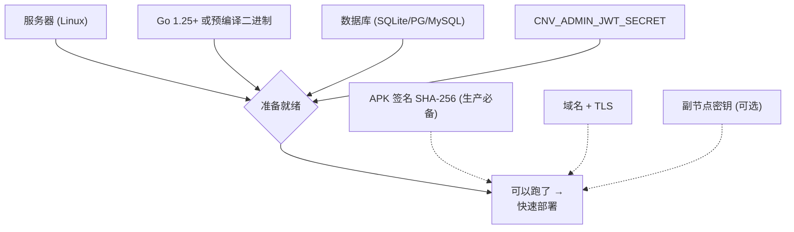

# 部署前准备

在动手之前,先把下面这些准备好。打勾的是**必需**,其余按需。

## 必需

### ☑️ 一台服务器

- Linux(amd64 或 arm64)。任意主流发行版都行。
- 内存 512 MiB 起步即可(scrypt 登录哈希会吃一点 CPU,但并发不高时毫无压力)。
- 能开放一个对外端口(默认 `:8080`),或放在反向代理后面。

### ☑️ Go 工具链(用于编译/运行)

- Go **1.25+**(见仓库 `go.mod`)。
- 如果你用 CI 产物的预编译二进制,则**运行**环境不需要 Go。
- 静态编译(推荐发布形态):

```bash
GOOS=linux GOARCH=amd64 CGO_ENABLED=0 \
  go build -trimpath -ldflags="-s -w" -o magireco-node ./cmd/node
```

`CGO_ENABLED=0` 时连 libc 都不依赖,丢到任何 Linux 上都能跑。

::: tip SQLite 与 CGO
本项目用的是纯 Go 的 `modernc.org/sqlite`,**不需要 CGO**。所以即使用 SQLite 也能静态编译,这是选它做内嵌驱动的关键原因。
:::

### ☑️ 一个数据库

三选一,详见 **[选择数据库](./database)**:

- **SQLite** — 零运维,单文件,适合单机/小规模。**最省事**。
- **PostgreSQL ≥ 14** — 推荐的生产选择。
- **MySQL ≥ 5.7** — 如果你已有 MySQL 设施。

迁移会在主节点**启动时自动执行**(全部 `CREATE TABLE IF NOT EXISTS`,可重复运行),你不需要手动建表。

### ☑️ 一个管理后台密钥

设一个 `CNV_ADMIN_JWT_SECRET`,**≥16 字符**的随机串(实际建议 32+)。用于管理后台 cookie 的完整性。生成一个:

```bash
openssl rand -hex 32
```

## 强烈建议(生产环境)

### ⚠️ 客户端 APK 签名的 SHA-256

这是**防改包的核心闸门**。客户端 APK 用某个 keystore 签名,你需要把那张签名证书的 SHA-256 摘要配进 `CNV_SIGNATURE_WHITELIST`。任何重打包的客户端都得用攻击者自己的 key 重签,摘要就对不上,握手被拒。

从 keystore 导出摘要:

```bash
keytool -exportcert -keystore your.keystore -alias your_alias \
  | openssl dgst -sha256
# 取输出里的 64 位小写 hex
```

这个值必须与客户端 CI 注入到 `IntegrityGuard.EXPECTED_SIGNATURE_SHA256` 的值**完全一致**。详见 **[防改包闸门](/security/anti-tamper)**。

::: warning 不配会怎样
为空时服务端会**放行所有签名**并打 WARN 日志 —— 等于这道闸门没开。开发可以,生产强烈不建议。
:::

### ⚠️ 一个域名 + TLS

玩家客户端需要一个稳定的 HTTPS 入口。你可以:

- 把 TLS 终结在前置网关(Nginx / Caddy / 云负载均衡),反代到本进程的 `:8080`;**或**
- 让本进程直接终结 TLS,设 `CNV_TLS_CERT` / `CNV_TLS_KEY`。

放在反代后面时**务必**正确设置 `CNV_TRUST_PROXY`,否则限流和审计的来源 IP 全会记成网关 IP。见 **[受信任代理](/security/trust-proxy)**。

## 可选

### 边缘节点(多地分发)+ 面板

如果你想在多个地区放下载节点,准备额外的服务器跑 `magireco-node`(设 `CNV_NODE_ROLE=edge`);用 `magireco-panel`(需 `CNV_PANEL_KEY`,**≥16 字符**)统一注册与监控这些节点。见 **[节点与面板](./nodes)**。

### 邮件服务

注册/找回密码用邮箱验证码。当前实现把验证码**写入数据库**,实际发信由你对接外部邮件服务完成(本仓库不含 SMTP 客户端)。本地开发可设 `CNV_EMAIL_DEV_MODE=on` 把验证码直接打到日志。

### 资源文件

如果主节点要兼做资源分发,准备一个资源目录(`CNV_PRIMARY_RES_DIR`)。它同时也是离线整包打包器的源目录。

## 准备清单速览



准备好了就去 **[快速部署](./quick-start)**。
